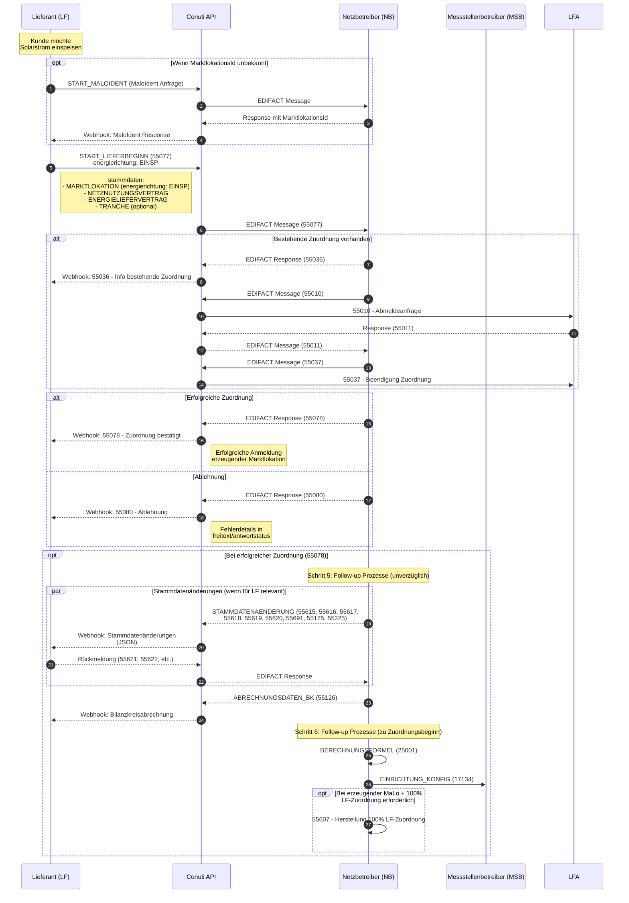
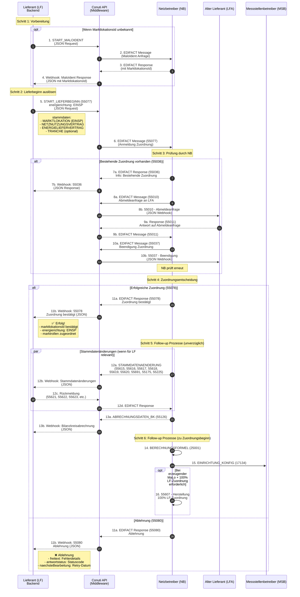

# Flow zur Anmeldung eines Kunden mit Produktionsvertrag (Solarstrom)

## Prozessübersicht

Für die Anmeldung eines Kunden mit **Produktionsvertrag (Solarstrom)** als **Lieferant (LF)** ist der Prozess **Lieferbeginn** für eine **erzeugende Marktlokation (EINSP)** relevant. Der Prozess verwendet den BDEW Prüfidentifikator **55077**.

### Rolle der Conuti API

Die **Conuti API** (auch MACO APP API) ist die **Middleware** zwischen Ihrem Backend und den Marktteilnehmern (Netzbetreiber NB, Messstellenbetreiber MSB):

- **Ihr Backend** sendet **JSON-Nachrichten** (BO4E-Format) an die Conuti API
- **Conuti** konvertiert diese in **EDIFACT-Nachrichten** und sendet sie an NB/MSB
- **NB/MSB** antworten mit **EDIFACT-Nachrichten** an Conuti
- **Conuti** konvertiert die EDIFACT-Responses zurück zu **JSON** und sendet sie als **Webhooks** an Ihr Backend

**Warum ist Conuti im Diagramm?** Conuti ist die zentrale Schnittstelle, die alle Nachrichten zwischen Backend und Marktteilnehmern routet und transformiert. Sie müssen sich als Backend-Entwickler nur mit der JSON-API beschäftigen, während Conuti die komplexe EDIFACT-Kommunikation übernimmt.

### Mermaid-Diagramm-Syntax

In den Sequenzdiagrammen werden folgende Mermaid-Syntax-Elemente verwendet:

- **`opt ... end`** = **Optionaler Pfad** (if-Bedingung)
  - Der Block wird nur ausgeführt, wenn die Bedingung erfüllt ist
  - Beispiel: `opt Wenn MarktlokationsId unbekannt` → Nur wenn MaLo-ID fehlt, wird MaloIdent ausgeführt

- **`alt ... else ... end`** = **Alternative Pfade** (if/else-Bedingung)
  - Zeigt verschiedene mögliche Ausgänge eines Prozesses
  - Beispiel: `alt Erfolgreiche Zuordnung ... else Ablehnung` → Entweder Erfolg (55078) oder Ablehnung (55080)

## Prozesssequenz



## Detaillierter Prozessfluss mit Sequenz



## Nachrichtentypen & Felder

| Nachrichtentyp | Richtung | BDEW ID | Beschreibung | Beispiel |
|---|---|---|---|---|
| START_LIEFERBEGINN | Outbound | 55077 | Anmeldung erzeugender Marktlokation | `maco-edi-testfiles/outbound/v202404/v1/files/json/utilmd/55077/1.json` |
| PI_55078 | Inbound | 55078 | Erfolgreiche Zuordnung (erzeugend) | `maco-api-documentation/macoapp-schreiben/components/examples/Strom/55078_eingehend_Testfall1.yaml` |
| PI_55080 | Inbound | 55080 | Ablehnung (erzeugend) | - |
| PI_55036 | Inbound | 55036 | Info bestehende Zuordnung | - |
| PI_55615-55620, etc. | Inbound | 55615, 55616, 55617, 55618, 55619, 55620, 55691, 55175, 55225 | Stammdatenänderungen vom NB | `docs-offline/stammdatenänderung-vom-netzbetreiber-verantwortlich-rolle-lf-3130230f0.md` |
| PI_55621-55626, etc. | Outbound | 55621, 55622, 55623, 55624, 55625, 55626, 55227, 55180 | Rückmeldung auf Stammdatenänderung | - |

### Pflichtfelder für START_LIEFERBEGINN (55077)

**stammdaten.MARKTLOKATION** (mindestens 1):
- ✅ **Required**: `marktlokationsId` (string) - Pflicht
- ✅ **Required**: `sparte: "STROM"` - Pflicht
- ✅ **Required**: `energierichtung: "EINSP"` - Pflicht für Produktionsvertrag
- ⚠️ **Optional**: `foerderungsLand` (string) - Optional, z.B. "DE"
- ⚠️ **Optional**: `statusErzeugendeMalo` (enum) - Optional, z.B. "GEFOERDERTE_DIREKTVERMARKTUNG"
- ⚠️ **Optional**: `verguetungEmpfaenger` (enum) - Optional, z.B. "KUNDE" oder "LIEFERANT"

**stammdaten.NETZNUTZUNGSVERTRAG** (optional):
- `vertragsbeginn` (date-time)
- `vertragsart: "NETZNUTZUNGSVERTRAG"`
- `sparte: "STROM"`

**stammdaten.ENERGIELIEFERVERTRAG** (optional):
- `vertragsbeginn` (date-time)
- `vertragsart: "ENERGIELIEFERVERTRAG"`
- `sparte: "STROM"`
- `vertragspartner2` (array) - Kundendaten

**stammdaten.TRANCHE** (optional, für erzeugende MaLo):
- `tranchenId` (string)
- `bildungTranchengroesse` (enum) - z.B. "PROZENTUAL"
- `aufteilungsmenge` (object)

**transaktionsdaten** (Pflicht):
- ✅ **Required**: `vertragsbeginn` (date-time) - Pflicht
- ✅ **Required**: `sparte: "STROM"` - Pflicht
- ✅ **Required**: `transaktionsgrund` (string) - z.B. "E01" oder "E03"
- ✅ **Required**: `absender` (MARKTTEILNEHMER) - Ihre Rollencodenummer
- ✅ **Required**: `empfaenger` (MARKTTEILNEHMER) - NB Rollencodenummer

**zusatzdaten** (Pflicht):
- ✅ **Required**: `prozessId` (UUID) - Ihre interne Prozess-ID
- ✅ **Required**: `eventname: "START_LIEFERBEGINN"`

## Beispielnachrichten

### Outbound (55077) - Erzeugende Marktlokation
Siehe: `maco-edi-testfiles/outbound/v202404/v1/files/json/utilmd/55077/1.json`

Wichtige Felder:
```json
{
  "stammdaten": {
    "MARKTLOKATION": [{
      "marktlokationsId": "50074561188",
      "sparte": "STROM",
      "energierichtung": "EINSP",
      "verguetungEmpfaenger": "KUNDE",
      "statusErzeugendeMalo": "GEFOERDERTE_DIREKTVERMARKTUNG",
      "foerderungsLand": "DE"
    }],
    "NETZNUTZUNGSVERTRAG": [{
      "vertragsbeginn": "2024-06-30T22:00:00Z",
      "vertragsart": "NETZNUTZUNGSVERTRAG",
      "sparte": "STROM"
    }],
    "TRANCHE": [{
      "bildungTranchengroesse": "PROZENTUAL",
      "aufteilungsmenge": {
        "wert": 100,
        "einheit": "PROZENT"
      }
    }]
  },
  "transaktionsdaten": {
    "pruefidentifikator": "55077",
    "sparte": "STROM",
    "transaktionsgrund": "E03",
    "vertragsbeginn": "2024-06-30T22:00:00Z"
  }
}
```

### Inbound (55078) - Erfolgreiche Zuordnung
Siehe: `maco-api-documentation/macoapp-schreiben/components/examples/Strom/55078_eingehend_Testfall1.yaml`

Wichtige Felder:
- `pruefidentifikator: "55078"` → **Erfolg**
- `marktlokationsId` → Bestätigte Marktlokation
- `energierichtung: "EINSP"` → Erzeugend bestätigt
- `marktrollen` → Zugeordnete Rollen
- `bilanzkreis` → Bilanzkreiszuordnung

## Backend-Anforderungen

### Outbound APIs
1. **START_MALOIDENT** (falls MaLo-ID unbekannt)
   - Schema: `maloident-macoapp.min.json`
   - Webhook für Response: `maloident-lieferant.min.json`

2. **START_LIEFERBEGINN** (55077)
   - Schema: `macoapp-trigger.min.json` → `START_LIEFERBEGINN`
   - ⚠️ **Wichtig**: `energierichtung: "EINSP"` setzen

### Inbound Webhooks
1. **MaloIdent Response** (falls verwendet)
   - Endpoint für `maloident-lieferant` Webhook

2. **Lieferbeginn Responses**
   - **55078**: Erfolg → Zuordnung speichern
   - **55080**: Ablehnung → Fehlerdetails verarbeiten
   - **55036**: Info → Auf LFA-Beendigung warten

3. **Follow-up Prozesse** (optional)
   - **STAMMDATENAENDERUNG** (55615, 55616, 55617, 55618, 55619, 55620, 55691, 55175, 55225)
     - ⚠️ **WICHTIG**: Diese kommen auch zum Lieferanten als INBOUND Webhooks!
     - Richtung: NB → LF (via Conuti)
     - Sie müssen darauf antworten (55621, 55622, etc.)
     - Timing: "unverzüglich" nach erfolgreicher Zuordnung
   - ABRECHNUNGSDATEN_BK (55126)
   - BERECHNUNGSFORMEL (25001)
   - EINRICHTUNG_KONFIG (17134)
   - 100% LF-Zuordnung (55607, falls erforderlich)

## Unterschiede: Erzeugend vs. Verbrauchend

| Aspekt | Verbrauchend (55001) | Erzeugend (55077) |
|---|---|---|
| `energierichtung` | `"AUSSP"` | `"EINSP"` |
| Erfolgs-Response | 55002 | 55078 |
| Ablehnungs-Response | 55003 | 55080 |
| Besondere Felder | - | `statusErzeugendeMalo`, `verguetungEmpfaenger`, `foerderungsLand` |
| Optional | Ersatz-/Grundversorgung möglich | 100% LF-Zuordnung möglich (55607) |
| TRANCHE | Selten | Häufig bei erzeugenden MaLo |

**Der Hauptunterschied liegt in `energierichtung: "EINSP"` für erzeugende Marktlokationen (Solarstrom).**

## ⚠️ WICHTIG: Stammdatenänderungen kommen auch zum Lieferanten!

**Frage**: "Laufen die Stammdatenänderungen nur beim NB ab?"

**Antwort**: Nein. Die Stammdatenänderungen kommen auch zum Lieferanten als INBOUND Webhooks.

### Warum sind sie im Diagramm nur als "ref" erwähnt?

Im ursprünglichen Diagramm (`docs-offline/lieferbeginn.md`) steht:
```mermaid
NB ->> NB : ref Stammdatenänderung vom NB (verantwortlich) ausgehend (*9)
```

Das **"ref"** bedeutet:
- Es ist ein **Referenzprozess** - ein separater Prozess, der parallel läuft
- Er wird nicht im Detail gezeigt, sondern nur referenziert
- Der vollständige Flow ist in der separaten Dokumentation beschrieben

### Was sagt die Dokumentation?

**Quelle**: `docs-offline/stammdatenänderung-vom-netzbetreiber-verantwortlich-rolle-lf-3130230f0.md`

```mermaid
NB ->> LF: Änderung vom NB an LF (*1)
LF ->> NB : Rückmeldung auf Änderung (*2)
```

**Prüfidentifikatoren**:
- **Inbound (NB → LF)**: 55615, 55616, 55617, 55618, 55619, 55620, 55691, 55175, 55225
- **Outbound (LF → NB)**: 55621, 55622, 55623, 55624, 55625, 55626, 55227, 55180 (Rückmeldungen)

### Was bedeutet das für Ihr Backend?

Sie müssen **Webhook-Handler** für diese Stammdatenänderungen implementieren:

1. **Empfangen** (INBOUND):
   - 55615: Daten der NeLo (Netzlokation)
   - 55616: Daten der MaLo (Marktlokation)
   - 55617: Daten der TR (Technische Ressource)
   - 55618: Daten der SR (Steuerbare Ressource)
   - 55619: Daten der Tranche
   - 55620: Daten der MeLo (Messlokation)
   - 55691: Weitere Stammdaten
   - 55175: Lokationsbündelstruktur
   - 55225: Blindarbeitsdaten der NeLo

2. **Antworten** (OUTBOUND):
   - 55621, 55622, etc.: Rückmeldung auf die Änderung
   - Falls Sie anderen Inhalt erwarten: NB sendet 21047 (Bearbeitungsstand)

**Timing**: Diese Nachrichten kommen "unverzüglich" nach erfolgreicher Zuordnung (55078).

## Quellen

- **Prozessdokumentation**: `docs-offline/lieferbeginn.md` (Mermaid-Diagramm)
- **Prozessübersicht**: `docs-offline/prozessübersicht-853953m0.md`
- **Business Rules**: `maco-api-documentation/pythons/createPiFromTemplater/templater/yaml_output/55077.yaml`
- **Schema**: `maco-api-documentation/macoapp-schreiben/components/requestBodies/PIs/PI_55077.yml`
- **Beispiel Outbound**: `maco-edi-testfiles/outbound/v202404/v1/files/json/utilmd/55077/1.json`
- **Beispiel Inbound**: `maco-api-documentation/macoapp-schreiben/components/examples/Strom/55078_eingehend_Testfall1.yaml`
- **Trigger-Dokumentation**: `docs-offline/lieferbeginn-14992210e0.md`
