# Kundenanmeldung mit Produktionsvertrag (Solarstrom) - Prozess-Flow

**Geschäftsziel**: Anmeldung eines Kunden mit Produktionsvertrag (Solarstrom)  
**Ihre Rolle**: Lieferant (LF) / Neulieferant (LFN)  
**Hauptprozess**: Lieferbeginn für erzeugende Marktlokation  
**BDEW Prozess-ID**: 55077 (erzeugend) vs. 55001 (verbrauchend)

---

## Prozess-Übersicht

Der Prozess zur Anmeldung eines Kunden mit Produktionsvertrag (Solarstrom) unterscheidet sich von der Anmeldung eines Verbrauchsvertrags durch die Verwendung des Prozesses **55077** statt **55001**. Bei erzeugenden Marktlokationen wird Strom ins Netz eingespeist (EINSP), während bei verbrauchenden Marktlokationen Strom verbraucht wird (AUSSP).

### Was ist Blindarbeitsabrechnung?

**Blindarbeit** (reactive power) ist ein elektrotechnischer Begriff und bezieht sich auf die Blindleistung, die für den Betrieb von elektrischen Anlagen benötigt wird. Im Gegensatz zur Wirkarbeit (active power), die tatsächlich genutzt wird, wird Blindarbeit für die Erzeugung von Magnetfeldern benötigt (z.B. bei Motoren, Transformatoren).

**Blindarbeitsabrechnung** ist die Abrechnung dieser Blindleistung im Rahmen der Netznutzungsabrechnung. Der Prozess **55225** übermittelt die Blindarbeitsabrechnungsdaten für eine Netzlokation (NeLo) vom NB an den LF.

**Wichtige Felder**:
- `abrechnungBlindarbeit` (boolean): Ob Blindarbeit abgerechnet wird
- `zahlerBlindarbeit` (ANSCHLUSSNUTZER, LIEFERANT, NICHT_FESTGELEGT): Wer die Blindarbeit zahlt
- `artikelId`: Artikel-ID gemäß BDEW für die Blindarbeitsabrechnung

**Relevanz für Einspeisung**: Auch bei erzeugenden Marktlokationen (Solarstrom) kann Blindarbeit relevant sein, da die Anlage Blindleistung ins Netz einspeisen oder aus dem Netz beziehen kann. Die Blindarbeitsabrechnung wird daher auch für Produktionsverträge übermittelt.

---

## Prozess-Sequenz

```mermaid
sequenceDiagram
    autonumber
    participant Backend as Ihr Backend
    participant Conuti as Conuti API
    participant NB as Netzbetreiber (NB)
    participant MSB as Messstellenbetreiber (MSB)
    
    Note over Backend: Kunde möchte Solarstrom einspeisen
    
    opt Wenn MaLo-ID unbekannt
        Backend->>Conuti: START_MALOIDENT (outbound)
        Note right of Backend: energierichtung: "EINSP"<br/>Adresse, Zählerdaten
        Conuti->>NB: MaloIdent Anfrage
        NB-->>Conuti: MaloIdent Response
        Conuti->>Backend: Webhook: MaLo-ID erhalten
    end
    
    Backend->>Conuti: START_LIEFERBEGINN (55077)
    Note right of Backend: marktlokationsId: "..."<br/>energierichtung: "EINSP"<br/>sparte: "STROM"<br/>vertragsbeginn: "2025-01-01"
    Conuti->>NB: 55077 - Anmeldung Zuordnung LFN
    
    alt Bestehende Zuordnung vorhanden
        NB->>Conuti: 55036 - Info bestehende Zuordnung
        Conuti->>Backend: Webhook: PI_55036
        NB->>NB: 55010 - Abmeldeanfrage an LFA
        NB->>NB: 55011/55012 - Antwort LFA
        NB->>NB: 55037 - Beendigung Zuordnung LFA
    end
    
    alt Erfolgreiche Anmeldung
        NB->>Conuti: 55078 - Zuordnung erfolgreich
        Conuti->>Backend: Webhook: PI_55078 (SUCCESS)
        
        par Unverzüglich (immer)
            NB->>Backend: 55615 - Daten der NeLo an LF (Netzlokation)
            NB->>Backend: 55616 - Daten der MaLo an LF (Marktlokation)
            NB->>Backend: 55619 - Daten der Tranche an LF
            NB->>Backend: 55617 - Daten der TR an LF (Technische Ressource)
            NB->>Backend: 55618 - Daten der SR an LF (Steuerbare Ressource)
            NB->>Backend: 55620 - Daten der MeLo an LF (Messlokation)
            NB->>Backend: 55225 - Blindarbeit Daten der NeLo an LF
            NB->>Backend: 55175 - Lokationsbündelstruktur an LF
            NB->>NB: 55691 - ergänzende Daten zum Lokationsbündel (NB an NB)
            NB->>Backend: 55126 - ABRECHNUNGSDATEN_BK (Bilanzkreisabrechnung)
            opt Wenn LF andere Abrechnungsdaten erwartet
                Backend->>NB: 55673 - Rückmeldung/Anfrage Abr.-Daten BK-Abr. erz. Malo (LF an NB)
                NB->>Backend: 21047 - Bearbeitungsstand zur Rückmeldung (optional)
            end
        end
        
        par Abhängig vom Zuordnungsbeginn
            NB->>NB: BERECHNUNGSFORMEL (25001)
            NB->>MSB: EINRICHTUNG_KONFIG (17134)
            
            opt Bei erzeugender MaLo + 100% LF-Zuordnung erforderlich
                NB->>NB: 55607 - 100% LF-Zuordnung erzeugende MaLo
            end
        end
        
    else Ablehnung
        NB->>Conuti: 55080 - Ablehnung
        Conuti->>Backend: Webhook: PI_55080 (REJECTION)
        Note right of Backend: freitext: Ablehnungsgrund
    end
```



---

## Prozess-Flow


---

## Nachrichtentypen & Felder

| Nachrichtentyp | Richtung | Prüfi | Beschreibung | Pflichtfelder | Optionale Felder |
|---|---|---|---|---|---|
| **START_MALOIDENT** | Outbound | - | MaloIdent Anfrage (wenn MaLo-ID unbekannt) | `energierichtung: "EINSP"`, `lokationsadresse`, `ausfuehrungsdatum` | `tranchenIds`, `meloIds`, `zaehlernummern`, `katasterinformation`, `geokoordinaten` |
| **START_LIEFERBEGINN** | Outbound | 55077 | Anmeldung Zuordnung LFN (erzeugend) | `marktlokationsId`, `sparte: "STROM"`, `transaktionsdaten.vertragsbeginn`, `transaktionsdaten.transaktionsgrund`, `zusatzdaten.prozessId` | `energierichtung: "EINSP"` (implizit), `NETZNUTZUNGSVERTRAG`, `ENERGIELIEFERVERTRAG`, `TRANCHE` |
| **PI_55036** | Inbound | 55036 | Info bestehende Zuordnung | `marktlokationsId`, `transaktionsdaten.pruefidentifikator: "55036"` | `freitext`, `marktrollen` |
| **PI_55078** | Inbound | 55078 | Zuordnung erfolgreich (SUCCESS) | `marktlokationsId`, `transaktionsdaten.pruefidentifikator: "55078"`, `transaktionsdaten.vertragsbeginn` | `marktrollen`, `MESSLOKATION`, `NETZLOKATION` |
| **PI_55080** | Inbound | 55080 | Ablehnung (REJECTION) | `marktlokationsId`, `transaktionsdaten.pruefidentifikator: "55080"`, `freitext` | `antwortstatusCodeliste`, `abweichungsgrund` |
| **PI_55615** | Inbound | 55615 | Daten der NeLo an LF (Netzlokation) | `marktlokationsId`, `transaktionsdaten.pruefidentifikator: "55615"`, `NETZLOKATION` | `datenqualitaet` |
| **PI_55616** | Inbound | 55616 | Daten der MaLo an LF (Marktlokation) | `marktlokationsId`, `transaktionsdaten.pruefidentifikator: "55616"`, `MARKTLOKATION` | `datenqualitaet` |
| **PI_55619** | Inbound | 55619 | Daten der Tranche an LF | `marktlokationsId`, `transaktionsdaten.pruefidentifikator: "55619"`, `TRANCHE` | `datenqualitaet` |
| **PI_55617** | Inbound | 55617 | Daten der TR an LF (Technische Ressource) | `marktlokationsId`, `transaktionsdaten.pruefidentifikator: "55617"`, `TECHNISCHE_RESSOURCE` | `datenqualitaet` |
| **PI_55618** | Inbound | 55618 | Daten der SR an LF (Steuerbare Ressource) | `marktlokationsId`, `transaktionsdaten.pruefidentifikator: "55618"`, `STEUERBARE_RESSOURCE` | `datenqualitaet` |
| **PI_55620** | Inbound | 55620 | Daten der MeLo an LF (Messlokation) | `marktlokationsId`, `transaktionsdaten.pruefidentifikator: "55620"`, `MESSLOKATION` | `datenqualitaet` |
| **PI_55225** | Inbound | 55225 | Blindarbeit Daten der NeLo an LF | `marktlokationsId`, `transaktionsdaten.pruefidentifikator: "55225"`, `NETZLOKATION` | `datenqualitaet` |
| **PI_55175** | Inbound | 55175 | Lokationsbündelstruktur an LF | `marktlokationsId`, `transaktionsdaten.pruefidentifikator: "55175"`, `LOKATIONSBUENDEL` | `datenqualitaet` |
| **PI_55691** | Inbound | 55691 | ergänzende Daten zum Lokationsbündel (NB an NB) | `marktlokationsId`, `transaktionsdaten.pruefidentifikator: "55691"`, `VERWENDUNGSZEITRAUM` | `paketId` |
| **PI_55607** | Inbound | 55607 | 100% LF-Zuordnung erzeugende MaLo | `marktlokationsId`, `transaktionsdaten.pruefidentifikator: "55607"`, `statusErzeugendeMalo` | `TRANCHE`, `foerderungsLand` |
| **PI_25001** | Inbound | 25001 | Berechnungsformel | `marktlokationsId`, `transaktionsdaten.pruefidentifikator: "25001"` | `berechnungsformel` |
| **PI_17134** | Inbound | 17134 | Einrichtung Konfiguration | `marktlokationsId`, `transaktionsdaten.pruefidentifikator: "17134"` | `MESSLOKATION`, `ZAEHLER` |
| **PI_55126** | Inbound | 55126 | Abrechnungsdaten Bilanzkreisabrechnung | `marktlokationsId`, `transaktionsdaten.pruefidentifikator: "55126"` | `bilanzkreis`, `abrechnungszeitraum` |
| **PI_55673** | Outbound | 55673 | Rückmeldung/Anfrage Abr.-Daten BK-Abr. erz. Malo (LF an NB) | `marktlokationsId`, `transaktionsdaten.pruefidentifikator: "55673"`, `BILANZIERUNG` | `TRANCHE`, `VERWENDUNGSZEITRAUM` |
| **PI_21047** | Inbound | 21047 | Bearbeitungsstand zur Rückmeldung (optional, wenn NB antwortet) | `transaktionsdaten.pruefidentifikator: "21047"` | `bearbeitungsstand` |

---

## Detaillierte Eventstrukturen

### START_MALOIDENT (Outbound)

**Endpoint**: `/maloident-macoapp/maloId/request/v1`  
**Schema**: `maco-api-documentation/macoapp-trigger/components/schemas/START_MALOIDENT.yml`

#### ✅ Pflichtfelder

```json
{
  "stammdaten": {
    "MARKTLOKATION": [
      {
        "boTyp": "MARKTLOKATION",
        "versionStruktur": "1",
        "energierichtung": "EINSP",  // Pflicht für Produktionsvertrag
        "lokationsadresse": { ... }   // Pflicht
      }
    ]
  },
  "transaktionsdaten": {
    "ausfuehrungsdatum": "2025-01-01T00:00:00Z",  // Pflicht
    "vorgangsnummer": "f81d4fae-7dec-11d0-a765-00a0c91e6bf6",  // Pflicht (UUID)
    "absender": {
      "rollencodenummer": "9904000000005"  // Pflicht (Ihre ILN)
    },
    "empfaenger": {
      "rollencodenummer": "9900936000002"  // Pflicht (NB ILN)
    }
  },
  "zusatzdaten": {
    "prozessId": "00505688-E4A2-1EDF-A0C2-C81842E2515E",  // Pflicht
    "eventname": "START_MALOIDENT"  // Pflicht
  }
}
```

#### ⚠️ Optionale Felder

- `stammdaten.MARKTLOKATION[].marktlokationsId` (wenn bekannt)
- `stammdaten.MARKTLOKATION[].katasterinformation` (Gemarkung, Flurstück)
- `stammdaten.MARKTLOKATION[].geokoordinaten` (Breiten-/Längengrad, UTM)
- `stammdaten.TRANCHE[]` (wenn Tranche vorhanden)
- `stammdaten.MESSLOKATION[]` (wenn MeLo-ID bekannt)
- `stammdaten.ZAEHLER[]` (Zählernummern)
- `stammdaten.ENERGIELIEFERVERTRAG[]` (Kundeninformationen)
- `transaktionsdaten.nachrichtendatum` (wird automatisch gesetzt, wenn nicht befüllt)
- `transaktionsdaten.idempodenzschluessel` (für Retry)

---

### START_LIEFERBEGINN (55077) - Outbound

**Endpoint**: `/inbound` (POST)  
**Event**: `START_LIEFERBEGINN`  
**Schema**: `maco-api-documentation/macoapp-trigger/components/schemas/START_LIEFERBEGINN.yml`  
**Business Rules**: `maco-api-documentation/pythons/createPiFromTemplater/templater/yaml_output/55077.yaml`

#### ✅ Pflichtfelder

```json
{
  "stammdaten": {
    "MARKTLOKATION": [
      {
        "marktlokationsId": "57685676748"  // Pflicht (11-stellig)
        // Weitere Pflichtfelder über $ref: Marktlokation Schema
      }
    ]
  },
  "transaktionsdaten": {
    "ausfuehrungsdatum": "2025-01-01T00:00:00Z",  // Pflicht
    "vorgangsnummer": "f81d4fae-7dec-11d0-a765-00a0c91e6bf6",  // Pflicht (UUID)
    "absender": {
      "rollencodenummer": "9904000000005"  // Pflicht (Ihre ILN)
    },
    "empfaenger": {
      "rollencodenummer": "9900936000002"  // Pflicht (NB ILN)
    }
  },
  "zusatzdaten": {
    "prozessId": "00505688-E4A2-1EDF-A0C2-C81842E2515E",  // Pflicht
    "eventname": "START_LIEFERBEGINN"  // Pflicht
  }
}
```

#### ⚠️ Optionale Felder

- `stammdaten.ENERGIELIEFERVERTRAG[]` (Kundenvertragsdaten)
- `stammdaten.NETZNUTZUNGSVERTRAG[]` (Netznutzungsvertrag)
- `stammdaten.MARKTLOKATION[].erforderlichesProduktpaket[]` (Produktpaket-Anforderungen)
- `stammdaten.MARKTLOKATION[].foerderungsLand` (Förderland)
- `stammdaten.TRANCHE[]` (wenn Tranche vorhanden)

**Hinweis**: `energierichtung: "EINSP"` ist implizit durch Prozess 55077 (erzeugende MaLo).

---

### PI_55036 (Inbound) - Info bestehende Zuordnung

**Schema**: `maco-api-documentation/macoapp-schreiben/components/requestBodies/PIs/PI_55036.yml`

#### ✅ Pflichtfelder

```json
{
  "transaktionsdaten": {
    "pruefidentifikator": "55036",  // Pflicht
    "vorgangsnummer": "...",  // Pflicht
    "absender": {
      "rollencodenummer": "..."  // Pflicht (NB ILN)
    },
    "empfaenger": {
      "rollencodenummer": "..."  // Pflicht (Ihre ILN)
    }
  },
  "stammdaten": {
    "MARKTLOKATION": [
      {
        "marktlokationsId": "..."  // Pflicht
      }
    ],
    "TRANCHE": [  // Optional, aber häufig vorhanden
      {
        "tranchenId": "..."
      }
    ]
  }
}
```

#### ⚠️ Optionale Felder

- `transaktionsdaten.anfragereferenznummer` (Referenz zur ursprünglichen Anfrage)
- `transaktionsdaten.kategorie` (Anfragekategorie)
- `transaktionsdaten.transaktionsgrund`
- `transaktionsdaten.absender.rufnummern[]`
- `transaktionsdaten.absender.ansprechpartner`
- `transaktionsdaten.dokumentennummer`
- `transaktionsdaten.nachrichtendatum`
- `transaktionsdaten.nachrichtenreferenznummer`

---

### PI_55078 (Inbound) - Zuordnung erfolgreich (SUCCESS)

**Schema**: `maco-api-documentation/macoapp-schreiben/components/requestBodies/PIs/PI_55078.yml`

#### ✅ Pflichtfelder

```json
{
  "stammdaten": {
    "MARKTLOKATION": [
      {
        "marktlokationsId": "..."  // Pflicht
      }
    ]
  },
  "transaktionsdaten": {
    "pruefidentifikator": "55078",  // Pflicht
    "vorgangsnummer": "...",  // Pflicht
    "vertragsbeginn": "2025-01-01T00:00:00Z",  // Pflicht
    "absender": {
      "rollencodenummer": "..."  // Pflicht (NB ILN)
    },
    "empfaenger": {
      "rollencodenummer": "..."  // Pflicht (Ihre ILN)
    }
  }
}
```

#### ⚠️ Optionale Felder

- `stammdaten.MESSLOKATION[]` (Messlokationsdaten)
- `stammdaten.NETZLOKATION[]` (Netzlokationsdaten)
- `stammdaten.TRANCHE[]` (Tranchendaten)
- `stammdaten.STEUERBARE_RESSOURCE[]` (Steuerbare Ressource)
- `stammdaten.TECHNISCHE_RESSOURCE[]` (Technische Ressource)
- `stammdaten.NETZNUTZUNGSVERTRAG[]` (Netznutzungsvertrag)
- `stammdaten.MARKTLOKATION[].marktrollen[]` (Marktrollen-Zuordnungen)
- `transaktionsdaten.antwortstatus` (Antwortstatus)
- `transaktionsdaten.antwortstatusCodeliste`
- `transaktionsdaten.geplantesProduktpaket`
- `transaktionsdaten.anfragereferenznummer`
- `transaktionsdaten.transaktionsgrundergaenzung`

---

### PI_55080 (Inbound) - Ablehnung (REJECTION)

**Schema**: `maco-api-documentation/macoapp-schreiben/components/requestBodies/PIs/PI_55080.yml`

#### ✅ Pflichtfelder

```json
{
  "transaktionsdaten": {
    "pruefidentifikator": "55080",  // Pflicht
    "vorgangsnummer": "...",  // Pflicht
    "absender": {
      "rollencodenummer": "..."  // Pflicht (NB ILN)
    },
    "empfaenger": {
      "rollencodenummer": "..."  // Pflicht (Ihre ILN)
    }
  }
}
```

#### ⚠️ Optionale Felder

- `transaktionsdaten.freitext` (Ablehnungsgrund - **wichtig für Fehlerbehandlung**)
  - `freitext.freitext1` bis `freitext.freitext5`
- `transaktionsdaten.antwortstatus` (Antwortstatus)
- `transaktionsdaten.antwortstatusCodeliste`
- `transaktionsdaten.antwortstatusdritter` (Antwortstatus dritter)
- `transaktionsdaten.antwortstatusdritterCodeliste`
- `transaktionsdaten.antwortstatusdritterReferenz`
- `transaktionsdaten.antwortstatusdritterBetroffeneLokation`
- `transaktionsdaten.lieferbeginndatuminbearbeitung` (wenn in Bearbeitung)
- `transaktionsdaten.naechsteBearbeitung` (Datum für nächste Bearbeitung)
- `transaktionsdaten.anfragereferenznummer`
- `transaktionsdaten.transaktionsgrundergaenzung`

---

### PI_55615 (Inbound) - Daten der NeLo an LF (Netzlokation)

**Schema**: `maco-api-documentation/macoapp-schreiben/components/requestBodies/PIs/PI_55615.yml`  
**Beschreibung**: NB (entspricht NBA) an NB (entspricht NBN) - ergänzende Daten zum Lokationsbündel

#### ✅ Pflichtfelder

```json
{
  "transaktionsdaten": {
    "pruefidentifikator": "55615",  // Pflicht
    "vorgangsnummer": "...",  // Pflicht
    "absender": {
      "rollencodenummer": "..."  // Pflicht (NB ILN)
    },
    "empfaenger": {
      "rollencodenummer": "..."  // Pflicht (Ihre ILN)
    }
  },
  "stammdaten": {
    "NETZLOKATION": [
      {
        "netzlokationsId": "...",  // Pflicht
        "marktrollen": [  // Pflicht
          {
            "marktrolle": "NB",
            "rollencodenummer": "...",
            "messstellenbetreiberEigenschaft": "GRUNDZUSTAENDIGER_MESSSTELLENBETREIBER"
          }
        ]
      }
    ]
  }
}
```

#### ⚠️ Optionale Felder

- `stammdaten.NETZLOKATION[].gueltigkeitszeitraum` (mit `zeitraumId`)
- `stammdaten.NETZLOKATION[].datenqualitaet` (ERWARTETE_DATEN, IM_SYSTEM_VORHANDENE_DATEN, etc.)
- `stammdaten.VERWENDUNGSZEITRAUM[]` (mit `verwendungAb`, `verwendungBis`, `zeitraumId`, `datenqualitaet`)

---

### PI_55616 (Inbound) - Daten der MaLo an LF (Marktlokation)

**Schema**: `maco-api-documentation/macoapp-schreiben/components/requestBodies/PIs/PI_55616.yml`  
**Beschreibung**: NB (entspricht NBA) an NB (entspricht NBN) - ergänzende Daten zum Lokationsbündel

#### ✅ Pflichtfelder

```json
{
  "stammdaten": {
    "MARKTLOKATION": [
      {
        "marktlokationsId": "...",  // Pflicht
        "datenqualitaet": "GUELTIGE_DATEN"  // Optional, aber empfohlen
      }
    ]
  },
  "transaktionsdaten": {
    "pruefidentifikator": "55616",  // Pflicht
    "vorgangsnummer": "...",  // Pflicht
    "absender": {
      "rollencodenummer": "..."  // Pflicht (NB ILN)
    },
    "empfaenger": {
      "rollencodenummer": "..."  // Pflicht (Ihre ILN)
    }
  }
}
```

#### ⚠️ Optionale Felder

- `stammdaten.MARKTLOKATION[].lokationsadresse` (Adressdaten)
- `stammdaten.MARKTLOKATION[].eigentuemer` (Eigentümerdaten)
- `stammdaten.MARKTLOKATION[].hausverwalter` (Hausverwalterdaten)
- `stammdaten.MARKTLOKATION[].marktrollen[]` (Marktrollen-Zuordnungen)
- `stammdaten.MARKTLOKATION[].statusErzeugendeMalo` (für erzeugende MaLo)
- `stammdaten.MARKTLOKATION[].redispatch` (Redispatch-Flag)
- `stammdaten.MARKTLOKATION[].energieherkunft[]` (Erzeugungsarten)
- `stammdaten.MARKTLOKATION[].messtechnischeEinordnung` (IMS, KME_MME, KEINE_MESSUNG)
- `stammdaten.MARKTLOKATION[].zaehlwerke[]` (Zählwerke mit OBIS-Kennzahl)
- `stammdaten.MARKTLOKATION[].verguetungEmpfaenger` (KUNDE, LIEFERANT)
- `stammdaten.MARKTLOKATION[].fernsteuerbarkeit`
- `stammdaten.MARKTLOKATION[].gueltigkeitszeitraum`
- `stammdaten.MARKTLOKATION[].datenqualitaet`
- `stammdaten.NETZNUTZUNGSVERTRAG[]` (Netznutzungsvertragsdaten)
- `stammdaten.VERWENDUNGSZEITRAUM[]`
- `stammdaten.BILANZIERUNG[]` (Bilanzierungsdaten)

---

### PI_55619 (Inbound) - Daten der Tranche an LF

**Schema**: `maco-api-documentation/macoapp-schreiben/components/requestBodies/PIs/PI_55619.yml`  
**Beschreibung**: NB (entspricht NBA) an NB (entspricht NBN) - ergänzende Daten zum Lokationsbündel

#### ✅ Pflichtfelder

```json
{
  "stammdaten": {
    "TRANCHE": [
      {
        "tranchenId": "..."  // Pflicht
      }
    ]
  },
  "transaktionsdaten": {
    "pruefidentifikator": "55619",  // Pflicht
    "vorgangsnummer": "...",  // Pflicht
    "absender": {
      "rollencodenummer": "..."  // Pflicht (NB ILN)
    },
    "empfaenger": {
      "rollencodenummer": "..."  // Pflicht (Ihre ILN)
    }
  }
}
```

#### ⚠️ Optionale Felder

- `stammdaten.TRANCHE[].datenqualitaet`
- `stammdaten.TRANCHE[].verguetungEmpfaenger` (KUNDE, LIEFERANT)
- `stammdaten.TRANCHE[].gueltigkeitszeitraum` (mit `zeitraumId`)
- `stammdaten.VERWENDUNGSZEITRAUM[]` (mit `verwendungAb`, `verwendungBis`, `zeitraumId`, `datenqualitaet`)

---

### PI_55617 (Inbound) - Daten der TR an LF (Technische Ressource)

**Schema**: `maco-api-documentation/macoapp-schreiben/components/requestBodies/PIs/PI_55617.yml`  
**Beschreibung**: NB (entspricht NBA) an NB (entspricht NBN) - ergänzende Daten zum Lokationsbündel

#### ✅ Pflichtfelder

```json
{
  "stammdaten": {
    "TECHNISCHE_RESSOURCE": [
      {
        "ressourcenId": "..."  // Pflicht
      }
    ]
  },
  "transaktionsdaten": {
    "pruefidentifikator": "55617",  // Pflicht
    "vorgangsnummer": "...",  // Pflicht
    "absender": {
      "rollencodenummer": "..."  // Pflicht (NB ILN)
    },
    "empfaenger": {
      "rollencodenummer": "..."  // Pflicht (Ihre ILN)
    }
  }
}
```

#### ⚠️ Optionale Felder

- `stammdaten.TECHNISCHE_RESSOURCE[].einordnung` (IMS, KME_MME, KEINE_MESSUNG)
- `stammdaten.TECHNISCHE_RESSOURCE[].weitereEinrichtung` (boolean)
- `stammdaten.TECHNISCHE_RESSOURCE[].nennleistung` (mit `aufnahme`, `abgabe`)
- `stammdaten.TECHNISCHE_RESSOURCE[].referenzNetzlokation`
- `stammdaten.TECHNISCHE_RESSOURCE[].enwg` (boolean)
- `stammdaten.TECHNISCHE_RESSOURCE[].speicherkapazitaet`
- `stammdaten.TECHNISCHE_RESSOURCE[].erzeugungsart` (EEG, KWK, SOLAR, WIND, etc.)
- `stammdaten.TECHNISCHE_RESSOURCE[].referenzSteuerbareRessource`
- `stammdaten.TECHNISCHE_RESSOURCE[].speicherart` (WASSERSTOFFSPEICHER, PUMPSPEICHER, BATTERIESPEICHER, etc.)
- `stammdaten.TECHNISCHE_RESSOURCE[].art` (KAS, SA, SAS, TA, TAS, TK, TKS, TS, TSS)
- `stammdaten.TECHNISCHE_RESSOURCE[].waermenutzung` (SPEICHERHEIZUNG, WAERMEPUMPE, etc.)
- `stammdaten.TECHNISCHE_RESSOURCE[].verbrauchsart` (KL, W, EMOB, SB, SW, WK)
- `stammdaten.TECHNISCHE_RESSOURCE[].inbetriebsetzungsdatum` (INBETRIEBSETZUNG_NACH_2023, INBETRIEBSETZUN_VOR_2024)
- `stammdaten.VERWENDUNGSZEITRAUM[]` (mit `verwendungAb`, `verwendungBis`, `zeitraumId`, `datenqualitaet`)

---

### PI_55618 (Inbound) - Daten der SR an LF (Steuerbare Ressource)

**Schema**: `maco-api-documentation/macoapp-schreiben/components/requestBodies/PIs/PI_55618.yml`  
**Beschreibung**: NB (entspricht NBA) an NB (entspricht NBN) - ergänzende Daten zum Lokationsbündel

#### ✅ Pflichtfelder

```json
{
  "stammdaten": {
    "STEUERBARE_RESSOURCE": [
      {
        "ressourcenId": "..."  // Pflicht
      }
    ]
  },
  "transaktionsdaten": {
    "pruefidentifikator": "55618",  // Pflicht
    "vorgangsnummer": "...",  // Pflicht
    "absender": {
      "rollencodenummer": "..."  // Pflicht (NB ILN)
    },
    "empfaenger": {
      "rollencodenummer": "..."  // Pflicht (Ihre ILN)
    }
  }
}
```

#### ⚠️ Optionale Felder

- `stammdaten.STEUERBARE_RESSOURCE[].marktrollen[]` (Marktrollen-Zuordnungen)
- `stammdaten.STEUERBARE_RESSOURCE[].datenqualitaet`
- `stammdaten.STEUERBARE_RESSOURCE[].gueltigkeitszeitraum` (mit `zeitraumId`)
- `stammdaten.VERWENDUNGSZEITRAUM[]` (mit `verwendungAb`, `verwendungBis`, `zeitraumId`, `datenqualitaet`)

---

### PI_55620 (Inbound) - Daten der MeLo an LF (Messlokation)

**Schema**: `maco-api-documentation/macoapp-schreiben/components/requestBodies/PIs/PI_55620.yml`  
**Beschreibung**: NB (entspricht NBA) an NB (entspricht NBN) - ergänzende Daten zum Lokationsbündel

#### ✅ Pflichtfelder

```json
{
  "stammdaten": {
    "MESSLOKATION": [
      {
        "messlokationsId": "..."  // Pflicht
      }
    ]
  },
  "transaktionsdaten": {
    "pruefidentifikator": "55620",  // Pflicht
    "vorgangsnummer": "...",  // Pflicht
    "absender": {
      "rollencodenummer": "..."  // Pflicht (NB ILN)
    },
    "empfaenger": {
      "rollencodenummer": "..."  // Pflicht (Ihre ILN)
    }
  }
}
```

#### ⚠️ Optionale Felder

- `stammdaten.MESSLOKATION[].marktrollen[]` (Marktrollen-Zuordnungen mit `rollencodenummer`, `weiterverpflichtet`, `messstellenbetreiberEigenschaft`, `marktrolle`)
- `stammdaten.MESSLOKATION[].gueltigkeitszeitraum` (mit `zeitraumId`)
- `stammdaten.MESSLOKATION[].datenqualitaet`
- `stammdaten.MESSSTELLENBETRIEBSVERTRAG[]` (mit `vertragskonditionen.abrechnungUeberNna`)
- `stammdaten.VERWENDUNGSZEITRAUM[]` (mit `verwendungAb`, `verwendungBis`, `zeitraumId`, `datenqualitaet`)

---

### PI_55225 (Inbound) - Blindarbeit Daten der NeLo an LF

**Schema**: `maco-api-documentation/macoapp-schreiben/components/requestBodies/PIs/PI_55225.yml`  
**Beschreibung**: NB (entspricht NBA) an NB (entspricht NBN) - ergänzende Daten zum Lokationsbündel

#### ✅ Pflichtfelder

```json
{
  "stammdaten": {
    "NETZLOKATION": [
      {
        "netzlokationsId": "...",  // Pflicht
        "abrechnungsdaten": [  // Pflicht
          {
            "artikelId": ["..."],  // Pflicht (Array)
            "artikelIdTyp": "ARTIKELID",  // Pflicht (ARTIKELID oder GRUPPENARTIKELID)
            "abrechnungBlindarbeit": true,  // Pflicht (boolean)
            "zahlerBlindarbeit": "ANSCHLUSSNUTZER"  // Optional (ANSCHLUSSNUTZER, LIEFERANT, NICHT_FESTGELEGT)
          }
        ]
      }
    ]
  },
  "transaktionsdaten": {
    "pruefidentifikator": "55225",  // Pflicht
    "vorgangsnummer": "...",  // Pflicht
    "absender": {
      "rollencodenummer": "..."  // Pflicht (NB ILN)
    },
    "empfaenger": {
      "rollencodenummer": "..."  // Pflicht (Ihre ILN)
    }
  }
}
```

#### ⚠️ Optionale Felder

- `stammdaten.VERWENDUNGSZEITRAUM[]` (mit `verwendungAb`, `verwendungBis`, `zeitraumId`, `datenqualitaet`)

---

### PI_55175 (Inbound) - Lokationsbündelstruktur an LF

**Schema**: `maco-api-documentation/macoapp-schreiben/components/requestBodies/PIs/PI_55175.yml`  
**Beschreibung**: NB an LF - Änderung vom NB an LF

#### ✅ Pflichtfelder

```json
{
  "stammdaten": {
    "MARKTLOKATION": [
      {
        "marktlokationsId": "..."  // Pflicht
      }
    ],
    "LOKATIONSBUENDEL": [
      {
        "lokationsbuendelNummer": 1,  // Pflicht (integer)
        "lokationsbuendelstrukturId": "...",  // Pflicht
        "standardisierteLokationsbuendelstruktur": true,  // Pflicht (boolean)
        "zuordnungObjectcode": [  // Optional
          {
            "objectcode": [
              {
                "objectcode": { ... },
                "lokationsbuendelNummer": 1
              }
            ],
            "vorgelagerteLokationId": "...",
            "referenzMarktlokationTechnischeRessource": [["..."]],
            "referenzLokationsTyp": "MALO",  // MALO, MELO, NELO, TECHNISCHE_RESSOURCE
            "vorgelagerteLokationTyp": "MALO",
            "referenzLokationsId": "..."
          }
        ]
      }
    ]
  },
  "transaktionsdaten": {
    "pruefidentifikator": "55175",  // Pflicht
    "vorgangsnummer": "...",  // Pflicht
    "absender": {
      "rollencodenummer": "..."  // Pflicht (NB ILN)
    },
    "empfaenger": {
      "rollencodenummer": "..."  // Pflicht (Ihre ILN)
    }
  }
}
```

#### ⚠️ Optionale Felder

- `stammdaten.NETZLOKATION[]`
- `stammdaten.STEUERBARE_RESSOURCE[]`
- `stammdaten.TECHNISCHE_RESSOURCE[]`
- `stammdaten.MESSLOKATION[]`
- `stammdaten.VERWENDUNGSZEITRAUM[]` (mit `verwendungAb`, `verwendungBis`, `zeitraumId`, `datenqualitaet`)

---

### PI_55607 (Inbound) - 100% LF-Zuordnung erzeugende MaLo

**Schema**: `maco-api-documentation/macoapp-schreiben/components/requestBodies/PIs/PI_55607.yml`  
**Beschreibung**: NB an LFN - Zuordnung des LFN zur Tranche aufgrund fehlender Antwort

#### ✅ Pflichtfelder

```json
{
  "stammdaten": {
    "MARKTLOKATION": [
      {
        "marktlokationsId": "...",  // Pflicht
        "statusErzeugendeMalo": "EINSPEISEVERGUETUNG_PARAGRAPH_37"  // Pflicht (Enum)
        // Weitere Optionen: GEFOERDERTE_DIREKTVERMARKTUNG, SONSTIGE_DIREKTVERMARKTUNG,
        // VERMARKTUNG_OHNE_GESETZL_VERGUETUNG, KWKG_VERGUETUNG,
        // EINSPEISEVERGUETUNG_PARAGRAPH_38_AUSFALLVERGUETUNG
      }
    ]
  },
  "transaktionsdaten": {
    "pruefidentifikator": "55607",  // Pflicht
    "vorgangsnummer": "...",  // Pflicht
    "vertragsbeginn": "2025-01-01T00:00:00Z",  // Pflicht
    "absender": {
      "rollencodenummer": "..."  // Pflicht (NB ILN)
    },
    "empfaenger": {
      "rollencodenummer": "..."  // Pflicht (Ihre ILN)
    }
  }
}
```

#### ⚠️ Optionale Felder

- `stammdaten.MARKTLOKATION[].energieherkunft[]` (Erzeugungsarten: EEG, KWK, SOLAR, WIND, etc.)
- `stammdaten.MARKTLOKATION[].NETZLOKATION[]` (Netzlokationsdaten)
- `stammdaten.MARKTLOKATION[].TRANCHE[]` (Tranchendaten)
- `stammdaten.MARKTLOKATION[].STEUERBARE_RESSOURCE[]` (Steuerbare Ressource)
- `stammdaten.MARKTLOKATION[].NETZNUTZUNGSVERTRAG[]` (mit `vertragsbeginn`, `vertragsende`)
- `transaktionsdaten.vertragsende` (wenn befristet)
- `transaktionsdaten.transaktionsgrundergaenzungBefristeteAnmeldung` (bei befristeten An-/Abmeldungen)
- `transaktionsdaten.anfragereferenznummer`

---

### PI_55126 (Inbound) - Abrechnungsdaten Bilanzkreisabrechnung

**Schema**: `maco-api-documentation/macoapp-schreiben/components/requestBodies/PIs/PI_55126.yml`  
**Beschreibung**: NB (entspricht NBA) an NB (entspricht NBN) - ergänzende Daten zum Lokationsbündel

#### ✅ Pflichtfelder

```json
{
  "stammdaten": {
    "MARKTLOKATION": [
      {
        "marktlokationsId": "...",  // Pflicht
        "bilanzierung": [  // Optional, aber häufig vorhanden
          {
            "prognosegrundlage": "WERTE",  // WERTE oder PROFILE
            "zeitreihentyp": "EGS"  // EGS, LGS, NZR, SES, SLS, TES, TLS, SLS_TLS, SES_TES
          }
        ]
      }
    ]
  },
  "transaktionsdaten": {
    "pruefidentifikator": "55126",  // Pflicht
    "vorgangsnummer": "...",  // Pflicht
    "absender": {
      "rollencodenummer": "..."  // Pflicht (NB ILN)
    },
    "empfaenger": {
      "rollencodenummer": "..."  // Pflicht (Ihre ILN)
    }
  }
}
```

#### ⚠️ Optionale Felder

- `stammdaten.MARKTLOKATION[].bilanzierung[].lastprofile[]` (Lastprofildaten)
  - `profilschar` (Profilcharakteristik)
  - `bezeichnung` (Externe Bezeichnung)
  - `tagesparameter` (mit `herausgeber`, `dienstanbieter`, `klimazone`, `temperaturmessstelle`)
  - `profilart` (ART_STANDARDLASTPROFIL, ART_TAGESPARAMETERABHAENGIGES_LASTPROFIL, ART_LASTPROFIL)
  - `einspeisung` (boolean)
  - `verfahren` (SYNTHETISCH, ANALYTISCH)
- `stammdaten.MARKTLOKATION[].bilanzierung[].temperaturarbeit` (mit `wert`, `einheit`)
- `stammdaten.MARKTLOKATION[].bilanzierung[].gueltigkeitszeitraum` (mit `zeitraumId`)
- `stammdaten.MARKTLOKATION[].bilanzierung[].datenqualitaet`
- `stammdaten.MARKTLOKATION[].bilanzierung[].detailsPrognosegrundlage[]` (Profiltyp: SLP_SEP, TLP_TEP, TEP)
- `stammdaten.MARKTLOKATION[].bilanzierung[].aggregationsverantwortung` (UENB, VNB)
- `stammdaten.MARKTLOKATION[].bilanzierung[].jahresverbrauchsprognose` (mit `wert`, `einheit`)
- `stammdaten.MARKTLOKATION[].bilanzierung[].bilanzkreis` (Bilanzkreis-Objekt)
- `stammdaten.MARKTLOKATION[].marktrollen[]` (Marktrollen-Zuordnungen)
- `stammdaten.MARKTLOKATION[].regelzone`
- `stammdaten.MARKTLOKATION[].bilanzierungsgebiet`
- `stammdaten.MARKTLOKATION[].gueltigkeitszeitraum`
- `stammdaten.MARKTLOKATION[].datenqualitaet`
- `stammdaten.VERWENDUNGSZEITRAUM[]` (mit `verwendungAb`, `verwendungBis`, `zeitraumId`, `datenqualitaet`)

---

### PI_25001 (Inbound) - Berechnungsformel

**Schema**: `maco-api-documentation/macoapp-schreiben/components/requestBodies/PIs/PI_25001.yml`  
**Hinweis**: Schema-Datei nicht gefunden, Struktur basiert auf Standard-PI-Pattern.

#### ✅ Pflichtfelder (erwartet)

```json
{
  "transaktionsdaten": {
    "pruefidentifikator": "25001",  // Pflicht
    "vorgangsnummer": "...",  // Pflicht
    "absender": {
      "rollencodenummer": "..."  // Pflicht (NB ILN)
    },
    "empfaenger": {
      "rollencodenummer": "..."  // Pflicht (Ihre ILN)
    }
  },
  "stammdaten": {
    "MARKTLOKATION": [
      {
        "marktlokationsId": "..."  // Pflicht
      }
    ]
  }
}
```

#### ⚠️ Optionale Felder (erwartet)

- `stammdaten.berechnungsformel` (Berechnungsformel-Details)

---

### PI_17134 (Inbound) - Einrichtung Konfiguration

**Schema**: `maco-api-documentation/macoapp-schreiben/components/requestBodies/PIs/PI_17134.yml`  
**Hinweis**: Schema-Datei nicht gefunden, Struktur basiert auf Standard-PI-Pattern.

#### ✅ Pflichtfelder (erwartet)

```json
{
  "transaktionsdaten": {
    "pruefidentifikator": "17134",  // Pflicht
    "vorgangsnummer": "...",  // Pflicht
    "absender": {
      "rollencodenummer": "..."  // Pflicht (MSB ILN)
    },
    "empfaenger": {
      "rollencodenummer": "..."  // Pflicht (Ihre ILN)
    }
  },
  "stammdaten": {
    "MARKTLOKATION": [
      {
        "marktlokationsId": "..."  // Pflicht
      }
    ]
  }
}
```

#### ⚠️ Optionale Felder (erwartet)

- `stammdaten.MESSLOKATION[]` (Messlokationsdaten)
- `stammdaten.ZAEHLER[]` (Zählerdaten)

---

### PI_55691 (Inbound) - ergänzende Daten zum Lokationsbündel (NB an NB)

**Schema**: Nicht gefunden, Struktur basiert auf Standard-PI-Pattern.

#### ✅ Pflichtfelder (erwartet)

```json
{
  "transaktionsdaten": {
    "pruefidentifikator": "55691",  // Pflicht
    "vorgangsnummer": "...",  // Pflicht
    "absender": {
      "rollencodenummer": "..."  // Pflicht (NB ILN)
    },
    "empfaenger": {
      "rollencodenummer": "..."  // Pflicht (NB ILN)
    }
  },
  "stammdaten": {
    "VERWENDUNGSZEITRAUM": [  // Pflicht
      {
        "verwendungAb": "2025-01-01T00:00:00Z",
        "verwendungBis": "2025-12-31T23:59:59Z",
        "zeitraumId": 1,
        "datenqualitaet": "GUELTIGE_DATEN"
      }
    ]
  }
}
```

#### ⚠️ Optionale Felder (erwartet)

- `stammdaten.paketId` (Paket-ID)

---

### PI_55673 (Outbound) - Rückmeldung/Anfrage Abr.-Daten BK-Abr. erz. Malo (LF an NB)

**Schema**: `maco-api-documentation/macoapp-schreiben/components/requestBodies/PIs/PI_55673.yml`  
**Beschreibung**: LF an NB - Bestellung einer Änderung von Abrechnungsdaten  
**Hinweis**: Dies ist eine **optionale Rückmeldung** vom LF an NB, wenn der LF andere Abrechnungsdaten erwartet oder Änderungen wünscht. Wird nur gesendet, wenn der LF eine Qualitätsrückmeldung zu 55126 geben möchte.

#### ✅ Pflichtfelder

```json
{
  "stammdaten": {
    "MARKTLOKATION": [
      {
        "marktlokationsId": "...",  // Pflicht
        "BILANZIERUNG": [  // Pflicht (wenn Rückmeldung gegeben wird)
          {
            "prognosegrundlage": "WERTE",  // WERTE oder PROFILE
            "zeitreihentyp": "EGS"  // EGS, LGS, NZR, SES, SLS, TES, TLS, SLS_TLS, SES_TES
          }
        ]
      }
    ]
  },
  "transaktionsdaten": {
    "pruefidentifikator": "55673",  // Pflicht
    "vorgangsnummer": "...",  // Pflicht
    "anfragereferenznummer": "...",  // Pflicht (Referenz zur ursprünglichen 55126)
    "absender": {
      "rollencodenummer": "..."  // Pflicht (Ihre ILN)
    },
    "empfaenger": {
      "rollencodenummer": "..."  // Pflicht (NB ILN)
    }
  }
}
```

#### ⚠️ Optionale Felder

- `stammdaten.MARKTLOKATION[].BILANZIERUNG[].lastprofile[]` (Lastprofildaten mit `profilschar`, `bezeichnung`, `tagesparameter`, `profilart`, `einspeisung`, `verfahren`)
- `stammdaten.MARKTLOKATION[].BILANZIERUNG[].temperaturarbeit` (mit `wert`, `einheit`)
- `stammdaten.MARKTLOKATION[].BILANZIERUNG[].gueltigkeitszeitraum` (mit `zeitraumId`)
- `stammdaten.MARKTLOKATION[].BILANZIERUNG[].datenqualitaet`
- `stammdaten.MARKTLOKATION[].BILANZIERUNG[].detailsPrognosegrundlage[]` (Profiltyp: SLP_SEP, TLP_TEP, TEP)
- `stammdaten.MARKTLOKATION[].BILANZIERUNG[].aggregationsverantwortung` (UENB, VNB)
- `stammdaten.MARKTLOKATION[].BILANZIERUNG[].jahresverbrauchsprognose` (mit `wert`, `einheit`)
- `stammdaten.MARKTLOKATION[].BILANZIERUNG[].bilanzkreis` (Bilanzkreis-Objekt)
- `stammdaten.MARKTLOKATION[].marktrollen[]` (Marktrollen-Zuordnungen)
- `stammdaten.MARKTLOKATION[].regelzone`
- `stammdaten.MARKTLOKATION[].bilanzierungsgebiet`
- `stammdaten.MARKTLOKATION[].gueltigkeitszeitraum`
- `stammdaten.MARKTLOKATION[].datenqualitaet`
- `stammdaten.TRANCHE[]` (Tranchendaten mit `tranchenId`, `bilanzkreis`, `gueltigkeitszeitraum`, `datenqualitaet`)
- `stammdaten.VERWENDUNGSZEITRAUM[]` (mit `verwendungAb`, `verwendungBis`, `zeitraumId`, `datenqualitaet`)
- `transaktionsdaten.antwortStatusZeitraum[]` (mit `code`, `zeitraumId`, `liste`)

**Wichtig**: 55673 wird nur gesendet, wenn der LF eine Qualitätsrückmeldung zu den erhaltenen Abrechnungsdaten (55126) geben möchte. Dies ist optional.

---

## Feldanforderungen für Produktionsvertrag

**Prozess 55077 (Lieferbeginn erzeugende Marktlokation)**:

### ✅ Pflichtfelder

- `stammdaten.MARKTLOKATION[].marktlokationsId` (string, 11-stellig)
- `stammdaten.MARKTLOKATION[].sparte: "STROM"`
- `transaktionsdaten.vertragsbeginn` (date-time)
- `transaktionsdaten.transaktionsgrund` (z.B. "E01")
- `transaktionsdaten.absender.rollencodenummer` (Ihre BDEW-Rollennummer)
- `transaktionsdaten.empfaenger.rollencodenummer` (NB-Rollennummer)
- `zusatzdaten.prozessId` (UUID für Korrelation)
- `zusatzdaten.eventname: "START_LIEFERBEGINN"`

### ⚠️ Wichtig für Produktionsvertrag

- `energierichtung: "EINSP"` (implizit durch Prozess 55077)
- `TRANCHE` (optional, wenn Tranche vorhanden)
- `NETZNUTZUNGSVERTRAG` (optional, aber empfohlen)
- `ENERGIELIEFERVERTRAG` (optional, Kundeninformationen)

### 📋 Schema & Business Rules

- **Schema**: `maco-api-documentation/macoapp-schreiben/components/requestBodies/PIs/PI_55077.yml`
- **Business Rules**: `maco-api-documentation/pythons/createPiFromTemplater/templater/yaml_output/55077.yaml`

---

## Beispiel-Nachrichten

- **START_LIEFERBEGINN (55077)**: Siehe `maco-api-documentation/macoapp-trigger/components/examples/START_LIEFERBEGINN_STROMZ16.yml` (anpassen für erzeugende MaLo)
- **START_MALOIDENT**: `maco-api-documentation/macoapp-trigger/components/examples/START_MALOIDENT.yml` (setze `energierichtung: "EINSP"`)

---

## Backend-Anforderungen

### Outbound APIs (Ihr Backend → Conuti)

1. **START_MALOIDENT** (optional, wenn MaLo-ID unbekannt)
   - Endpoint: `/maloident-macoapp/maloId/request/v1`
   - Schema: `maco-api-documentation/_build/maloident-macoapp.min.json`

2. **START_LIEFERBEGINN** (55077)
   - Endpoint: `/inbound` (POST)
   - Event: `START_LIEFERBEGINN`
   - Schema: `maco-api-documentation/_build/macoapp-trigger.min.json`

3. **PI_55673** (optional, Rückmeldung zu 55126)
   - Endpoint: `/updateProcessData` (POST)
   - Prüfi: 55673
   - Schema: `maco-api-documentation/_build/macoapp-schreiben.min.json`
   - **Nur wenn**: LF andere Abrechnungsdaten erwartet oder Änderungen wünscht

### Inbound Webhooks (Conuti → Ihr Backend)

1. **MaloIdent Response**
   - Schema: `maco-api-documentation/_build/maloident-lieferant.min.json`
   - Endpoint: `/maloId/dataForMarketLocationPositive/v1` oder `/maloId/dataForMarketLocationNegative/v1`

2. **Lieferbeginn Responses**
   - **55036**: Info bestehende Zuordnung
   - **55078**: Success (Zuordnung erfolgreich)
   - **55080**: Rejection (Ablehnung)
   - Schema: `maco-api-documentation/_build/macoapp-lesen.min.json`

3. **Follow-up Prozesse** (werden vom NB ausgelöst)
   - **Stammdatenänderungen (unverzüglich)**:
     - **55615**: Daten der NeLo an LF (Netzlokation)
     - **55616**: Daten der MaLo an LF (Marktlokation)
     - **55619**: Daten der Tranche an LF
     - **55617**: Daten der TR an LF (Technische Ressource)
     - **55618**: Daten der SR an LF (Steuerbare Ressource)
     - **55620**: Daten der MeLo an LF (Messlokation)
     - **55225**: Blindarbeit Daten der NeLo an LF
     - **55175**: Lokationsbündelstruktur an LF
     - **55691**: ergänzende Daten zum Lokationsbündel (NB an NB)
   - **55126**: Abrechnungsdaten Bilanzkreisabrechnung (unverzüglich, **immer**)
     - **55673**: Rückmeldung/Anfrage Abr.-Daten BK-Abr. erz. Malo (optional, **outbound** vom LF an NB, wenn LF andere Daten erwartet)
     - **21047**: Bearbeitungsstand zur Rückmeldung (optional, **inbound** vom NB an LF, wenn NB auf 55673 antwortet)
   - **55607**: 100% LF-Zuordnung erzeugende MaLo (ab Zuordnungsbeginn, wenn erforderlich)
   - **25001**: Berechnungsformel (ab Zuordnungsbeginn)
   - **17134**: Einrichtung Konfiguration (ab Zuordnungsbeginn)

---

## Unterschiede: Produktionsvertrag vs. Verbrauchsvertrag

| Aspekt | Produktionsvertrag (55077) | Verbrauchsvertrag (55001) |
|---|---|---|
| **Prüfi** | 55077 | 55001 |
| **energierichtung** | EINSP (implizit) | AUSSP |
| **Success Response** | 55078 | 55002 |
| **Rejection Response** | 55080 | 55003 |
| **Follow-up: ABRECHNUNGSDATEN_NN** | ❌ Nicht erforderlich | ✅ Immer (55218) |
| **Follow-up: ABRECHNUNGSDATEN_BK Rückmeldung** | ✅ 55673 (optional, wenn LF andere Daten erwartet) | ✅ 55156 (optional, wenn LF andere Daten erwartet) |
| **Follow-up: 100% LF-Zuordnung** | ✅ 55607 (wenn erforderlich) | ❌ Nicht erforderlich |
| **Follow-up: ERSATZ_GRUNDVERSORGUNG** | ❌ Nicht erforderlich | ✅ 55013 (wenn E/G erforderlich) |

---

## Quellenverifikation

Diese Dokumentation wurde gemäß der Anti-Hallucination-Regel erstellt. Alle Informationen wurden aus den folgenden Quellen verifiziert:

### Discovery-Prozess

- **PROCESS_GRAPH.json Index**: `indexes.by_bdew_id["55077"]` → gefundene Dateien
- **BUSINESS_PROCESS_MAP.md**: Verwendet für Business-Szenario-Mapping

### Gelesene Quell-Dokumentation

1. **Prozess-Dokumentation**: 
   - `docs-offline/lieferbeginn.md` - Mermaid-Sequenzdiagramm mit allen Prüfidentifikatoren
   - `docs-offline/lieferbeginn-14992210e0.md` - Trigger-Event-Dokumentation
   - `docs-offline/prozessübersicht-853953m0.md` - Prozessübersicht mit API-Details

2. **Schema-Dateien**:
   - `maco-api-documentation/macoapp-schreiben/components/requestBodies/PIs/PI_55077.yml` - Schema für Prozess 55077
   - Beschreibung bestätigt: "55077 - LFN an NB" (outbound)

3. **Business Rules**:
   - `maco-api-documentation/pythons/createPiFromTemplater/templater/yaml_output/55077.yaml` - Pflichtfelder und Validierungsregeln

4. **MaloIdent-Dokumentation**:
   - `docs-offline/malo-ident-rolle-lf-3119288f0.md` - MaloIdent-Prozess für LF

5. **Follow-up-Prozesse**:
   - `docs-offline/lieferbeginn.md` Zeile 93-96: Referenz auf 55607 (100% LF-Zuordnung erzeugende MaLo)
   - `docs-offline/lieferbeginn.md` Zeile 110: Stammdatenänderungen Prüfidentifikatoren: 55615, 55620, 55175, 55225, 55616, 55617, 55618, 55619, 55691
   - `docs-offline/stammdatenänderung-vom-netzbetreiber-verantwortlich-rolle-lf-861893m0.md`: Beschreibungen der einzelnen Stammdatenänderungs-Prozesse
   - Prüfidentifikatoren aus Mermaid-Diagramm verifiziert: 55036, 55126, 25001, 17134, 55607

6. **Unterscheidung erzeugend/verbrauchend**:
   - `LIEFERBEGINN_PROCESS_MAP.md` - Dokumentiert 55077 (generating) vs. 55001 (consuming)
   - `LIEFERBEGINN_PROCESS_MAP.md` Zeile 19: "Success: 55002 (consuming) / 55078 (generating)"
   - `LIEFERBEGINN_PROCESS_MAP.md` Zeile 20: "Rejection: 55003 (consuming) / 55080 (generating)"

### Verifizierte Informationen

- ✅ Prozess-ID 55077 für erzeugende Marktlokation bestätigt
- ✅ Prüfidentifikatoren 55078 (Success), 55080 (Rejection), 55036 (Info) aus Dokumentation
- ✅ Follow-up-Prozesse aus Mermaid-Diagramm extrahiert
- ✅ Schema-Struktur aus PI_55077.yml gelesen
- ✅ Pflichtfelder aus yaml_output/55077.yaml verifiziert
- ✅ Unterschiede zwischen erzeugend/verbrauchend aus LIEFERBEGINN_PROCESS_MAP.md

### Quellenangaben

- **Prozess-Dokumentation**: `docs-offline/lieferbeginn.md` (Mermaid-Diagramm)
- **Trigger-Event**: `docs-offline/lieferbeginn-14992210e0.md`
- **Prozessübersicht**: `docs-offline/prozessübersicht-853953m0.md`
- **Schema 55077**: `maco-api-documentation/macoapp-schreiben/components/requestBodies/PIs/PI_55077.yml`
- **Business Rules**: `maco-api-documentation/pythons/createPiFromTemplater/templater/yaml_output/55077.yaml`
- **MaloIdent**: `docs-offline/malo-ident-rolle-lf-3119288f0.md`
- **100% LF-Zuordnung**: `docs-offline/überprüfung-einer-eeg-marktlokation-mit-dv-pflicht-auf-100-lf-zuordnung-rolle-lf-1677940m0.md`
- **Stammdatenänderungen**: `docs-offline/stammdatenänderung-vom-netzbetreiber-verantwortlich-rolle-lf-861893m0.md`
- **Process Map**: `LIEFERBEGINN_PROCESS_MAP.md`

### Schema-Dateien für Eventstrukturen

- **START_MALOIDENT**: `maco-api-documentation/macoapp-trigger/components/schemas/START_MALOIDENT.yml`
- **START_LIEFERBEGINN**: `maco-api-documentation/macoapp-trigger/components/schemas/START_LIEFERBEGINN.yml`
- **PI_55036**: `maco-api-documentation/macoapp-schreiben/components/requestBodies/PIs/PI_55036.yml`
- **PI_55078**: `maco-api-documentation/macoapp-schreiben/components/requestBodies/PIs/PI_55078.yml`
- **PI_55080**: `maco-api-documentation/macoapp-schreiben/components/requestBodies/PIs/PI_55080.yml`
- **PI_55615**: `maco-api-documentation/macoapp-schreiben/components/requestBodies/PIs/PI_55615.yml`
- **PI_55616**: `maco-api-documentation/macoapp-schreiben/components/requestBodies/PIs/PI_55616.yml`
- **PI_55619**: `maco-api-documentation/macoapp-schreiben/components/requestBodies/PIs/PI_55619.yml`
- **PI_55617**: `maco-api-documentation/macoapp-schreiben/components/requestBodies/PIs/PI_55617.yml`
- **PI_55618**: `maco-api-documentation/macoapp-schreiben/components/requestBodies/PIs/PI_55618.yml`
- **PI_55620**: `maco-api-documentation/macoapp-schreiben/components/requestBodies/PIs/PI_55620.yml`
- **PI_55225**: `maco-api-documentation/macoapp-schreiben/components/requestBodies/PIs/PI_55225.yml`
- **PI_55175**: `maco-api-documentation/macoapp-schreiben/components/requestBodies/PIs/PI_55175.yml`
- **PI_55607**: `maco-api-documentation/macoapp-schreiben/components/requestBodies/PIs/PI_55607.yml`
- **PI_55126**: `maco-api-documentation/macoapp-schreiben/components/requestBodies/PIs/PI_55126.yml`
- **PI_25001**: Schema-Datei nicht gefunden (Struktur basiert auf Standard-PI-Pattern)
- **PI_17134**: Schema-Datei nicht gefunden (Struktur basiert auf Standard-PI-Pattern)
- **PI_55691**: Schema-Datei nicht gefunden (Struktur basiert auf Standard-PI-Pattern)
- **PI_55673**: `maco-api-documentation/macoapp-schreiben/components/requestBodies/PIs/PI_55673.yml`
- **PI_21047**: Schema-Datei nicht gefunden (Struktur basiert auf Standard-PI-Pattern)

---

*Erstellt: 2025-01-XX*  
*Letzte Aktualisierung: 2025-01-XX*
