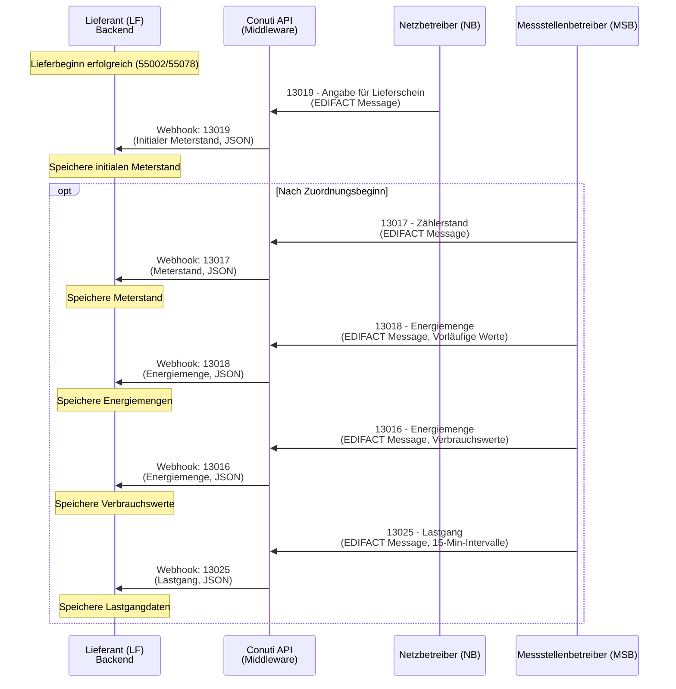
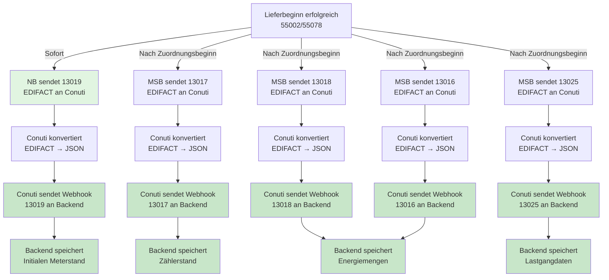

# Meterinformationen empfangen und speichern

## Prozessübersicht

Um Meterinformationen zu empfangen und zu speichern, insbesondere einen initialen Meterstand, sind folgende Prozesse relevant:

1. **13019** - Angabe für Lieferschein (Initialer Meterstand vom NB)
2. **13017** - Zählerstand (Meterstand vom MSB)
3. **13018** - Energiemenge mit vorläufigen Werten (vom MSB)
4. **13016** - Energiemenge mit Verbrauchswerten (vom MSB)
5. **13025** - Lastgang (15-Minuten-Intervalle vom MSB)

## Prozesssequenz



## Prozessfluss



## Nachrichtentypen & Felder

| Nachrichtentyp | Richtung | Prüfi | Beschreibung | Wichtige Felder | Beispiel |
|---|---|---|---|---|---|
| **13019** | NB → LF | 13019 | Angabe für Lieferschein (Initialer Meterstand) | `lokationsId`, `lokationsTyp`, `energieverbrauch[].wert`, `energieverbrauch[].messwertstatus: "ANGABE_FUER_LIEFERSCHEIN"`, `energieverbrauch[].obiskennzahl`, `startdatum`, `enddatum` | `maco-edi-testfiles/inbound/v202404/MSCONS/13019_Testfall1_eingehend.json` |
| **13017** | MSB → LF | 13017 | Zählerstand (Meterstand) | `zaehlernummer`, `lokationsId`, `lokationsTyp: "MELO"`, `energieverbrauch[].wert`, `energieverbrauch[].messwertstatus`, `energieverbrauch[].ablesedatum`, `energieverbrauch[].nutzungszeitpunkt`, `energieverbrauch[].obiskennzahl` | `docs-offline/aufbereitung-und-übermittlung-von-werten-vom-msb-der-marktlokation-rolle-lf-1820159m0.md` |
| **13018** | MSB → LF | 13018 | Energiemenge (Vorläufige Werte) | `lokationsId`, `lokationsTyp`, `energieverbrauch[].wert`, `energieverbrauch[].messwertstatus: "VOLAEUFIGERWERT"`, `startdatum`, `enddatum`, `obiskennzahl` | `docs-offline/aufbereitung-und-übermittlung-von-werten-vom-msb-der-marktlokation-rolle-lf-1820159m0.md` |
| **13016** | MSB → LF | 13016 | Energiemenge (Verbrauchswerte) | `lokationsId`, `lokationsTyp`, `energieverbrauch[].wert`, `energieverbrauch[].messwertstatus: "ERSATZWERT"`, `startdatum`, `enddatum`, `obiskennzahl` | `docs-offline/aufbereitung-und-übermittlung-von-werten-vom-msb-der-marktlokation-rolle-lf-1820159m0.md` |
| **13025** | MSB → LF | 13025 | Lastgang (15-Min-Intervalle) | `lokationsId`, `lokationsTyp`, `energieverbrauch[]` (Array mit vielen Werten), `startdatum`, `enddatum` (pro Wert), `wert`, `obiskennzahl` | `docs-offline/aufbereitung-und-übermittlung-von-werten-vom-msb-der-marktlokation-rolle-lf-1820159m0.md` |

## Schema-Übersicht für alle Events

### Gemeinsame Struktur (Wrapper)

Alle MSCONS-Nachrichten folgen dieser gemeinsamen Struktur:

**Pflichtfelder**:
- `businessKey` (string) - Eindeutiger Business Key
- `dataSource` (enum) - "INBOUND" für eingehende Nachrichten
- `version` (integer) - Schema-Version (typisch: 1)
- `edifactVersion` (integer) - EDIFACT-Version (z.B. 202404, 202510)
- `data` (object) - Enthält `stammdaten`, `transaktionsdaten`, `zusatzdaten`

**Optionale Felder**:
- `processDate` (date-time | null) - Prozessdatum

---

### 13019 - Angabe für Lieferschein (Initialer Meterstand, NB → LF)

**Pflichtfelder**:

**Root-Level**:
- `data.stammdaten.ENERGIEMENGE[]` (array) - Mindestens 1 Element erforderlich
- `data.transaktionsdaten.pruefidentifikator` (string) - "13019"
- `data.transaktionsdaten.sparte` (enum) - "STROM" oder "GAS"
- `data.transaktionsdaten.absender.boTyp` (enum) - "MARKTTEILNEHMER"
- `data.transaktionsdaten.absender.versionStruktur` (string) - "1"
- `data.transaktionsdaten.absender.marktrolle` (enum) - "NB"
- `data.transaktionsdaten.absender.rollencodenummer` (string) - BDEW-Rollencodenummer
- `data.transaktionsdaten.absender.rollencodetyp` (enum) - "BDEW"
- `data.transaktionsdaten.empfaenger.boTyp` (enum) - "MARKTTEILNEHMER"
- `data.transaktionsdaten.empfaenger.versionStruktur` (string) - "1"
- `data.transaktionsdaten.empfaenger.marktrolle` (enum) - "LF"
- `data.transaktionsdaten.empfaenger.rollencodenummer` (string) - BDEW-Rollencodenummer
- `data.transaktionsdaten.empfaenger.rollencodetyp` (enum) - "BDEW"

**ENERGIEMENGE**:
- `boTyp` (enum) - "ENERGIEMENGE"
- `versionStruktur` (string) - "1"
- `lokationsId` (string) - Marktlokations-ID
- `lokationsTyp` (enum) - "MALO" oder "MELO"
- `energieverbrauch[]` (array) - Mindestens 1 Element erforderlich

**energieverbrauch** (Verbrauch):
- `wert` (number) - Meterstandswert
- `messwertstatus` (enum) - **"ANGABE_FUER_LIEFERSCHEIN"** (spezifisch für 13019)
- `obiskennzahl` (string) - OBIS-Kennzahl (z.B. "1-0:1.9.0")
- `startdatum` (date-time) - Startdatum des Zeitraums
- `enddatum` (date-time) - Enddatum des Zeitraums

**Optionale Felder**:

**ENERGIEMENGE**:
- `startdatum` (date-time) - Startdatum auf Energiemenge-Ebene
- `enddatum` (date-time) - Enddatum auf Energiemenge-Ebene
- `fertigstellungsdatum` (date-time)
- `bilanzierungsdatum` (date-time)
- `beginndatum` (date-time)
- `referenzStammdatenmeldungMsb` (string)
- `konfiguration` (string)

**energieverbrauch**:
- `position` (integer) - Position innerhalb der Nachricht
- `wertermittlungsverfahren` (enum)
- `einheit` (enum) - Mengeneinheit
- `type` (enum) - Verbrauchsmengetyp
- `tarifstufe` (enum)
- `nutzungszeitpunkt` (date-time)
- `ausfuehrungszeitpunkt` (date-time)
- `ablesedatum` (date-time)
- `leistungsperiode` (string)
- `statuszusatzinformationen[]` (array) - Array von StatusZusatzInformation

**transaktionsdaten**:
- `datenaustauschreferenz` (string)
- `dokumentennummer` (string)
- `kategorie` (string) - z.B. "Z41" für 13019
- `nachrichtenfunktion` (string) - z.B. "9"
- `nachrichtendatum` (date-time)
- `nachrichtenreferenznummer` (string)
- `typ` (enum) - z.B. "EM"
- `anfrageReferenz` (string)
- `absender.ansprechpartner` (object) - ANSPRECHPARTNER mit nachname, eMailAdresse, rufnummern[]

**zusatzdaten**:
- `zusatzdaten` (object | array) - Zusätzliche Daten (kann leer sein: `{}` oder `[]`)

---

### 13017 - Zählerstand (Meterstand, MSB → LF)

**Pflichtfelder**:

**Root-Level**:
- `data.stammdaten.ZAEHLER[]` (array) - Mindestens 1 Element erforderlich (spezifisch für 13017)
- `data.stammdaten.ENERGIEMENGE[]` (array) - Mindestens 1 Element erforderlich
- `data.transaktionsdaten.pruefidentifikator` (string) - "13017"
- `data.transaktionsdaten.sparte` (enum) - "STROM" oder "GAS"
- `data.transaktionsdaten.absender.boTyp` (enum) - "MARKTTEILNEHMER"
- `data.transaktionsdaten.absender.versionStruktur` (string) - "1"
- `data.transaktionsdaten.absender.rollencodenummer` (string) - BDEW-Rollencodenummer (MSB)
- `data.transaktionsdaten.absender.rollencodetyp` (enum) - "BDEW"
- `data.transaktionsdaten.empfaenger.boTyp` (enum) - "MARKTTEILNEHMER"
- `data.transaktionsdaten.empfaenger.versionStruktur` (string) - "1"
- `data.transaktionsdaten.empfaenger.rollencodenummer` (string) - BDEW-Rollencodenummer (LF)
- `data.transaktionsdaten.empfaenger.rollencodetyp` (enum) - "BDEW"

**ZAEHLER**:
- `boTyp` (enum) - "ZAEHLER"
- `versionStruktur` (string) - "1"
- `zaehlernummer` (string) - Zählernummer
- `sparte` (enum) - "STROM" oder "GAS"

**ENERGIEMENGE**:
- `boTyp` (enum) - "ENERGIEMENGE"
- `versionStruktur` (string) - "1"
- `lokationsId` (string) - Messlokations-ID (typisch MELO)
- `lokationsTyp` (enum) - **"MELO"** (spezifisch für 13017)
- `energieverbrauch[]` (array) - Mindestens 1 Element erforderlich

**energieverbrauch**:
- `wert` (number) - Zählerstandswert
- `messwertstatus` (enum) - **"ABGELESEN"** (typisch für 13017)
- `obiskennzahl` (string) - OBIS-Kennzahl (z.B. "1-1:1.8.0")
- `nutzungszeitpunkt` (date-time) - Zeitpunkt der Nutzung
- `ablesedatum` (date-time) - Datum der Ablesung

**Optionale Felder**:

**ZAEHLER**:
- `zaehlerauspraegung` (enum)
- `zaehlertyp` (enum)
- `tarifart` (enum)
- `zaehlerkonstante` (number)
- `eichungBis` (date-time)
- `zaehlerhersteller` (object) - Geschaeftspartner
- `gateway` (string)
- `fernschaltung` (enum)
- `messwerterfassung` (enum)
- `zaehlertypspezifikation` (object)
- `befestigungsart` (enum)
- `zaehlergroesse` (enum)
- `mengenumwertertyp` (enum)
- `volumenerfassung` (enum)
- `serialnummer` (string)
- `geraetemerkmal` (enum)
- `herstellungsdatum` (date-time)
- `baujahr` (string)
- `messlokationsId` (string)
- `marktlokationsId` (string)

**ENERGIEMENGE**:
- `startdatum` (date-time)
- `enddatum` (date-time)
- `fertigstellungsdatum` (date-time)
- `bilanzierungsdatum` (date-time)
- `beginndatum` (date-time)
- `referenzStammdatenmeldungMsb` (string)
- `konfiguration` (string)

**energieverbrauch**:
- `startdatum` (date-time) - Startdatum (optional bei 13017)
- `enddatum` (date-time) - Enddatum (optional bei 13017)
- `position` (integer)
- `wertermittlungsverfahren` (enum)
- `einheit` (enum)
- `type` (enum)
- `tarifstufe` (enum)
- `ausfuehrungszeitpunkt` (date-time)
- `leistungsperiode` (string)
- `statuszusatzinformationen[]` (array) - z.B. `[{"art": "PLAUSIBILISIERUNGSHINWEIS", "status": "KUNDENSELBSTABLESUNG"}]`

**transaktionsdaten**:
- `datenaustauschreferenz` (string)
- `dokumentennummer` (string)
- `kategorie` (string) - z.B. "7" für 13017
- `nachrichtenfunktion` (string) - z.B. "9"
- `nachrichtendatum` (date-time)
- `nachrichtenreferenznummer` (string)
- `typ` (enum) - z.B. "VL"
- `anfrageReferenz` (string)
- `absender.marktrolle` (enum) - Kann fehlen, aber MSB impliziert
- `absender.gewerbekennzeichnung` (boolean)
- `absender.ansprechpartner` (object)
- `empfaenger.marktrolle` (enum) - Kann fehlen, aber LF impliziert
- `empfaenger.gewerbekennzeichnung` (boolean)

---

### 13018 - Energiemenge (Vorläufige Werte, MSB → LF)

**Pflichtfelder**:

**Root-Level**:
- `data.stammdaten.ENERGIEMENGE[]` (array) - Mindestens 1 Element erforderlich
- `data.transaktionsdaten.pruefidentifikator` (string) - "13018"
- `data.transaktionsdaten.sparte` (enum) - "STROM" oder "GAS"
- `data.transaktionsdaten.absender.boTyp` (enum) - "MARKTTEILNEHMER"
- `data.transaktionsdaten.absender.versionStruktur` (string) - "1"
- `data.transaktionsdaten.absender.rollencodenummer` (string) - BDEW-Rollencodenummer (MSB)
- `data.transaktionsdaten.absender.rollencodetyp` (enum) - "BDEW"
- `data.transaktionsdaten.empfaenger.boTyp` (enum) - "MARKTTEILNEHMER"
- `data.transaktionsdaten.empfaenger.versionStruktur` (string) - "1"
- `data.transaktionsdaten.empfaenger.rollencodenummer` (string) - BDEW-Rollencodenummer (LF)
- `data.transaktionsdaten.empfaenger.rollencodetyp` (enum) - "BDEW"

**ENERGIEMENGE**:
- `boTyp` (enum) - "ENERGIEMENGE"
- `versionStruktur` (string) - "1"
- `lokationsId` (string) - Messlokations-ID
- `lokationsTyp` (enum) - "MELO" (typisch)
- `startdatum` (date-time) - Startdatum auf Energiemenge-Ebene
- `enddatum` (date-time) - Enddatum auf Energiemenge-Ebene
- `energieverbrauch[]` (array) - Mindestens 1 Element erforderlich

**energieverbrauch**:
- `wert` (number) - Energiemengenwert
- `messwertstatus` (enum) - **"VOLAEUFIGERWERT"** (spezifisch für 13018)
- `obiskennzahl` (string) - OBIS-Kennzahl (z.B. "1-0:5.29.0")
- `startdatum` (date-time) - Startdatum des Zeitraums
- `enddatum` (date-time) - Enddatum des Zeitraums

**Optionale Felder**:

**ENERGIEMENGE**:
- `fertigstellungsdatum` (date-time)
- `bilanzierungsdatum` (date-time)
- `beginndatum` (date-time)
- `referenzStammdatenmeldungMsb` (string)
- `konfiguration` (string)

**energieverbrauch**:
- `position` (integer)
- `wertermittlungsverfahren` (enum)
- `einheit` (enum)
- `type` (enum)
- `tarifstufe` (enum)
- `nutzungszeitpunkt` (date-time)
- `ausfuehrungszeitpunkt` (date-time)
- `ablesedatum` (date-time)
- `leistungsperiode` (string)
- `statuszusatzinformationen[]` (array) - z.B. `[{"art": "KORREKTURGRUND", "status": "STATUS_GERAETEWECHSEL"}]`

**transaktionsdaten**:
- `datenaustauschreferenz` (string)
- `dokumentennummer` (string)
- `kategorie` (string) - z.B. "7" für 13018
- `nachrichtenfunktion` (string) - z.B. "9"
- `nachrichtendatum` (date-time)
- `nachrichtenreferenznummer` (string)
- `typ` (enum) - z.B. "TL"
- `anfrageReferenz` (string)
- `absender.marktrolle` (enum)
- `absender.gewerbekennzeichnung` (boolean)
- `absender.ansprechpartner` (object)
- `empfaenger.marktrolle` (enum)
- `empfaenger.gewerbekennzeichnung` (boolean)

---

### 13016 - Energiemenge (Verbrauchswerte, MSB → LF)

**Pflichtfelder**:

**Root-Level**:
- `data.stammdaten.ENERGIEMENGE[]` (array) - Mindestens 1 Element erforderlich
- `data.transaktionsdaten.pruefidentifikator` (string) - "13016" (Hinweis: Dokumentation zeigt manchmal "13027", aber Prüfi ist "13016")
- `data.transaktionsdaten.sparte` (enum) - "STROM" oder "GAS"
- `data.transaktionsdaten.absender.boTyp` (enum) - "MARKTTEILNEHMER"
- `data.transaktionsdaten.absender.versionStruktur` (string) - "1"
- `data.transaktionsdaten.absender.rollencodenummer` (string) - BDEW-Rollencodenummer (MSB)
- `data.transaktionsdaten.absender.rollencodetyp` (enum) - "BDEW"
- `data.transaktionsdaten.empfaenger.boTyp` (enum) - "MARKTTEILNEHMER"
- `data.transaktionsdaten.empfaenger.versionStruktur` (string) - "1"
- `data.transaktionsdaten.empfaenger.rollencodenummer` (string) - BDEW-Rollencodenummer (LF)
- `data.transaktionsdaten.empfaenger.rollencodetyp` (enum) - "BDEW"

**ENERGIEMENGE**:
- `boTyp` (enum) - "ENERGIEMENGE"
- `versionStruktur` (string) - "1"
- `lokationsId` (string) - Marktlokations-ID (typisch MALO)
- `lokationsTyp` (enum) - "MALO" (typisch)
- `energieverbrauch[]` (array) - Mindestens 1 Element erforderlich

**energieverbrauch**:
- `wert` (number) - Verbrauchswert
- `messwertstatus` (enum) - **"ERSATZWERT"** (spezifisch für 13016)
- `obiskennzahl` (string) - OBIS-Kennzahl (z.B. "1-0:1.29.0")
- `startdatum` (date-time) - Startdatum
- `enddatum` (date-time) - Enddatum
- `nutzungszeitpunkt` (date-time) - Zeitpunkt der Nutzung

**Optionale Felder**:

**ENERGIEMENGE**:
- `startdatum` (date-time) - Startdatum auf Energiemenge-Ebene
- `enddatum` (date-time) - Enddatum auf Energiemenge-Ebene
- `fertigstellungsdatum` (date-time)
- `bilanzierungsdatum` (date-time)
- `beginndatum` (date-time)
- `referenzStammdatenmeldungMsb` (string)
- `konfiguration` (string)

**energieverbrauch**:
- `position` (integer)
- `wertermittlungsverfahren` (enum)
- `einheit` (enum)
- `type` (enum)
- `tarifstufe` (enum)
- `ausfuehrungszeitpunkt` (date-time)
- `ablesedatum` (date-time)
- `leistungsperiode` (string) - z.B. "202301" (spezifisch für 13016)
- `statuszusatzinformationen[]` (array)

**transaktionsdaten**:
- `datenaustauschreferenz` (string)
- `dokumentennummer` (string)
- `kategorie` (string) - z.B. "Z28" oder "Z83" für 13016
- `nachrichtenfunktion` (string) - z.B. "9"
- `nachrichtendatum` (date-time)
- `nachrichtenreferenznummer` (string)
- `typ` (enum) - z.B. "EM" oder "TL"
- `anfrageReferenz` (string)
- `absender.marktrolle` (enum)
- `absender.gewerbekennzeichnung` (boolean)
- `absender.ansprechpartner` (object)
- `empfaenger.marktrolle` (enum)
- `empfaenger.gewerbekennzeichnung` (boolean)

---

### 13025 - Lastgang (15-Minuten-Intervalle, MSB → LF)

**Pflichtfelder**:

**Root-Level**:
- `data.stammdaten.ENERGIEMENGE[]` (array) - Mindestens 1 Element erforderlich
- `data.transaktionsdaten.pruefidentifikator` (string) - "13025"
- `data.transaktionsdaten.sparte` (enum) - "STROM" oder "GAS"
- `data.transaktionsdaten.absender.boTyp` (enum) - "MARKTTEILNEHMER"
- `data.transaktionsdaten.absender.versionStruktur` (string) - "1"
- `data.transaktionsdaten.absender.marktrolle` (enum) - **"MSB"** (spezifisch für 13025)
- `data.transaktionsdaten.absender.rollencodenummer` (string) - BDEW-Rollencodenummer (MSB)
- `data.transaktionsdaten.absender.rollencodetyp` (enum) - "BDEW"
- `data.transaktionsdaten.empfaenger.boTyp` (enum) - "MARKTTEILNEHMER"
- `data.transaktionsdaten.empfaenger.versionStruktur` (string) - "1"
- `data.transaktionsdaten.empfaenger.marktrolle` (enum) - **"LF"** (spezifisch für 13025)
- `data.transaktionsdaten.empfaenger.rollencodenummer` (string) - BDEW-Rollencodenummer (LF)
- `data.transaktionsdaten.empfaenger.rollencodetyp` (enum) - "BDEW"

**ENERGIEMENGE**:
- `boTyp` (enum) - "ENERGIEMENGE"
- `versionStruktur` (string) - "1"
- `lokationsId` (string) - Marktlokations-ID (typisch MALO)
- `lokationsTyp` (enum) - "MALO" (typisch)
- `startdatum` (date-time) - Startdatum des gesamten Lastgangs
- `enddatum` (date-time) - Enddatum des gesamten Lastgangs
- `energieverbrauch[]` (array) - **Viele Elemente** (typisch 96 für 24 Stunden à 15 Minuten)

**energieverbrauch** (jedes Element):
- `wert` (number) - Lastgangwert für das Intervall
- `messwertstatus` (enum) - **"ABGELESEN"** (typisch für 13025)
- `obiskennzahl` (string) - OBIS-Kennzahl (z.B. "1-1:3.29.0" für Wirkleistung, "1-1:1.29.0" für Wirkarbeit)
- `startdatum` (date-time) - Startdatum des 15-Minuten-Intervalls
- `enddatum` (date-time) - Enddatum des 15-Minuten-Intervalls

**Optionale Felder**:

**ENERGIEMENGE**:
- `fertigstellungsdatum` (date-time)
- `bilanzierungsdatum` (date-time)
- `beginndatum` (date-time)
- `referenzStammdatenmeldungMsb` (string)
- `konfiguration` (string)

**energieverbrauch** (jedes Element):
- `position` (integer) - Position innerhalb der Nachricht (kann unterschiedlich sein für verschiedene OBIS-Kennzahlen)
- `wertermittlungsverfahren` (enum)
- `einheit` (enum)
- `type` (enum)
- `tarifstufe` (enum)
- `nutzungszeitpunkt` (date-time)
- `ausfuehrungszeitpunkt` (date-time)
- `ablesedatum` (date-time)
- `leistungsperiode` (string)
- `statuszusatzinformationen[]` (array)

**transaktionsdaten**:
- `datenaustauschreferenz` (string)
- `dokumentennummer` (string)
- `kategorie` (string) - z.B. "Z48" für 13025
- `nachrichtenfunktion` (string) - z.B. "9"
- `nachrichtendatum` (date-time)
- `nachrichtenreferenznummer` (string)
- `typ` (enum) - z.B. "TL"
- `anfrageReferenz` (string)
- `absender.gewerbekennzeichnung` (boolean)
- `absender.ansprechpartner` (object)
- `empfaenger.gewerbekennzeichnung` (boolean)

---

### Schema-Quellen

**BO4E-Schema-Definitionen**:
- `Energiemenge`: `maco-api-documentation/_build/bo4e-openapi.min.json` → `components.schemas.Energiemenge` (Zeilen 2476-2546)
- `Verbrauch`: `maco-api-documentation/_build/bo4e-openapi.min.json` → `components.schemas.Verbrauch` (Zeilen 6808-6878)
- `Zaehler`: `maco-api-documentation/_build/bo4e-openapi.min.json` → `components.schemas.Zaehler` (Zeilen 4594+)

**Beispiel-Nachrichten**:
- **13019**: `maco-edi-testfiles/inbound/v202404/MSCONS/13019_Testfall1_eingehend.json`
- **13017**: `maco-edi-testfiles/inbound/v202404/MSCONS/13017_Testfall1_eingehend.json`
- **13018**: `maco-edi-testfiles/inbound/v202404/MSCONS/13018_eingehend_Testfall1.json`
- **13016**: `maco-edi-testfiles/inbound/v202404/MSCONS/13016_eingehend_Testfall1.json`
- **13025**: `maco-edi-testfiles/inbound/v202404/MSCONS/13025_eingehend_Testfall1.json`

**Dokumentation**:
- `docs-offline/aufbereitung-und-übermittlung-von-werten-vom-msb-der-marktlokation-rolle-lf-1820159m0.md` (enthält Beispiele für alle Prozesse)

**Hinweis**: Diese Prozesse verwenden MSCONS-Nachrichten (Metering System Consumption). Schema-Dateien im Format `PI_{ID}.yml` existieren möglicherweise nicht im Standard-Verzeichnis. Die Feldanforderungen basieren auf den BO4E-Schema-Definitionen, Beispiel-Nachrichten und der Dokumentation.

## Beispiel-Nachrichten

### 13019 - Initialer Meterstand (von NB)

**Quelle**: `maco-edi-testfiles/inbound/v202404/MSCONS/13019_Testfall1_eingehend.json`

```json
{
  "businessKey": "<businessKey>",
  "processDate": "<prozessDatum>",
  "dataSource": "INBOUND",
  "version": 1,
  "edifactVersion": 202404,
  "data": {
    "stammdaten": {
      "ENERGIEMENGE": [{
        "boTyp": "ENERGIEMENGE",
        "versionStruktur": "1",
        "lokationsId": "50074561188",
        "lokationsTyp": "MALO",
        "energieverbrauch": [{
          "startdatum": "2023-12-31T23:00:00Z",
          "enddatum": "2024-03-15T23:00:00Z",
          "messwertstatus": "ANGABE_FUER_LIEFERSCHEIN",
          "obiskennzahl": "1-0:1.9.0",
          "wert": 2000,
          "position": 1
        }]
      }]
    },
    "transaktionsdaten": {
      "datenaustauschreferenz": "510029",
      "sparte": "STROM",
      "pruefidentifikator": "13019",
      "absender": {
        "boTyp": "MARKTTEILNEHMER",
        "versionStruktur": "1",
        "marktrolle": "NB",
        "rollencodenummer": "9900321000005",
        "rollencodetyp": "BDEW"
      },
      "empfaenger": {
        "boTyp": "MARKTTEILNEHMER",
        "versionStruktur": "1",
        "marktrolle": "LF",
        "rollencodenummer": "9903790000002",
        "rollencodetyp": "BDEW"
      },
      "dokumentennummer": "621092BGM",
      "kategorie": "Z41",
      "nachrichtenfunktion": "9",
      "nachrichtendatum": "2024-04-01T13:13:00Z",
      "nachrichtenreferenznummer": "621092",
      "typ": "EM"
    },
    "zusatzdaten": {}
  }
}
```

### 13017 - Zählerstand (von MSB)

**Quelle**: `docs-offline/aufbereitung-und-übermittlung-von-werten-vom-msb-der-marktlokation-rolle-lf-1820159m0.md` (Dokumentation zeigt MSB → LF)

**Hinweis**: Die Testdateien in `maco-edi-testfiles/inbound/v202404/MSCONS/13017_Testfall1_eingehend.json` zeigen möglicherweise unterschiedliche Rollenkonfigurationen. Die Dokumentation bestätigt jedoch klar die Richtung MSB → LF.

```json
{
  "businessKey": "<businessKey>",
  "processDate": null,
  "dataSource": "INBOUND",
  "version": 1,
  "edifactVersion": 202510,
  "data": {
    "stammdaten": {
      "ZAEHLER": [{
        "boTyp": "ZAEHLER",
        "versionStruktur": "1",
        "zaehlernummer": "G12345678910",
        "sparte": "STROM"
      }],
      "ENERGIEMENGE": [{
        "boTyp": "ENERGIEMENGE",
        "versionStruktur": "1",
        "lokationsId": "DE0073395252733953513649640711234",
        "lokationsTyp": "MELO",
        "energieverbrauch": [{
          "messwertstatus": "ABGELESEN",
          "statuszusatzinformationen": [{
            "art": "PLAUSIBILISIERUNGSHINWEIS",
            "status": "KUNDENSELBSTABLESUNG"
          }],
          "obiskennzahl": "1-1:1.8.0",
          "wert": 1234567.357,
          "nutzungszeitpunkt": "2024-03-01T23:00:00Z",
          "position": 1,
          "ablesedatum": "2024-03-01T11:00:00Z"
        }]
      }]
    },
    "transaktionsdaten": {
      "datenaustauschreferenz": "141757",
      "sparte": "STROM",
      "pruefidentifikator": "13017",
      "absender": {
        "boTyp": "MARKTTEILNEHMER",
        "versionStruktur": "1",
        "rollencodenummer": "9904079000002",
        "rollencodetyp": "BDEW"
      },
      "empfaenger": {
        "boTyp": "MARKTTEILNEHMER",
        "versionStruktur": "1",
        "rollencodenummer": "9900051000002",
        "rollencodetyp": "BDEW"
      },
      "dokumentennummer": "137826BGM",
      "kategorie": "7",
      "nachrichtenfunktion": "9",
      "nachrichtendatum": "2024-04-01T12:41:00Z",
      "nachrichtenreferenznummer": "137826",
      "typ": "VL",
      "anfrageReferenz": "REF12345678910"
    },
    "zusatzdaten": {}
  }
}
```

## Rolle der Conuti API

Die **Conuti API** (auch MACO APP API) ist die **Middleware** zwischen Ihrem Backend und den Marktteilnehmern (Netzbetreiber NB, Messstellenbetreiber MSB):

- **NB/MSB** senden **EDIFACT-Nachrichten** an Conuti
- **Conuti** konvertiert diese in **JSON-Nachrichten** (BO4E-Format) und sendet sie als **Webhooks** an Ihr Backend
- **Ihr Backend** empfängt **JSON-Nachrichten** über Webhook-Endpunkte
- Sie müssen sich als Backend-Entwickler nur mit der JSON-API beschäftigen, während Conuti die komplexe EDIFACT-Kommunikation übernimmt

**Warum ist Conuti im Diagramm?** Conuti ist die zentrale Schnittstelle, die alle Nachrichten zwischen Marktteilnehmern und Backend routet und transformiert. Alle eingehenden Meterinformationen laufen über Conuti-Webhooks.

## Backend-Implementierung

### 1. Webhook-Handler implementieren

Sie müssen Webhook-Endpunkte für `macoapp-schreiben` implementieren, um eingehende Meterinformationen von Conuti zu empfangen:

```python
# Beispiel-Struktur für Webhook-Handler
@app.post("/webhook/macoapp-schreiben")
async def receive_meter_data(webhook_data: dict):
    pruefi = webhook_data["data"]["transaktionsdaten"]["pruefidentifikator"]
    
    if pruefi == "13019":
        # Initialer Meterstand vom NB
        handle_initial_meter_reading(webhook_data)
    elif pruefi == "13017":
        # Zählerstand vom MSB
        handle_meter_reading(webhook_data)
    elif pruefi == "13018":
        # Vorläufige Energiemenge
        handle_provisional_energy(webhook_data)
    elif pruefi == "13016":
        # Verbrauchswerte
        handle_consumption_values(webhook_data)
    elif pruefi == "13025":
        # Lastgang
        handle_load_profile(webhook_data)
```

### 2. Daten extrahieren und speichern

**Für 13019 (Initialer Meterstand)**:
```python
def handle_initial_meter_reading(data):
    energiemenge = data["data"]["stammdaten"]["ENERGIEMENGE"][0]
    lokations_id = energiemenge["lokationsId"]
    verbrauch = energiemenge["energieverbrauch"][0]
    
    meter_reading = {
        "lokations_id": lokations_id,
        "wert": verbrauch["wert"],
        "obiskennzahl": verbrauch["obiskennzahl"],
        "messwertstatus": verbrauch["messwertstatus"],  # "ANGABE_FUER_LIEFERSCHEIN"
        "startdatum": verbrauch["startdatum"],
        "enddatum": verbrauch["enddatum"],
        "typ": "initial",
        "quelle": "NB",
        "empfangen_am": datetime.now()
    }
    
    # In Datenbank speichern
    save_meter_reading(meter_reading)
```

**Für 13017 (Zählerstand)**:
```python
def handle_meter_reading(data):
    zaehler = data["data"]["stammdaten"]["ZAEHLER"][0]
    energiemenge = data["data"]["stammdaten"]["ENERGIEMENGE"][0]
    verbrauch = energiemenge["energieverbrauch"][0]
    
    meter_reading = {
        "zaehlernummer": zaehler["zaehlernummer"],
        "lokations_id": energiemenge["lokationsId"],
        "wert": verbrauch["wert"],
        "obiskennzahl": verbrauch["obiskennzahl"],
        "messwertstatus": verbrauch["messwertstatus"],  # "ABGELESEN"
        "ablesedatum": verbrauch.get("ablesedatum"),
        "nutzungszeitpunkt": verbrauch["nutzungszeitpunkt"],
        "typ": "zaehlerstand",
        "quelle": "MSB",
        "empfangen_am": datetime.now()
    }
    
    save_meter_reading(meter_reading)
```

### 3. Timing beachten

- **13019**: Kommt direkt nach erfolgreichem Lieferbeginn (55002/55078) vom NB
- **13017, 13018, 13016, 13025**: Kommen nach Zuordnungsbeginn vom MSB

**⚠️ Wichtiger Hinweis**: In der verfügbaren Dokumentation wurden **keine expliziten Timing-Spezifikationen** (z.B. "innerhalb von X Stunden", "unverzüglich", konkrete Fristen) für die Meterinformationen-Prozesse gefunden. Die Dokumentation gibt nur relative Timing-Informationen an:
- "Nach Lieferbeginn" (für 13019)
- "Nach Zuordnungsbeginn" (für 13017, 13018, 13016, 13025)

Für andere Prozesse (z.B. Stammdatenänderungen) wird "unverzüglich" oder "immediate" verwendet, aber dies wurde für die Meterinformationen-Prozesse nicht explizit dokumentiert.

## Discovery-Prozess

- **PROCESS_GRAPH.json**: Verwendet `indexes.by_bdew_id["13019"]`, `["13017"]`, `["13018"]`, `["13016"]`, `["13025"]` zur Dateisuche
- **Gefundene Dokumentation**: 
  - `docs-offline/aufbereitung-und-übermittlung-von-werten-vom-msb-der-marktlokation-rolle-lf-1820159m0.md`
  - `docs-offline/stammdatenänderung-vom-msb-verantwortlich-rolle-lf-3130254f0.md`

## Quellen verifiziert

- **Prozessdokumentation**: `docs-offline/aufbereitung-und-übermittlung-von-werten-vom-msb-der-marktlokation-rolle-lf-1820159m0.md` (gelesen, enthält Beispiele für 13016, 13017, 13018, 13019, 13025)
- **Stammdatenänderung MSB**: `docs-offline/stammdatenänderung-vom-msb-verantwortlich-rolle-lf-3130254f0.md` (gelesen, zeigt Mermaid-Diagramm mit Prozess 13017, 13018)
- **Beispiel 13019**: `maco-edi-testfiles/inbound/v202404/MSCONS/13019_Testfall1_eingehend.json` (gelesen, validiert Struktur)
- **Beispiel 13017**: `maco-edi-testfiles/inbound/v202404/MSCONS/13017_Testfall1_eingehend.json` (gelesen, validiert Struktur)
- **PROCESS_GRAPH.json**: `docs/entry-points/PROCESS_GRAPH.json` → `indexes.by_bdew_id["13019"]`, `["13017"]`, etc. (verwendet für Discovery)

## Wichtige Hinweise

1. **MSCONS-Nachrichten**: Diese Prozesse verwenden MSCONS (Metering System Consumption) Nachrichten, keine standard PI-Nachrichten. Schema-Dateien im Format `PI_{ID}.yml` existieren möglicherweise nicht im Standard-Verzeichnis `maco-api-documentation/macoapp-schreiben/components/requestBodies/PIs/`.

2. **Nachrichtenrichtung**: Alle genannten Prozesse sind **INBOUND** (empfangen vom LF):
   - 13019: NB → LF (Initialer Meterstand) - bestätigt durch Beispiel-Datei `13019_Testfall1_eingehend.json`
   - 13017, 13018, 13016, 13025: MSB → LF (Meterwerte) - bestätigt durch Dokumentation `aufbereitung-und-übermittlung-von-werten-vom-msb-der-marktlokation-rolle-lf-1820159m0.md` und Mermaid-Diagramm in `stammdatenänderung-vom-msb-verantwortlich-rolle-lf-3130254f0.md`

3. **Testdateien**: Die Testdateien in `maco-edi-testfiles/inbound/` können unterschiedliche Rollenkonfigurationen zeigen. Die Dokumentation ist die maßgebliche Quelle für die tatsächliche Nachrichtenrichtung.

4. **Timing-Spezifikationen**: 
   - ⚠️ **Keine expliziten Timing-Spezifikationen gefunden**: In der verfügbaren Dokumentation wurden keine konkreten Fristen (z.B. "innerhalb von X Stunden", "unverzüglich", "innerhalb von X Tagen") für die Meterinformationen-Prozesse dokumentiert.
   - **Relative Timing-Informationen**:
     - **13019**: Kommt "direkt nach erfolgreichem Lieferbeginn" (55002/55078) vom NB
     - **13017, 13018, 13016, 13025**: Kommen "nach Zuordnungsbeginn" vom MSB
   - **Vergleich mit anderen Prozessen**: Für andere Prozesse (z.B. Stammdatenänderungen vom NB) wird "unverzüglich" oder "immediate" verwendet (siehe `docs/kundenanmeldung-produktionsvertrag-solarstrom.md`), aber dies wurde für die Meterinformationen-Prozesse nicht explizit dokumentiert.
   - **Empfehlung**: Implementieren Sie Ihre Webhook-Handler so, dass sie jederzeit eingehende Meterinformationen verarbeiten können, da keine konkreten Fristen spezifiziert sind.

4. **Webhook-Implementierung**: Alle Nachrichten werden über den `macoapp-schreiben` Webhook-Endpunkt empfangen. Der `pruefidentifikator` im `transaktionsdaten`-Objekt identifiziert den Prozess.

5. **Datenstruktur**: Die Nachrichten folgen der BO4E-Struktur mit `stammdaten`, `transaktionsdaten` und `zusatzdaten`.

## Zusammenfassung

Um Meterinformationen zu empfangen und zu speichern:

1. **13019** (NB → LF): Initialer Meterstand für Lieferschein, kommt direkt nach Lieferbeginn
2. **13017** (MSB → LF): Zählerstand, kommt nach Zuordnungsbeginn
3. **Weitere Prozesse**: 13018, 13016, 13025 für Energiemengen und Lastgang

Implementieren Sie Webhook-Handler für diese Prozesse und speichern Sie die Meterinformationen in Ihrer Datenbank.

## Validierungsstatus

**Verifiziert gegen Anti-Hallucination-Regel**:

- ✅ **Discovery**: PROCESS_GRAPH.json verwendet (`indexes.by_bdew_id["13019"]`, etc.)
- ✅ **Quelldokumentation gelesen**: 
  - `docs-offline/aufbereitung-und-übermittlung-von-werten-vom-msb-der-marktlokation-rolle-lf-1820159m0.md` (vollständig gelesen)
  - `docs-offline/stammdatenänderung-vom-msb-verantwortlich-rolle-lf-3130254f0.md` (Mermaid-Diagramm geparst)
- ✅ **Beispiel-Dateien referenziert**: 
  - `maco-edi-testfiles/inbound/v202404/MSCONS/13019_Testfall1_eingehend.json` (gelesen und validiert)
  - `maco-edi-testfiles/inbound/v202404/MSCONS/13017_Testfall1_eingehend.json` (gelesen, Rollenkonfiguration notiert)
- ⚠️ **Schema-Dateien**: Keine `PI_{ID}.yml` Dateien für diese MSCONS-Prozesse gefunden (erwartet, da MSCONS-Nachrichten)
- ⚠️ **Business Rules**: Keine `yaml_output/{ID}.yaml` Dateien für diese Prozesse gefunden (erwartet, da MSCONS-Nachrichten)
- ✅ **Nachrichtenrichtung**: Bestätigt durch Dokumentationstitel und Mermaid-Diagramme
- ✅ **Conuti-Integration**: Conuti wurde zu den Sequenzdiagrammen hinzugefügt, da alle Nachrichten über Conuti laufen (konsistent mit `docs/kundenanmeldung-produktionsvertrag-solarstrom.md` und Visualisierungsregeln)
- ✅ **Alle Quellen zitiert**: Alle verwendeten Dateien sind im Dokument referenziert

**Hinweis**: Diese Prozesse verwenden MSCONS-Nachrichten, die möglicherweise nicht die gleiche Schema-Struktur wie Standard-PI-Nachrichten haben. Die Informationen basieren auf der verfügbaren Dokumentation und Beispiel-Dateien.

**Korrektur**: Conuti wurde nachträglich zu den Sequenzdiagrammen hinzugefügt, da es die zentrale Middleware ist, die alle Nachrichten zwischen Marktteilnehmern und Backend routet und transformiert. Dies ist konsistent mit anderen Dokumentationen (z.B. `docs/kundenanmeldung-produktionsvertrag-solarstrom.md`) und den Visualisierungsregeln, die explizit "Actors (Backend, Conuti, NB, MSB)" fordern.

