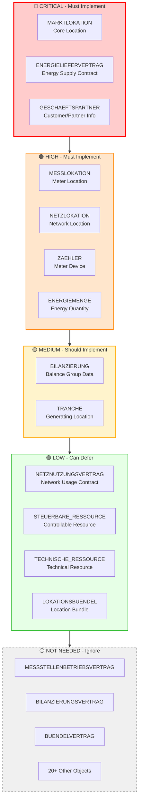
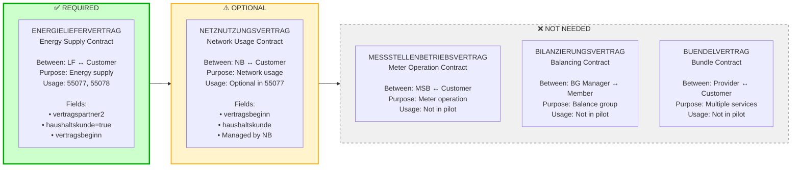

# BO4E Object Scoping for POC: Private Customer Energy Contracts (STROM)

## Executive Summary

This document scopes which BO4E objects are **required**, **optional**, or **not needed** for a POC delivering energy contracts to private customers (retail/consuming primary, feed-in secondary) for STROM (electricity) only.

**Scope**: Based on `conuti-process-overview.csv` pilot processes  
**Customer Type**: Private customers only (haushaltskunde = true)  
**Energy Direction**: Retail (consuming) primary, Feed-in (generating) secondary  
**Energy Sector**: STROM only  
**Message Direction**: Both outbound and inbound

---

## Visual Overview

### BO4E Object Priority Classification

### Contract Types Comparison

**📊 For complete visual diagrams, see `BO4E_OBJECT_SCOPING_VISUAL.md`**

---

## Process Overview

### Core Processes in Scope

| Process Category | Prüfis | Direction | Description |
|-----------------|--------|-----------|-------------|
| **Lieferbeginn** | 55077 | Outbound | Anmeldung Zuordnung (generating) |
| | 55078 | Inbound | Zuordnung bestätigt (generating) |
| | 55080 | Inbound | Zuordnung abgelehnt (generating) |
| **Stammdatenänderung NB** | 55615, 55616, 55617, 55618, 55619, 55620, 55175, 55691 | Inbound | Master data changes from NB |
| **Stammdatenänderung Responses** | 55621, 55622, 55623, 55624, 55625, 55626, 55180, 55227, 55692 | Outbound | Responses to NB changes |
| **Stammdatenänderung MSB** | 55649, 55650, 55651, 55652, 55653 | Inbound | Master data changes from MSB |
| **Stammdatenänderung Responses MSB** | 55654, 55655, 55656, 55657, 55658 | Outbound | Responses to MSB changes |
| **Abrechnungsdaten** | 55672 | Inbound | Bilanzkreisabrechnung |
| | 55673 | Outbound | Response (auto-generated) |
| **MSCONS** | 13017, 13019, 13025 | Inbound | Meter readings and load profiles |

---

## BO4E Object Scoping

### ✅ Required BO4E Objects (Must Implement)

These objects are **mandatory** for the POC to function.

| BO4E Object | Usage | Processes | Priority | Notes |
|-------------|-------|-----------|----------|-------|
| **MARKTLOKATION** | Required | 55077, 55078, 55616, 55650, 55672, 13019, 13025 | **Critical** | Core location object - **schema-required** in 55077 |
| **ENERGIELIEFERVERTRAG** | Required | 55077 (outbound trigger) | **Critical** | Energy supply contract - **REQUIRED for customer registration** (contains customer data in vertragspartner2) **Note**: Schema says "optional" but **practically required** - you cannot register a customer without providing customer information |
| **GESCHAEFTSPARTNER** | Required | Embedded in ENERGIELIEFERVERTRAG | **Critical** | Customer/partner information (embedded as `ENERGIELIEFERVERTRAG[].vertragspartner2[]`) |

**Important Distinction**:
- **Schema-required**: Field is in the `required` array of the schema (e.g., MARKTLOKATION in 55077)
- **Business-required**: Field is not schema-required but **necessary for the business use case** (e.g., ENERGIELIEFERVERTRAG for customer registration - you need customer data)
| **MESSLOKATION** | Required | 55078, 55620, 55653, 55175 | **High** | Meter location - received in responses and Stammdatenänderung |
| **NETZLOKATION** | Required | 55078, 55615, 55649 | **High** | Network location - received in responses and Stammdatenänderung |
| **ZAEHLER** | Required | 13017, 55653 | **High** | Meter device - required for 13017 (Zählerstand) and 55653 (MeLo change from MSB) |
| **ENERGIEMENGE** | Required | 13017, 13019, 13025 | **High** | Energy quantity - required for all MSCONS messages |
| **BILANZIERUNG** | Required | 55616, 55672 | **Medium** | Balance group data - required for Abrechnungsdaten and some Stammdatenänderung |

### ⚠️ Optional BO4E Objects (Can Defer)

These objects are **optional** but may be needed for specific scenarios or future expansion.

| BO4E Object | Usage | Processes | Priority | When Needed |
|-------------|-------|-----------|----------|-------------|
| **TRANCHE** | Optional | 55077, 55078, 55619, 55652 | **Medium** | Only for generating locations (feed-in) - secondary priority |
| **STEUERBARE_RESSOURCE** | Optional | 55618, 55651 | **Low** | Controllable resources - only if customer has controllable devices |
| **TECHNISCHE_RESSOURCE** | Optional | 55617 | **Low** | Technical resources - only if customer has technical resources |
| **NETZNUTZUNGSVERTRAG** | Optional | 55077, 55078, 55616 | **Low** | Network usage contract - optional in Lieferbeginn, present in some Stammdatenänderung |
| **MESSSTELLENBETRIEBSVERTRAG** | Optional | 55620, 55650, 55653 | **Low** | Meter operation contract - used in Stammdatenänderung MeLo (55620) and Stammdatenänderung MSB (55650, 55653) |
| **LOKATIONSBUENDEL** | Optional | 55175 | **Low** | Location bundle structure - only if customer has bundled locations |

### ❌ Not Needed for POC (Can Ignore)

These objects are **not used** in the pilot scope and can be disregarded.

| BO4E Object | Reason |
|-------------|--------|
| **BILANZIERUNGSVERTRAG** | Not used in pilot processes |
| **BUENDELVERTRAG** | Not used in pilot processes |
| **RECHNUNG** | Not in pilot scope |
| **STATUSMITTEILUNG** | Not in pilot scope |
| **HANDELSUNSTIMMIGKEIT** | Not in pilot scope |
| **AUFTRAG** | Not in pilot scope |
| **ANFRAGE** | Not in pilot scope |
| **BERECHNUNGSFORMEL** | Not in pilot scope (follow-up process, not in CSV) |
| **SPERRAUFTRAG** | Not in pilot scope |
| **ANGEBOT** | Not in pilot scope |
| **KOMMUNIKATIONSDATEN** | Not in pilot scope |
| **PREISBLATT** | Not in pilot scope |
| **STATUSBERICHT** | Not in pilot scope |
| **AVIS** | Not in pilot scope |
| **REKLAMATION** | Not in pilot scope |
| **ZAEHLZEITDEFINITION** | Not in pilot scope |
| **SCHALTZEITDEFINITION** | Not in pilot scope |
| **LEISTUNGSKURVENDEFINITION** | Not in pilot scope |
| **AD_HOC_STEUERKANAL** | Not in pilot scope |
| **WERTE_NACH_TYP2** | Not in pilot scope |
| **Ansprechpartner** | Not used as standalone object (embedded in Geschaeftspartner) |
| **Marktteilnehmer** | Used in transaktionsdaten, not in stammdaten |

---

## Contract Type Analysis

### ENERGIELIEFERVERTRAG (Energy Supply Contract) - ✅ REQUIRED FOR CUSTOMER REGISTRATION

**Purpose**: Contract between supplier (LF) and customer  
**Usage**: Primary contract type for Lieferbeginn (55077) - **REQUIRED for customer registration**

**Schema Status**:
- **Technically**: Optional (not in schema `required` array)
- **Practically**: **REQUIRED** for customer registration (contains customer data in `vertragspartner2`)

**Required Fields**:
- `boTyp`: "VERTRAG" (required)
- `versionStruktur`: "1" (required)
- `vertragsart`: "ENERGIELIEFERVERTRAG" (optional but recommended)
- `vertragsbeginn`: date-time (required in transaktionsdaten)
- `vertragspartner2`: array of Geschaeftspartner (customer info)
- `vertragskonditionen.haushaltskunde`: boolean (true for private customers)

**When Used**:
- **Outbound Trigger (55077)**: **MUST send** ENERGIELIEFERVERTRAG with customer data (`vertragspartner2`) for customer registration
  - Example: `START_LIEFERBEGINN_STROMZ16.yml` shows ENERGIELIEFERVERTRAG with customer name, address, etc.
- **Inbound Response (55078)**: ENERGIELIEFERVERTRAG is **NOT** in response (only in trigger)

**Private Customer Specifics**:
- `vertragskonditionen.haushaltskunde` = `true`
- `vertragspartner2` contains private customer data (name1=Nachname, name2=Vorname, anrede=Herr/Frau)
- `sparte` = "STROM"

---

### NETZNUTZUNGSVERTRAG (Network Usage Contract) - ⚠️ OPTIONAL

**Purpose**: Contract between network operator (NB) and customer/supplier  
**Usage**: Optional in Lieferbeginn (55077)  
**Required Fields**:
- `boTyp`: "VERTRAG" (required)
- `versionStruktur`: "1" (required)
- `vertragsart`: "NETZNUTZUNGSVERTRAG" (optional)
- `vertragsbeginn`: date-time (optional)
- `vertragskonditionen.haushaltskunde`: boolean (optional)

**When Used**:
- **Outbound (55077)**: Optional - can be included if network usage contract details are known
- **Inbound (55078)**: Received from NB if provided

**Difference from ENERGIELIEFERVERTRAG**:
- **ENERGIELIEFERVERTRAG**: Between LF (you) and customer - **REQUIRED**
- **NETZNUTZUNGSVERTRAG**: Between NB and customer - **OPTIONAL** (NB manages this)

**Recommendation**: Can be deferred for POC - NB will provide this information if needed.

---

### MESSSTELLENBETRIEBSVERTRAG (Meter Operation Contract) - ⚠️ OPTIONAL

**Purpose**: Contract between meter operator (MSB) and customer/supplier  
**Usage**: Used in Stammdatenänderung processes (55620, 55650)  
**Required Fields**: Same as Vertrag base structure

**When Used**: 
- **55620**: Stammdatenänderung MeLo (inbound from NB)
- **55650**: Stammdatenänderung MSB (inbound from MSB)

**Difference from ENERGIELIEFERVERTRAG**:
- **ENERGIELIEFERVERTRAG**: Energy supply - **REQUIRED** (practically required for customer registration)
- **MESSSTELLENBETRIEBSVERTRAG**: Meter operation - **OPTIONAL** (only if meter operation contract changes)

**Recommendation**: Optional for POC - only needed if handling meter operation contract changes (55620, 55650).

---

### BILANZIERUNGSVERTRAG (Balancing Contract) - ❌ NOT NEEDED

**Purpose**: Contract for balance group management  
**Usage**: Not used in pilot processes  
**Required Fields**: Same as Vertrag base structure

**When Used**: Not in pilot scope

**Difference from ENERGIELIEFERVERTRAG**:
- **ENERGIELIEFERVERTRAG**: Energy supply - **REQUIRED**
- **BILANZIERUNGSVERTRAG**: Balance group - **NOT IN SCOPE**

**Recommendation**: Can be ignored for POC.

---

### BUENDELVERTRAG (Bundle Contract) - ❌ NOT NEEDED

**Purpose**: Combined contract for multiple services  
**Usage**: Not used in pilot processes  
**Required Fields**: Same as Vertrag base structure

**When Used**: Not in pilot scope

**Difference from ENERGIELIEFERVERTRAG**:
- **ENERGIELIEFERVERTRAG**: Single service (energy supply) - **REQUIRED**
- **BUENDELVERTRAG**: Multiple services bundled - **NOT IN SCOPE**

**Recommendation**: Can be ignored for POC.

---

## COM (Common) Objects Required

These are embedded objects used within BO4E Business Objects:

| COM Object | Used In | Required |
|------------|---------|----------|
| **Adresse** | Geschaeftspartner (vertragspartner2.partneradresse) | ✅ Yes |
| **Vertragskonditionen** | Vertrag (ENERGIELIEFERVERTRAG) | ✅ Yes |
| **Zeitraum** | Vertrag (vertragsbeginn, vertragsende, gueltigkeitszeitraum) | ✅ Yes |
| **EnFG** | Vertrag (optional regulatory info) | ⚠️ Optional |
| **Gemeinderabatt** | Vertragskonditionen (optional municipal discount) | ⚠️ Optional |
| **Menge** | Energiemenge (energy quantity values) | ✅ Yes |
| **Verbrauch** | Energiemenge (consumption data) | ✅ Yes |
| **Zaehlwerk** | Zaehler (meter register) | ✅ Yes |
| **Zaehlzeit** | Zaehler (meter reading time) | ✅ Yes |
| **Lastprofil** | Energiemenge (load profile) | ✅ Yes (for 13025) |
| **MarktlokationsTypisierung** | Marktlokation (location type classification) | ⚠️ Optional |
| **Messlokationszuordnung** | Messlokation (meter location assignment) | ✅ Yes |
| **Netznutzungsabrechnungsdaten** | Bilanzierung (network usage billing data) | ✅ Yes (for 55672) |
| **Produktpaket** | Marktlokation (product package requirements) | ⚠️ Optional |
| **Produkt** | Marktlokation (product details) | ⚠️ Optional |
| **VERWENDUNGSZEITRAUM** | Multiple processes (time period for changes) | ✅ Yes | Used extensively in stammdaten sections: 55615, 55616, 55617, 55618, 55619, 55620, 55650, 55652, 55672, 55691, 55175 |

---

## Process-by-Process BO4E Object Mapping

### 1. Lieferbeginn (55077) - Outbound

**Required Objects** (validated from `START_LIEFERBEGINN.yml` and example `START_LIEFERBEGINN_STROMZ16.yml`):
- ✅ `MARKTLOKATION` (at least 1, **schema-required**)
- ✅ `ENERGIELIEFERVERTRAG` (**practically required** for customer registration - contains customer data in `vertragspartner2`)
  - **Schema**: Technically optional (not in required array)
  - **Business**: **REQUIRED** for customer registration (you need customer name, address, etc.)
  - **Example**: Present in `START_LIEFERBEGINN_STROMZ16.yml` with customer data
- ⚠️ `NETZNUTZUNGSVERTRAG` (optional - present in yaml_output and example)
- ⚠️ `TRANCHE` (optional, only for generating locations - present in yaml_output)

**Note**: `GESCHAEFTSPARTNER` is **embedded** in `ENERGIELIEFERVERTRAG` as `vertragspartner2`, not a separate stammdaten entry. This is where customer information (name, address, etc.) is provided.

**Key Fields**:
- `MARKTLOKATION[].marktlokationsId` (required)
- `MARKTLOKATION[].sparte` = "STROM" (required)
- `MARKTLOKATION[].energierichtung` = "AUSSP" (consuming) or "EINSP" (generating)
- `ENERGIELIEFERVERTRAG[].vertragspartner2[]` (customer info)
- `ENERGIELIEFERVERTRAG[].vertragskonditionen.haushaltskunde` = true

---

### 2. Lieferbeginn Response (55078) - Inbound

**Required Objects** (validated from `yaml_output/55078.yaml`):
- ✅ `MARKTLOKATION` (confirmed location - **always present**)
- ✅ `MESSLOKATION` (meter locations - **always present**)
- ✅ `NETZLOKATION` (network locations - **always present**)
- ⚠️ `NETZNUTZUNGSVERTRAG` (optional - present in schema)
- ⚠️ `TRANCHE` (optional - if generating location)
- ⚠️ `STEUERBARE_RESSOURCE` (optional - if controllable resources)
- ⚠️ `TECHNISCHE_RESSOURCE` (optional - if technical resources)

**Note**: `ENERGIELIEFERVERTRAG` is **NOT** in 55078 response - it's only in the outbound trigger (55077).

**Key Fields**:
- `MARKTLOKATION[].marktlokationsId` (confirmed)
- `MARKTLOKATION[].marktrollen[]` (assigned market roles)

---

### 3. Stammdatenänderung NB (55615, 55616, etc.) - Inbound

**Required Objects** (validated from `yaml_output/{ID}.yaml`):
- **55615**: ✅ `NETZLOKATION`, ✅ `VERWENDUNGSZEITRAUM` (validated)
- **55616**: ✅ `MARKTLOKATION`, ✅ `BILANZIERUNG`, ✅ `NETZNUTZUNGSVERTRAG`, ✅ `VERWENDUNGSZEITRAUM` (validated)
- **55617**: ✅ `TECHNISCHE_RESSOURCE`, ✅ `VERWENDUNGSZEITRAUM` (validated)
- **55618**: ✅ `STEUERBARE_RESSOURCE`, ✅ `VERWENDUNGSZEITRAUM` (validated)
- **55619**: ✅ `TRANCHE`, ✅ `VERWENDUNGSZEITRAUM` (validated)
- **55620**: ✅ `MESSLOKATION`, ✅ `MESSSTELLENBETRIEBSVERTRAG`, ✅ `VERWENDUNGSZEITRAUM` (validated)
- **55175**: ✅ `MARKTLOKATION`, ✅ `LOKATIONSBUENDEL`, ✅ `NETZLOKATION`, ✅ `STEUERBARE_RESSOURCE`, ✅ `VERWENDUNGSZEITRAUM`, ✅ `MESSLOKATION`, ✅ `TECHNISCHE_RESSOURCE` (validated)
- **55691**: ✅ `MARKTLOKATION`, ✅ `VERWENDUNGSZEITRAUM` (validated)

---

### 4. Stammdatenänderung MSB (55649, 55650, etc.) - Inbound

**Required Objects** (validated from `yaml_output/{ID}.yaml`):
- **55649**: ✅ `NETZLOKATION` (validated)
- **55650**: ✅ `MARKTLOKATION`, ✅ `MESSSTELLENBETRIEBSVERTRAG`, ✅ `VERWENDUNGSZEITRAUM` (validated)
- **55651**: ✅ `STEUERBARE_RESSOURCE`, ✅ `VERWENDUNGSZEITRAUM` (validated)
- **55652**: ✅ `TRANCHE`, ✅ `VERWENDUNGSZEITRAUM` (validated)
- **55653**: ✅ `MESSLOKATION`, ✅ `ZAEHLER`, ✅ `MESSSTELLENBETRIEBSVERTRAG`, ✅ `VERWENDUNGSZEITRAUM` (validated from schema and example)

---

### 5. Abrechnungsdaten Bilanzkreisabrechnung (55672) - Inbound

**Required Objects** (validated from `yaml_output/55672.yaml`):
- ✅ `BILANZIERUNG`, ✅ `TRANCHE`, ✅ `MARKTLOKATION`, ✅ `VERWENDUNGSZEITRAUM` (validated)
- ✅ `MARKTLOKATION` (for read operation)

**Key Fields**:
- `BILANZIERUNG[].lastprofile[]` (load profiles)
- `BILANZIERUNG[].bilanzierungsbeginn` / `bilanzierungsende` (period)

---

### 6. MSCONS (13017, 13019, 13025) - Inbound

**Required Objects** (validated from example messages `maco-edi-testfiles/inbound/v202404/MSCONS/`):
- **13017**: ✅ `ZAEHLER`, ✅ `ENERGIEMENGE` (both confirmed in example)
- **13019**: ✅ `ENERGIEMENGE` (confirmed in example, **no ZAEHLER**)
- **13025**: ✅ `ENERGIEMENGE` (confirmed in example with multiple energieverbrauch entries, **no ZAEHLER**)

**Key Fields**:
- `ZAEHLER[].zaehlernummer` (meter number)
- `ENERGIEMENGE[].lokationsId` (MALO or MELO)
- `ENERGIEMENGE[].energieverbrauch[]` (consumption values)
- `ENERGIEMENGE[].energieverbrauch[].wert` (meter reading value)
- `ENERGIEMENGE[].energieverbrauch[].obiskennzahl` (OBIS identifier)

---

## Implementation Priority

### Phase 1: Core Functionality (MVP)

**Must Implement**:
1. ✅ `MARKTLOKATION` - Core location object (schema-required)
2. ✅ `ENERGIELIEFERVERTRAG` - **REQUIRED for customer registration** (contains customer data)
3. ✅ `GESCHAEFTSPARTNER` - Customer information (embedded in ENERGIELIEFERVERTRAG.vertragspartner2)
4. ✅ `MESSLOKATION` - Meter locations (for responses)
5. ✅ `NETZLOKATION` - Network locations (for responses)
6. ✅ `ZAEHLER` - Meter devices (for MSCONS)
7. ✅ `ENERGIEMENGE` - Energy quantities (for MSCONS)

**COM Objects**:
- ✅ `Adresse` (for Geschaeftspartner)
- ✅ `Vertragskonditionen` (for Vertrag)
- ✅ `Zeitraum` (for dates)
- ✅ `Menge` (for Energiemenge)
- ✅ `Verbrauch` (for Energiemenge)
- ✅ `Zaehlwerk` (for Zaehler)
- ✅ `Zaehlzeit` (for Zaehler)

---

### Phase 2: Extended Functionality

**Should Implement**:
1. ⚠️ `TRANCHE` - For generating locations (feed-in)
2. ⚠️ `BILANZIERUNG` - For Abrechnungsdaten (55672)
3. ⚠️ `NETZNUTZUNGSVERTRAG` - Optional contract type
4. ⚠️ `STEUERBARE_RESSOURCE` - If controllable devices
5. ⚠️ `TECHNISCHE_RESSOURCE` - If technical resources

**COM Objects**:
- ⚠️ `Lastprofil` (for 13025 load profiles)
- ⚠️ `Netznutzungsabrechnungsdaten` (for Bilanzierung)
- ⚠️ `MarktlokationsTypisierung` (for Marktlokation)
- ⚠️ `Messlokationszuordnung` (for Messlokation)

---

### Phase 3: Nice-to-Have (Can Defer)

**Can Defer**:
1. ⚠️ `LOKATIONSBUENDEL` - Only if bundled locations
2. ⚠️ `MESSSTELLENBETRIEBSVERTRAG` - Not in pilot scope
3. ⚠️ `EnFG` - Optional regulatory info
4. ⚠️ `Gemeinderabatt` - Optional municipal discount
5. ⚠️ `Produktpaket` - Optional product packages

---

## Summary Table: BO4E Objects by Priority

| Priority | BO4E Object | Required For | Can Defer? |
|----------|-------------|--------------|------------|
| **Critical** | MARKTLOKATION | All processes | ❌ No |
| **Critical** | ENERGIELIEFERVERTRAG | 55077 (Lieferbeginn trigger) | ❌ No - **Required for customer registration** |
| **Critical** | GESCHAEFTSPARTNER | Embedded in Vertrag | ❌ No |
| **High** | MESSLOKATION | Responses, MSCONS | ❌ No |
| **High** | NETZLOKATION | Stammdatenänderung | ❌ No |
| **High** | ZAEHLER | MSCONS 13017 | ❌ No |
| **High** | ENERGIEMENGE | MSCONS 13017/13019/13025 | ❌ No |
| **Medium** | BILANZIERUNG | Abrechnungsdaten 55672 | ⚠️ Yes (Phase 2) |
| **Medium** | TRANCHE | Generating locations | ⚠️ Yes (Phase 2) |
| **Low** | NETZNUTZUNGSVERTRAG | Optional in 55077 | ⚠️ Yes (Phase 2) |
| **Low** | STEUERBARE_RESSOURCE | Stammdatenänderung | ⚠️ Yes (Phase 2) |
| **Low** | TECHNISCHE_RESSOURCE | Stammdatenänderung | ⚠️ Yes (Phase 2) |
| **Low** | LOKATIONSBUENDEL | Stammdatenänderung 55175 | ⚠️ Yes (Phase 3) |
| **Low** | MESSSTELLENBETRIEBSVERTRAG | 55620, 55650 | ⚠️ Used in Stammdatenänderung MeLo (55620) and MSB (55650) |
| **Not Needed** | BILANZIERUNGSVERTRAG | Not in scope | ✅ Ignore |
| **Not Needed** | BUENDELVERTRAG | Not in scope | ✅ Ignore |
| **Not Needed** | All other BO objects | Not in scope | ✅ Ignore |

---

## Field-Level Scoping

### MARKTLOKATION - Required Fields

**Minimum Required** (for POC):
- `boTyp`: "MARKTLOKATION" (required)
- `versionStruktur`: "1" (required)
- `marktlokationsId`: string (required)
- `sparte`: "STROM" (required)
- `energierichtung`: "AUSSP" or "EINSP" (required)

**Optional but Recommended**:
- `marktrollen[]` (market roles)
- `marktlokationsTyp[]` (location type classifications)

**Can Defer**:
- `erforderlichesProduktpaket[]` (product package requirements)
- `foerderungsLand` (promotion country)
- All other optional fields

---

### ENERGIELIEFERVERTRAG - Required Fields

**Minimum Required** (for POC):
- `boTyp`: "VERTRAG" (required)
- `versionStruktur`: "1" (required)
- `vertragsart`: "ENERGIELIEFERVERTRAG" (recommended)
- `vertragspartner2[]`: array (customer info)
  - `name1`: string (surname for private customers)
  - `name2`: string (first name for private customers)
  - `anrede`: string (Herr/Frau)
  - `partneradresse`: Adresse object
- `vertragskonditionen.haushaltskunde`: true (for private customers)

**Optional but Recommended**:
- `vertragsbeginn`: date-time (in transaktionsdaten)
- `vertragsende`: date-time
- `sparte`: "STROM"

**Can Defer**:
- `vertragsnummer` (contract number)
- `beschreibung` (description)
- `vertragskonditionen.*` (other contract conditions)
- `enFG[]` (regulatory info)
- All other optional fields

---

## Recommendations

### For MVP/POC:

1. **Start with Critical Objects**: Implement MARKTLOKATION, ENERGIELIEFERVERTRAG, GESCHAEFTSPARTNER first
2. **Add Response Objects**: Implement MESSLOKATION, NETZLOKATION for handling responses
3. **Add MSCONS Objects**: Implement ZAEHLER, ENERGIEMENGE for meter readings
4. **Defer Optional Objects**: TRANCHE, STEUERBARE_RESSOURCE, TECHNISCHE_RESSOURCE can be added later
5. **Ignore Not-Needed Objects**: Don't implement objects not in pilot scope

### For Production:

1. **Add Phase 2 Objects**: Implement BILANZIERUNG, TRANCHE, NETZNUTZUNGSVERTRAG
2. **Add Optional Fields**: Implement optional fields in required objects
3. **Add Phase 3 Objects**: Add LOKATIONSBUENDEL if needed
4. **Monitor Usage**: Track which optional objects are actually used in production

---

## Schema References

- **BO4E Schema**: `bo4e-schema/schemas/v1/bo/`
- **COM Schema**: `bo4e-schema/schemas/v1/com/`
- **Stammdaten Schema**: `cdoc-schema/schemas/Stammdaten.schema.json`
- **Process Schemas**: `maco-api-documentation/macoapp-schreiben/components/requestBodies/PIs/PI_{ID}.yml`
- **Business Rules**: `maco-api-documentation/pythons/createPiFromTemplater/templater/yaml_output/{ID}.yaml`
- **Examples**: `maco-edi-testfiles/outbound/v202510/` (JSON) and `maco-edi-testfiles/inbound/v202510/` (EDI) (⚠️ ALWAYS use v202510)

---

## Validation Summary

This scoping document has been **validated against actual documentation**:

### Validation Sources Used:
- ✅ `maco-api-documentation/macoapp-trigger/components/schemas/START_LIEFERBEGINN.yml` - Trigger event schema
- ✅ `maco-api-documentation/pythons/createPiFromTemplater/templater/yaml_output/{ID}.yaml` - Business rules (55077, 55078, 55615, 55616, 55620, 55672)
- ✅ `maco-api-documentation/macoapp-schreiben/components/requestBodies/PIs/PI_{ID}.yml` - Process schemas
- ✅ `maco-edi-testfiles/inbound/v202510/` or `v202604/` - MSCONS EDI format examples (⚠️ Use v202510/v202604, NOT v202404. Inbound messages are EDI format, not JSON)

### Key Validations:
1. ✅ **55077**: Confirmed MARKTLOKATION (required), ENERGIELIEFERVERTRAG (optional in trigger schema), TRANCHE (optional), NETZNUTZUNGSVERTRAG (optional)
2. ✅ **55078**: Confirmed MARKTLOKATION, MESSLOKATION, NETZLOKATION (all present), but **ENERGIELIEFERVERTRAG is NOT in response** (only in trigger)
3. ✅ **55615**: Confirmed NETZLOKATION, VERWENDUNGSZEITRAUM
4. ✅ **55616**: Confirmed MARKTLOKATION, BILANZIERUNG, NETZNUTZUNGSVERTRAG, VERWENDUNGSZEITRAUM all present
5. ✅ **55617**: Confirmed TECHNISCHE_RESSOURCE, VERWENDUNGSZEITRAUM
6. ✅ **55618**: Confirmed STEUERBARE_RESSOURCE, VERWENDUNGSZEITRAUM
7. ✅ **55619**: Confirmed TRANCHE, VERWENDUNGSZEITRAUM
8. ✅ **55620**: Confirmed MESSLOKATION, MESSSTELLENBETRIEBSVERTRAG, VERWENDUNGSZEITRAUM
9. ✅ **55650**: Confirmed MARKTLOKATION, MESSSTELLENBETRIEBSVERTRAG, VERWENDUNGSZEITRAUM
10. ✅ **55651**: Confirmed STEUERBARE_RESSOURCE, VERWENDUNGSZEITRAUM
11. ✅ **55652**: Confirmed TRANCHE, VERWENDUNGSZEITRAUM
12. ✅ **55672**: Confirmed BILANZIERUNG, TRANCHE, MARKTLOKATION, VERWENDUNGSZEITRAUM
13. ✅ **55691**: Confirmed MARKTLOKATION, VERWENDUNGSZEITRAUM
14. ✅ **55175**: Confirmed MARKTLOKATION, LOKATIONSBUENDEL, NETZLOKATION, STEUERBARE_RESSOURCE, VERWENDUNGSZEITRAUM, MESSLOKATION, TECHNISCHE_RESSOURCE
15. ✅ **55653**: Confirmed MESSLOKATION, ZAEHLER, MESSSTELLENBETRIEBSVERTRAG, VERWENDUNGSZEITRAUM (from `docs-offline/trigger-events-14016919e0.md` PI_55653 schema and example `maco-edi-testfiles/outbound/v202510/utilmd/55653/1.json`)
16. ✅ **13017**: Confirmed ZAEHLER and ENERGIEMENGE both present (from v202404 JSON examples - note: actual inbound format is EDI in v202510/v202604)
17. ✅ **13019**: Confirmed ENERGIEMENGE present, **ZAEHLER NOT present** (from v202404 JSON examples - note: actual inbound format is EDI in v202510/v202604)
18. ✅ **13025**: Confirmed ENERGIEMENGE present, **ZAEHLER NOT present** (from v202404 JSON examples - note: actual inbound format is EDI in v202510/v202604)

### Corrections Made:
- ❌ Removed ENERGIELIEFERVERTRAG from 55078 (not in response)
- ✅ Added MESSSTELLENBETRIEBSVERTRAG to optional (used in 55620, 55650)
- ✅ Added VERWENDUNGSZEITRAUM to COM objects (extensively used across many processes)
- ✅ Updated 55175 to show all 7 objects (was only showing LOKATIONSBUENDEL)
- ✅ Updated 55650 to show MESSSTELLENBETRIEBSVERTRAG and VERWENDUNGSZEITRAUM (was only showing MARKTLOKATION)
- ✅ Added VERWENDUNGSZEITRAUM to all Stammdatenänderung processes (55615-55620, 55650-55652, 55672, 55691, 55175)
- ✅ Clarified ZAEHLER only in 13017, not 13019/13025
- ✅ Added BILANZIERUNG to 55616 (present in schema)
- ✅ Clarified GESCHAEFTSPARTNER is embedded in ENERGIELIEFERVERTRAG, not separate stammdaten entry
- ✅ Updated MSCONS example references to note v202510/v202604 EDI format (not v202404 JSON)

---

## Next Steps

1. ✅ Review this scoping document
2. ✅ Prioritize BO4E objects for implementation
3. ✅ Start with Critical objects (Phase 1)
4. ✅ Test with pilot processes
5. ✅ Add Phase 2 objects as needed
6. ✅ Monitor and adjust based on actual usage
