# BO4E Object Scoping - Visual Diagrams

## Important Distinction

**Processes vs BO4E Objects**:
- **Processes** (like "Lieferbeginn", Prüfi 55077, 55078, etc.) are **business processes** - they are NOT BO4E objects
- **BO4E Objects** (like MARKTLOKATION, ENERGIELIEFERVERTRAG, GESCHAEFTSPARTNER) are **data structures** used within process messages
- Processes **USE** BO4E objects in their `stammdaten` sections

**Example**:
- Process: `55077` (Lieferbeginn) - This is a process identifier
- BO4E Objects used in 55077: `MARKTLOKATION` (schema-required), `ENERGIELIEFERVERTRAG` (business-required for customer registration) - These are BO4E objects

**Important**: 
- `ENERGIELIEFERVERTRAG` is **technically optional** in the schema (not in `required` array)
- But **practically required** for customer registration (contains customer data in `vertragspartner2`)
- Example `START_LIEFERBEGINN_STROMZ16.yml` shows ENERGIELIEFERVERTRAG with customer information

---

## 1. BO4E Object Overview - Priority Classification

```mermaid
graph TB
    subgraph CRITICAL["🔴 CRITICAL - Must Implement"]
        ML[MARKTLOKATION<br/>Core Location]
        ELV[ENERGIELIEFERVERTRAG<br/>Energy Supply Contract]
        GP[GESCHAEFTSPARTNER<br/>Customer/Partner Info]
    end
    
    subgraph HIGH["🟠 HIGH - Must Implement"]
        MELO[MESSLOKATION<br/>Meter Location]
        NELO[NETZLOKATION<br/>Network Location]
        ZAEHLER[ZAEHLER<br/>Meter Device]
        EM[ENERGIEMENGE<br/>Energy Quantity]
    end
    
    subgraph MEDIUM["🟡 MEDIUM - Should Implement"]
        BIL[BILANZIERUNG<br/>Balance Group Data]
        TR[TRANCHE<br/>Generating Location]
    end
    
    subgraph LOW["🟢 LOW - Can Defer"]
        NUV[NETZNUTZUNGSVERTRAG<br/>Network Usage Contract]
        SR[STEUERBARE_RESSOURCE<br/>Controllable Resource]
        TR2[TECHNISCHE_RESSOURCE<br/>Technical Resource]
        LB[LOKATIONSBUENDEL<br/>Location Bundle]
        MSBV[MESSSTELLENBETRIEBSVERTRAG<br/>Meter Operation Contract<br/>Used in 55620, 55650]
    end
    
    subgraph NOTNEEDED["⚪ NOT NEEDED - Ignore"]
        BILV[BILANZIERUNGSVERTRAG]
        BUV[BUENDELVERTRAG]
        OTHER[20+ Other Objects]
    end
    
    CRITICAL --> HIGH
    HIGH --> MEDIUM
    MEDIUM --> LOW
    LOW --> NOTNEEDED
    
    style CRITICAL fill:#ffcccc,stroke:#ff0000,stroke-width:3px
    style HIGH fill:#ffe6cc,stroke:#ff8800,stroke-width:2px
    style MEDIUM fill:#fff4cc,stroke:#ffaa00,stroke-width:2px
    style LOW fill:#e6ffe6,stroke:#00aa00,stroke-width:1px
    style NOTNEEDED fill:#f0f0f0,stroke:#666666,stroke-width:1px,stroke-dasharray: 5 5
```



---

## 2. Process Flow with BO4E Objects

```mermaid
sequenceDiagram
    participant Backend
    participant Conuti
    participant NB as Network Operator
    participant MSB as Meter Operator
    
    Note over Backend: Phase 1: Lieferbeginn (55077)
    Backend->>Conuti: START_LIEFERBEGINN<br/>📦 MARKTLOKATION<br/>📦 ENERGIELIEFERVERTRAG<br/>(with GESCHAEFTSPARTNER)
    Conuti->>NB: EDIFACT 55077
    
    alt Success (55078)
        NB->>Conuti: EDIFACT 55078
        Conuti->>Backend: Webhook 55078<br/>📦 MARKTLOKATION (confirmed)<br/>📦 MESSLOKATION<br/>📦 NETZLOKATION<br/>⚠️ TRANCHE (if generating)
    else Rejection (55080)
        NB->>Conuti: EDIFACT 55080
        Conuti->>Backend: Webhook 55080<br/>📦 MARKTLOKATION (rejected)
    end
    
    Note over Backend: Phase 2: Stammdatenänderung (NB)
    NB->>Conuti: EDIFACT 55616 (MaLo change)
    Conuti->>Backend: Webhook 55616<br/>📦 MARKTLOKATION (updated)
    
    NB->>Conuti: EDIFACT 55620 (MeLo change)
    Conuti->>Backend: Webhook 55620<br/>📦 MESSLOKATION (updated)
    
    NB->>Conuti: EDIFACT 55615 (NeLo change)
    Conuti->>Backend: Webhook 55615<br/>📦 NETZLOKATION (updated)
    
    Note over Backend: Phase 3: Stammdatenänderung (MSB)
    MSB->>Conuti: EDIFACT 55650 (MaLo change)
    Conuti->>Backend: Webhook 55650<br/>📦 MARKTLOKATION (updated)<br/>📦 MESSSTELLENBETRIEBSVERTRAG
    
    MSB->>Conuti: EDIFACT 55653 (MeLo change)
    Conuti->>Backend: Webhook 55653<br/>📦 MESSLOKATION (updated)<br/>📦 ZAEHLER<br/>📦 MESSSTELLENBETRIEBSVERTRAG (opt)
    
    Note over Backend: Phase 4: Abrechnungsdaten (55672)
    NB->>Conuti: EDIFACT 55672
    Conuti->>Backend: Webhook 55672<br/>📦 BILANZIERUNG<br/>📦 MARKTLOKATION (for read)
    
    Note over Backend: Phase 5: MSCONS (Meter Readings)
    MSB->>Conuti: EDIFACT 13017 (Zählerstand)
    Conuti->>Backend: Webhook 13017<br/>📦 ZAEHLER<br/>📦 ENERGIEMENGE
    
    MSB->>Conuti: EDIFACT 13019 (Energiemenge)
    Conuti->>Backend: Webhook 13019<br/>📦 ENERGIEMENGE
    
    MSB->>Conuti: EDIFACT 13025 (Lastgang)
    Conuti->>Backend: Webhook 13025<br/>📦 ENERGIEMENGE (with Lastprofil)
```



---

## 3. Contract Types Comparison

```mermaid
graph LR
    subgraph REQUIRED["✅ REQUIRED"]
        ELV[ENERGIELIEFERVERTRAG<br/>Energy Supply Contract<br/><br/>Between: LF ↔ Customer<br/>Purpose: Energy supply<br/>Usage: 55077, 55078<br/><br/>Fields:<br/>• vertragspartner2<br/>• haushaltskunde=true<br/>• vertragsbeginn]
    end
    
    subgraph OPTIONAL["⚠️ OPTIONAL"]
        NUV[NETZNUTZUNGSVERTRAG<br/>Network Usage Contract<br/><br/>Between: NB ↔ Customer<br/>Purpose: Network usage<br/>Usage: Optional in 55077<br/><br/>Fields:<br/>• vertragsbeginn<br/>• haushaltskunde<br/>• Managed by NB]
    end
    
    subgraph NOTNEEDED["❌ NOT NEEDED"]
        MSBV[MESSSTELLENBETRIEBSVERTRAG<br/>Meter Operation Contract<br/><br/>Between: MSB ↔ Customer<br/>Purpose: Meter operation<br/>Usage: Not in pilot]
        
        BILV[BILANZIERUNGSVERTRAG<br/>Balancing Contract<br/><br/>Between: BG Manager ↔ Member<br/>Purpose: Balance group<br/>Usage: Not in pilot]
        
        BUV[BUENDELVERTRAG<br/>Bundle Contract<br/><br/>Between: Provider ↔ Customer<br/>Purpose: Multiple services<br/>Usage: Not in pilot]
    end
    
    REQUIRED --> OPTIONAL
    OPTIONAL --> NOTNEEDED
    
    style REQUIRED fill:#ccffcc,stroke:#00aa00,stroke-width:3px
    style OPTIONAL fill:#fff4cc,stroke:#ffaa00,stroke-width:2px
    style NOTNEEDED fill:#f0f0f0,stroke:#666666,stroke-width:1px,stroke-dasharray: 5 5
```



---

## 4. BO4E Objects Used by Process Category

**Validated**: Based on actual `yaml_output/{ID}.yaml` and example messages.

```mermaid
mindmap
  root((BO4E Objects<br/>in stammdaten))
    Lieferbeginn<br/>55077 Outbound Trigger
      MARKTLOKATION required
      ENERGIELIEFERVERTRAG<br/>required for customer reg
      TRANCHE optional
      NETZNUTZUNGSVERTRAG optional
    Lieferbeginn Response<br/>55078 Inbound
      MARKTLOKATION
      MESSLOKATION
      NETZLOKATION
      TRANCHE optional
      NETZNUTZUNGSVERTRAG optional
      STEUERBARE_RESSOURCE optional
      TECHNISCHE_RESSOURCE optional
    Stammdatenänderung NB<br/>55615/55616/55617/55618/55619/55620/55175/55691
      MARKTLOKATION 55616, 55175, 55691
      NETZLOKATION 55615, 55175
      MESSLOKATION 55620, 55175
      BILANZIERUNG 55616
      NETZNUTZUNGSVERTRAG 55616
      MESSSTELLENBETRIEBSVERTRAG 55620
      TECHNISCHE_RESSOURCE 55617, 55175
      STEUERBARE_RESSOURCE 55618, 55175
      TRANCHE 55619
      LOKATIONSBUENDEL 55175
      VERWENDUNGSZEITRAUM<br/>(COM object) all
    Stammdatenänderung MSB<br/>55649/55650/55651/55652/55653
      NETZLOKATION 55649
      MARKTLOKATION 55650
      STEUERBARE_RESSOURCE 55651
      TRANCHE 55652
      MESSLOKATION 55653
      ZAEHLER 55653
      MESSSTELLENBETRIEBSVERTRAG 55650/55653
      VERWENDUNGSZEITRAUM<br/>(COM object) all
    Abrechnungsdaten<br/>55672 Inbound
      BILANZIERUNG
      MARKTLOKATION
      TRANCHE
    MSCONS<br/>13017/13019/13025
      ZAEHLER 13017 + 55653
      ENERGIEMENGE all
```

---

## 5. Implementation Phases


---

## 6. BO4E Object Dependencies


---

## 7. Process-to-BO4E Object Mapping Matrix

**Note**: Processes (Prüfis) are on the left, BO4E Objects are on the right.  
**Validated against**: `yaml_output/{ID}.yaml`, `PI_{ID}.yml`, and example messages.

```mermaid
graph TB
    subgraph Processes["Processes (Prüfis)"]
        P1[55077 Lieferbeginn<br/>Outbound Trigger]
        P2[55078 Success<br/>Inbound Response]
        P3[55616 MaLo Change<br/>Inbound]
        P4[55620 MeLo Change<br/>Inbound]
        P5[55615 NeLo Change<br/>Inbound]
        P6[55672 Abrechnungsdaten<br/>Inbound]
        P7[13017 Zählerstand<br/>Inbound MSCONS]
        P8[13019 Energiemenge<br/>Inbound MSCONS]
        P9[13025 Lastgang<br/>Inbound MSCONS]
    end
    
    subgraph Objects["BO4E Objects in stammdaten"]
        O1[MARKTLOKATION]
        O2[ENERGIELIEFERVERTRAG]
        O3[GESCHAEFTSPARTNER<br/>embedded in O2]
        O4[MESSLOKATION]
        O5[NETZLOKATION]
        O6[ZAEHLER]
        O7[ENERGIEMENGE]
        O8[BILANZIERUNG]
        O9[TRANCHE]
        O10[NETZNUTZUNGSVERTRAG]
        O11[STEUERBARE_RESSOURCE]
        O12[TECHNISCHE_RESSOURCE]
        O13[MESSSTELLENBETRIEBSVERTRAG]
        O14[LOKATIONSBUENDEL]
    end
    
    subgraph Processes2["Additional Processes"]
        P10[55617 TR Change<br/>Inbound]
        P11[55618 SR Change<br/>Inbound]
        P12[55619 Tranche Change<br/>Inbound]
        P13[55175 Lokationsbündel<br/>Inbound]
        P14[55650 MaLo Change MSB<br/>Inbound]
        P15[55651 SR Change MSB<br/>Inbound]
        P16[55652 Tranche Change MSB<br/>Inbound]
        P17[55691 Paket-ID Change<br/>Inbound]
        P18[55653 MeLo Change MSB<br/>Inbound]
    end
    
    P1 -->|stammdaten<br/>required| O1
    P1 -->|stammdaten<br/>required for<br/>customer reg| O2
    P1 -->|optional| O9
    P1 -->|optional| O10
    
    P2 -->|stammdaten| O1
    P2 -->|stammdaten| O4
    P2 -->|stammdaten| O5
    P2 -->|optional| O9
    P2 -->|optional| O10
    P2 -->|optional| O11
    P2 -->|optional| O12
    
    P3 -->|stammdaten| O1
    P3 -->|stammdaten| O8
    P3 -->|stammdaten| O10
    
    P4 -->|stammdaten| O4
    P4 -->|stammdaten| O13
    
    P5 -->|stammdaten| O5
    
    P6 -->|stammdaten| O8
    P6 -->|stammdaten| O1
    P6 -->|stammdaten| O9
    
    P7 -->|stammdaten| O6
    P7 -->|stammdaten| O7
    
    P8 -->|stammdaten| O7
    
    P9 -->|stammdaten| O7
    
    P10 -->|stammdaten| O12
    P11 -->|stammdaten| O11
    P12 -->|stammdaten| O9
    P13 -->|stammdaten| O1
    P13 -->|stammdaten| O14
    P13 -->|stammdaten| O5
    P13 -->|stammdaten| O11
    P13 -->|stammdaten| O4
    P13 -->|stammdaten| O12
    P14 -->|stammdaten| O1
    P14 -->|stammdaten| O13
    P15 -->|stammdaten| O11
    P16 -->|stammdaten| O9
    P17 -->|stammdaten| O1
    P18 -->|stammdaten| O4
    P18 -->|stammdaten| O6
    P18 -->|stammdaten| O13
    
    style P1 fill:#ffcccc
    style P2 fill:#ffe6cc
    style P3 fill:#ffe6cc
    style P4 fill:#ffe6cc
    style P5 fill:#ffe6cc
    style P6 fill:#fff4cc
    style P7 fill:#ffe6cc
    style P8 fill:#ffe6cc
    style P9 fill:#ffe6cc
    style P10 fill:#fff4cc
    style P11 fill:#fff4cc
    style P12 fill:#fff4cc
    style P13 fill:#fff4cc
    style P14 fill:#fff4cc
    style P15 fill:#fff4cc
    style P16 fill:#fff4cc
    style P17 fill:#fff4cc
    style P18 fill:#fff4cc
    
    style O1 fill:#ffcccc
    style O2 fill:#ffcccc
    style O3 fill:#ffcccc
    style O4 fill:#ffe6cc
    style O5 fill:#ffe6cc
    style O6 fill:#ffe6cc
    style O7 fill:#ffe6cc
    style O8 fill:#fff4cc
    style O9 fill:#fff4cc
    style O10 fill:#fff4cc
    style O11 fill:#fff4cc
    style O12 fill:#fff4cc
    style O13 fill:#fff4cc
    style O14 fill:#fff4cc
```



---

## 8. Field-Level Scoping for Key Objects

```mermaid
graph LR
    subgraph MARKTLOKATION["MARKTLOKATION Fields"]
        ML_REQ[Required:<br/>• boTyp<br/>• versionStruktur<br/>• marktlokationsId<br/>• sparte: STROM<br/>• energierichtung]
        ML_OPT[Optional:<br/>• marktrollen<br/>• marktlokationsTyp<br/>• erforderlichesProduktpaket]
    end
    
    subgraph ENERGIELIEFERVERTRAG["ENERGIELIEFERVERTRAG Fields"]
        ELV_REQ[Required:<br/>• boTyp: VERTRAG<br/>• versionStruktur: 1<br/>• vertragsart: ENERGIELIEFERVERTRAG<br/>• vertragspartner2<br/>• haushaltskunde: true]
        ELV_OPT[Optional:<br/>• vertragsbeginn<br/>• vertragsende<br/>• vertragsnummer<br/>• beschreibung<br/>• vertragskonditionen.*]
    end
    
    subgraph GESCHAEFTSPARTNER["GESCHAEFTSPARTNER Fields"]
        GP_REQ[Required:<br/>• boTyp: GESCHAEFTSPARTNER<br/>• versionStruktur: 1<br/>• name1: Nachname<br/>• name2: Vorname<br/>• anrede: Herr/Frau<br/>• partneradresse]
        GP_OPT[Optional:<br/>• name3, name4<br/>• geschaeftspartnerrolle<br/>• emailAdresse<br/>• website]
    end
    
    MARKTLOKATION --> ENERGIELIEFERVERTRAG
    ENERGIELIEFERVERTRAG --> GESCHAEFTSPARTNER
    
    style ML_REQ fill:#ffcccc
    style ELV_REQ fill:#ffcccc
    style GP_REQ fill:#ffcccc
    style ML_OPT fill:#fff4cc
    style ELV_OPT fill:#fff4cc
    style GP_OPT fill:#fff4cc
```



---

## 9. Private Customer Specific Requirements

```mermaid
graph TB
    subgraph PRIVATE["Private Customer Requirements"]
        PC1[ENERGIELIEFERVERTRAG<br/>vertragskonditionen.haushaltskunde = true]
        PC2[GESCHAEFTSPARTNER<br/>name1 = Nachname<br/>name2 = Vorname<br/>anrede = Herr/Frau]
        PC3[MARKTLOKATION<br/>sparte = STROM<br/>energierichtung = AUSSP<br/>primary]
        PC4[MARKTLOKATION<br/>sparte = STROM<br/>energierichtung = EINSP<br/>secondary]
    end
    
    subgraph CONTRACTS["Contract Types"]
        C1[ENERGIELIEFERVERTRAG<br/>✅ REQUIRED<br/>LF ↔ Customer]
        C2[NETZNUTZUNGSVERTRAG<br/>⚠️ OPTIONAL<br/>NB ↔ Customer]
        C3[MESSSTELLENBETRIEBSVERTRAG<br/>⚠️ OPTIONAL<br/>Used in 55620, 55650]
        C4[BILANZIERUNGSVERTRAG<br/>❌ NOT NEEDED]
        C5[BUENDELVERTRAG<br/>❌ NOT NEEDED]
    end
    
    PRIVATE --> CONTRACTS
    
    style PC1 fill:#ffcccc
    style PC2 fill:#ffcccc
    style PC3 fill:#ffcccc
    style PC4 fill:#ffe6cc
    style C1 fill:#ccffcc
    style C2 fill:#fff4cc
    style C3 fill:#fff4cc
    style C4 fill:#f0f0f0
    style C5 fill:#f0f0f0
```



---

## 10. Complete Object Inventory


---

## Legend

- 🔴 **CRITICAL** - Must implement for MVP
- 🟠 **HIGH** - Must implement for MVP
- 🟡 **MEDIUM** - Should implement (Phase 2)
- 🟢 **LOW** - Can defer (Phase 3)
- ⚪ **NOT NEEDED** - Ignore for POC

---

## Usage Instructions

1. **Start with Diagram 1** - Understand BO4E object priority classification
2. **Review Diagram 2** - See how BO4E objects flow through processes
3. **Check Diagram 3** - Understand contract type differences (all are BO4E Vertrag objects)
4. **Use Diagram 4** - Quick reference: BO4E objects used by process category (✅ validated)
5. **Follow Diagram 5** - Implementation timeline for BO4E objects
6. **Reference Diagram 6** - Understand BO4E object dependencies
7. **Use Diagram 7** - Process (Prüfi) to BO4E object mapping (✅ validated against yaml_output and examples)
8. **Review Diagram 8** - Field-level requirements for BO4E objects
9. **Check Diagram 9** - Private customer specifics for BO4E objects
10. **See Diagram 10** - Overall BO4E object distribution

**Important**: 
- **Processes** (like "Lieferbeginn", Prüfi 55077) are NOT BO4E objects
- **BO4E Objects** (like MARKTLOKATION, ENERGIELIEFERVERTRAG) are the data structures
- Processes USE BO4E objects in their `stammdaten` sections
- **GESCHAEFTSPARTNER** is embedded in ENERGIELIEFERVERTRAG (vertragspartner2), not a separate stammdaten entry
- **VERWENDUNGSZEITRAUM** is a COM object (Zeitraum), not a BO4E Business Object, but it appears in `stammdaten` of many Stammdatenänderung processes (55615, 55616, 55617, 55618, 55619, 55620, 55650, 55651, 55652, 55672, 55691, 55175)

**Validation**: Diagrams 4 and 7 have been validated against:
- ✅ `yaml_output/{ID}.yaml` files (55077, 55078, 55615, 55616, 55617, 55618, 55619, 55620, 55650, 55651, 55652, 55672, 55691, 55175)
- ✅ `PI_{ID}.yml` schema files  
- ✅ Example messages from `maco-edi-testfiles/inbound/v202510/` (EDI format) and `maco-edi-testfiles/inbound/v202604/mscons/` (MSCONS EDI format)
- ⚠️ **Note**: VERWENDUNGSZEITRAUM is a COM object (Zeitraum) but appears in stammdaten of many processes - included in dependency diagram
- ✅ **55653 validated** from `docs-offline/trigger-events-14016919e0.md` (PI_55653 schema) and example `maco-edi-testfiles/outbound/v202510/utilmd/55653/1.json`: Contains MESSLOKATION, ZAEHLER, MESSSTELLENBETRIEBSVERTRAG, VERWENDUNGSZEITRAUM
- ✅ **Corrections Made**: Moved MESSSTELLENBETRIEBSVERTRAG from "NOT NEEDED" to "LOW" (used in 55620, 55650), added all objects for 55175, added MESSSTELLENBETRIEBSVERTRAG to 55650

---

## Notes

- All diagrams use Mermaid syntax and can be rendered in Markdown viewers
- Colors indicate priority levels (red = critical, orange = high, yellow = medium, green = low, gray = not needed)
- Solid lines = required relationships, dashed lines = optional relationships
- Process IDs reference the actual BDEW Prüfidentifikatoren from `conuti-process-overview.csv`
