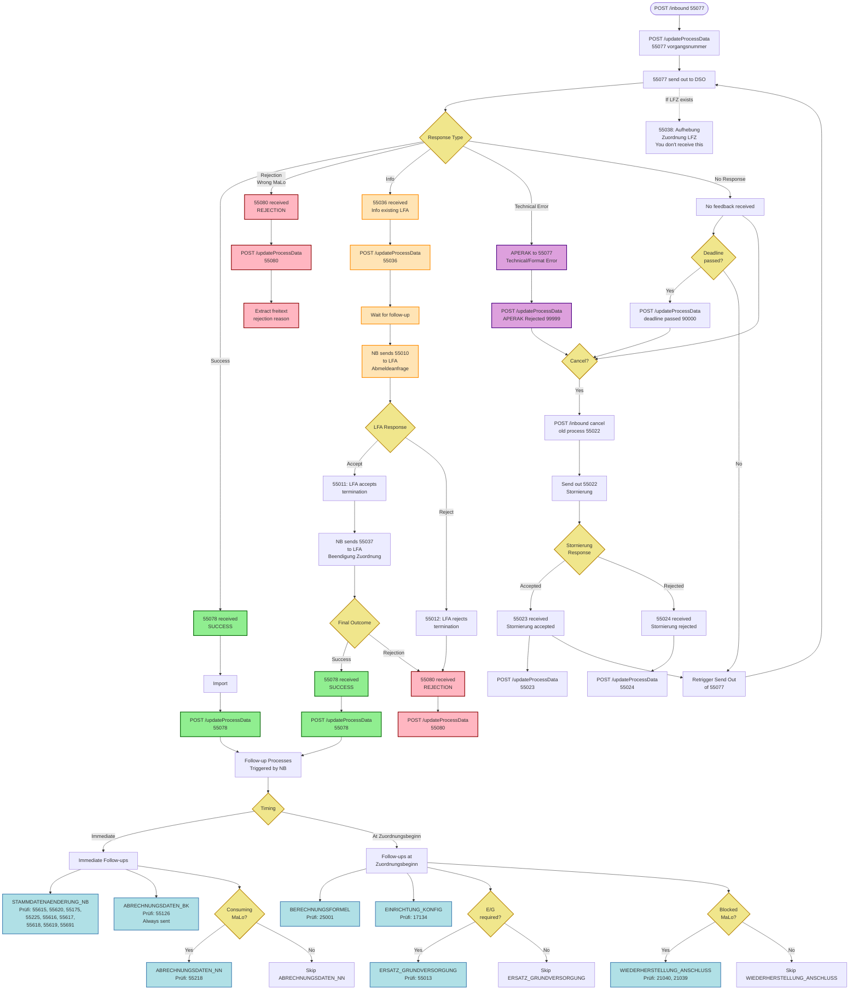

# Complete Lieferbeginn 55077 Process Flowchart

## Mermaid Diagram

## Key Answers

### Q: If MaLo is wrong in 55077, what do you get?

**A: 55080 (Rejection)** ✅

- **NOT 55078** (success)
- **NOT APERAK** (unless it's a format/technical error with the MaLo field itself)

**55080 contains:**
- `pruefidentifikator: "55080"`
- `freitext` → Human-readable rejection reason
- `antwortstatusCodeliste` → EBD error codes (E_0621, E_0622, E_0633)
- `abweichungsgrund` → May include `UNBEKANNTE_MARKTLOKATION_MESSLOKATION`

---

## Flow Explanation

### 1. Initial Request
- **POST /inbound 55077** → Trigger Lieferbeginn for generating Marktlokation
- **POST /updateProcessData 55077** → Store initial process data
- **55077 send out to DSO** → Send to Distribution System Operator

### 2. Direct Responses (5 paths)

#### Path A: Success (55078)
- **55078 received** → Success response
- **Import** → Process the success message
- **POST /updateProcessData 55078** → Update with success data
- **Then**: Follow-up processes triggered

#### Path B: Rejection (55080)
- **55080 received** → Rejection (e.g., wrong MaLo)
- **POST /updateProcessData 55080** → Update with rejection
- **Extract freitext** → Read rejection reason

#### Path C: Info Existing Assignment (55036)
- **55036 received** → Info about existing LFA assignment
- **POST /updateProcessData 55036** → Update with info
- **Wait for follow-up** → Then follow-up flow (see below)

#### Path D: Technical Error (APERAK)
- **APERAK to 55077** → Technical/format error
- **POST /updateProcessData APERAK Rejected 99999** → Update with error
- **Can cancel** → Option to send 55022

#### Path E: No Response
- **No feedback** → Timeout scenario
- **Deadline passed?** → Decision point
- **If yes**: POST /updateProcessData deadline passed 90000
- **If no**: Retrigger Send Out of 55077

### 3. Cancellation Flow (Stornierung)

- **Cancel?** → Decision to cancel
- **POST /inbound cancel old process 55022** → Request cancellation
- **Send out 55022** → Stornierung request
- **Stornierung Response**:
  - **55023** → Stornierung accepted
  - **55024** → Stornierung rejected
- **Can retry** → After successful cancellation

### 4. After 55036: Follow-up Flow

- **NB sends 55010 to LFA** → Abmeldeanfrage (you don't receive this)
- **LFA Response**:
  - **55011** → LFA accepts termination
  - **55012** → LFA rejects termination
- **If 55011**: NB sends 55037 to LFA (Beendigung Zuordnung)
- **Final Outcome**:
  - **55078** → Success (after LFA termination)
  - **55080** → Rejection (if LFA rejected or other issues)

### 5. After 55078 Success: Follow-up Processes

#### Immediate Follow-ups (from NB):
- **STAMMDATENAENDERUNG_NB** (Prüfi: 55615, 55620, 55175, 55225, 55616, 55617, 55618, 55619, 55691)
- **ABRECHNUNGSDATEN_BK** (Prüfi: 55126) - **Always sent**
- **ABRECHNUNGSDATEN_NN** (Prüfi: 55218) - Only for consuming MaLo

#### Follow-ups at Zuordnungsbeginn:
- **BERECHNUNGSFORMEL** (Prüfi: 25001) - Always
- **EINRICHTUNG_KONFIG** (Prüfi: 17134) - Always
- **ERSATZ_GRUNDVERSORGUNG** (Prüfi: 55013) - If E/G required
- **WIEDERHERSTELLUNG_ANSCHLUSS** (Prüfi: 21040, 21039) - If blocked MaLo

---

## Color Coding

- 🟢 **Green (Success)**: 55078 success messages and updates
- 🔴 **Red (Rejection)**: 55080 rejection messages and updates
- 🟡 **Yellow (Info)**: 55036 info messages and waiting states
- 🟣 **Purple (Technical)**: APERAK technical errors
- 🔵 **Blue (Process)**: Follow-up process messages
- 🟨 **Gold (Decision)**: Decision points and conditionals

---

## Critical Distinctions

### APERAK vs 55080

| Type | When | Example |
|------|------|---------|
| **APERAK** | Technical/format error | Malformed JSON, missing required field, invalid data type |
| **55080** | Business rejection | Wrong MaLo-ID, business rule violation, validation failure |

### Wrong MaLo Scenarios

| Scenario | Response | Reason |
|----------|----------|--------|
| MaLo format invalid | **APERAK** | Technical: Field format/type error |
| MaLo doesn't exist | **55080** | Business: Location not found |
| MaLo wrong for this supplier | **55080** | Business: Business rule violation |
| MaLo already assigned | **55036** | Business: Info about existing assignment |

---

## Implementation Notes

1. **Correlation**: Always match `anfragereferenznummer` in responses with your `vorgangsnummer` or `prozessId`

2. **55036 Handling**: When you receive 55036, update status to "PENDING_LFA_CONFIRMATION" and monitor for 55078 or 55080

3. **Follow-up Processes**: After 55078, implement handlers for all follow-up processes - they arrive asynchronously

4. **Timing**: 
   - Immediate follow-ups arrive right after 55078
   - Zuordnungsbeginn follow-ups arrive at the contract start date

5. **Conditional Follow-ups**:
   - ABRECHNUNGSDATEN_NN: Only for consuming MaLo
   - ERSATZ_GRUNDVERSORGUNG: Only if E/G required
   - WIEDERHERSTELLUNG_ANSCHLUSS: Only if MaLo is blocked

## Mermaid Process
sequenceDiagram

    autonumber

    

    title Feed-in MaLo Registration: BO4E Data Flow (Erzeugende Marktlokation)

    box "Internal System" #f8fafc

        participant B as Backend (LF)

        participant C as Conuti (Gateway)

    end

    

    box "Market Communication (External)" #fffcf0

        participant NB as Network Operator

        participant MSB as Meter Operator

    end

    Note over B, NB: Phase 1: Lieferbeginn - Generating MaLo (55077)

    

    B->>+C: 🚀 START_LIEFERBEGINN

    Note right of B: 📦 MARKTLOKATION     └─ energierichtung: EINSP     └─ erforderlichesProduktpaket:         • Bilanzkreis (9991000002082)         • Veräußerungsform (9991000002404)     └─ umsetzungsgradvorgabe  transaktionsgrundergaenzung: ZW3

    

    C->>+NB: 📡 EDIFACT 55077 (erz. MaLo)

    

    opt Existing Supplier Found (LFA exists)

        NB-->>C: 📡 EDIFACT 55036

        C-->>B: 🔔 Webhook 55036

        Note right of C: 📦 MARKTLOKATION     └─ Info: Existing assignment

    end

    

    alt Success Case (55078)

        NB-->>C: 📡 EDIFACT 55078

        C-->>B: 🔔 Webhook 55078

        Note right of C: 📦 MARKTLOKATION (Confirmed) 📦 MESSLOKATION 📦 NETZNUTZUNGSVERTRAG 📦 TRANCHE (if applicable)  antwortstatus: A51 antwortstatusCodeliste: E_0623

    else Rejection (55080 - erz. MaLo)

        NB-->>-C: 📡 EDIFACT 55080

        C-->>-B: 🔔 Webhook 55080

        Note right of C: ⚠️ Only transaktionsdaten:     • antwortstatus: A45/A01-A14     • antwortstatusCodeliste: E_0622     • freitext (rejection details)  ❌ No stammdaten / BO4E objects

    end

    Note over B, MSB: Phase 2: Master Data Sync from NB (Stammdatenänderung)

    

    rect rgb(240, 245, 255)

        Note right of NB: Network Operator (NB) Updates

        

        NB-->>+C: 📡 55616 (MaLo Change)

        C-->>B: 🔔 Webhook 55616

        Note right of C: 📦 MARKTLOKATION 📦 BILANZIERUNG 📦 NETZNUTZUNGSVERTRAG 📦 VERWENDUNGSZEITRAUM

        

        NB-->>C: 📡 55615 (NeLo Change)

        C-->>B: 🔔 Webhook 55615

        Note right of C: 📦 NETZLOKATION 📦 VERWENDUNGSZEITRAUM

        

        NB-->>C: 📡 55620 (MeLo Change)

        C-->>-B: 🔔 Webhook 55620

        Note right of C: 📦 MESSLOKATION 📦 MESSSTELLENBETRIEBSVERTRAG 📦 VERWENDUNGSZEITRAUM

    end

    Note over B, MSB: Phase 3: Master Data Sync from MSB

    

    rect rgb(255, 252, 240)

        Note right of MSB: Meter Operator (MSB) Updates

        

        MSB-->>+C: 📡 55650 (MaLo Change)

        C-->>B: 🔔 Webhook 55650

        Note right of C: 📦 MARKTLOKATION 📦 MESSSTELLENBETRIEBSVERTRAG 📦 VERWENDUNGSZEITRAUM

        

        MSB-->>C: 📡 55653 (MeLo Change)

        C-->>-B: 🔔 Webhook 55653

        Note right of C: 📦 MESSLOKATION 📦 ZAEHLER 📦 MESSSTELLENBETRIEBSVERTRAG 📦 VERWENDUNGSZEITRAUM

    end

    Note over B, MSB: Phase 4: Billing Data (Abrechnungsdaten)

    NB-->>+C: 📡 55672 (Bilanzkreisabrechnung)

    C-->>-B: 🔔 Webhook 55672

    Note right of C: 📦 BILANZIERUNG 📦 MARKTLOKATION 📦 TRANCHE 📦 VERWENDUNGSZEITRAUM

    Note over B, MSB: Phase 5: Meter Readings & Energy Data (MSCONS)

    

    rect rgb(235, 255, 235)

        Note right of MSB: Transactional Energy Data

        

        MSB-->>+C: 📡 13017 (Zählerstand)

        C-->>B: 🔔 Webhook 13017

        Note right of C: 📦 ZAEHLER 📦 ENERGIEMENGE

        

        MSB-->>C: 📡 13019 (Energiemenge)

        C-->>B: 🔔 Webhook 13019

        Note right of C: 📦 ENERGIEMENGE

        

        MSB-->>C: 📡 13025 (Lastgang)

        C-->>-B: 🔔 Webhook 13025

        Note right of C: 📦 ENERGIEMENGE     └─ Lastprofil

    end

---

*Based on PROCESS_GRAPH.json, LIEFERBEGINN_PROCESS_MAP.md, and official MaCo API documentation*

