# Complete Error Tree for Lieferbeginn (55077) Process

## Overview

This document provides a complete mapping of all possible rejection codes and error scenarios for the Lieferbeginn process, extracted from EBD decision trees E_0594, E_0622, E_0623, and E_0624.

**Process**: 55077 - Lieferbeginn (Registration of Supplier Assignment)  
**Response Messages**: 55078 (Success), 55080 (Rejection), 55036 (Info), 55003 (Rejection consuming)

### ⚠️ Important: Code Conflicts

Some rejection codes appear in multiple EBDs with **different meanings**. Always check the `antwortstatusCodeliste` field in the response to determine which EBD applies:

- **`E_0594`**: MaLo-Ident errors (if MaLo-ID unknown)
- **`E_0622`**: Direct rejection checks (early validation)
- **`E_0623`**: Final validation (after termination checks)
- **`E_0624`**: LFA termination request responses (affects your registration)

**Example**: Code `A02` means:
- In `E_0594`: "No MaLo found with two criteria" (MaLo-Ident issue)
- In `E_0622`: "MaLo does not participate in market communication" (Lieferbeginn rejection)

Always use `antwortstatusCodeliste` + `antwortstatus` together to determine the exact error.

---

## Error Tree Structure

```mermaid
flowchart TD
    Start[START_LIEFERBEGINN 55077] --> E0622{E_0622:<br/>Direct Rejection<br/>Check}
    
    %% E_0622 Rejections (Early)
    E0622 -->|A07| R1[❌ A07: Lead Time Not Met]
    E0622 -->|A36| R2[❌ A36: Ruhende MaLo Not iMS]
    E0622 -->|A09| R3[❌ A09: Ruhende MaLo Not Consuming]
    E0622 -->|A08| R4[❌ A08: Not Kundenanlage]
    E0622 -->|A37| R5[❌ A37: Ruhende MaLo Wrong NeLo]
    E0622 -->|A02| R6[❌ A02: MaLo Not Participating]
    E0622 -->|A04| R7[❌ A04: Wrong Process - Neuanlage]
    E0622 -->|A05| R8[❌ A05: Requirements Not Met]
    E0622 -->|A06| R9[❌ A06: Other Registration In Progress]
    E0622 -->|A21| R10[❌ A21: Wrong Process - Einzug Neuanlage]
    E0622 -->|A24| R11[❌ A24: Missing Quarter-Hourly Metering]
    E0622 -->|A25| R12[❌ A25: Requirements Not Met]
    E0622 -->|A45| R13[❌ A45: Other Registration In Progress]
    E0622 -->|A34| R14[❌ A34: Lead Time Not Met - Non-EEG/KWKG GV1]
    E0622 -->|A27| R15[❌ A27: EEG Requirements Not Met]
    E0622 -->|A28| R16[❌ A28: Lead Time Not Met - EEG/KWKG GV1]
    E0622 -->|A29| R17[❌ A29: Lead Time Not Met - EEG/KWKG GV1 Shortened]
    E0622 -->|A30| R18[❌ A30: Lead Time Not Met - Non-EEG/KWKG GV2]
    E0622 -->|A31| R19[❌ A31: Lieferbeginn Not 1st of Month GV2]
    E0622 -->|A32| R20[❌ A32: Lead Time Not Met - EEG/KWKG GV2]
    E0622 -->|A35| R21[❌ A35: Lead Time Not Met - Non-EEG/KWKG Other]
    E0622 -->|A44| R22[❌ A44: Deadline Exceeded]
    
    %% Pass E_0622, check E_0621
    E0622 -->|Pass| E0621{E_0621:<br/>Termination<br/>Required?}
    
    %% E_0621 leads to E_0624 (LFA checks)
    E0621 -->|Yes| E0624{E_0624:<br/>LFA Termination<br/>Check}
    
    %% E_0624 Rejections (LFA side)
    E0624 -->|A43| R23[❌ A43: Deadline Exceeded - LFA]
    E0624 -->|A30| R24[❌ A30: Already Terminated]
    E0624 -->|A32| R25[❌ A32: Not a Move-In]
    E0624 -->|A33| R26[❌ A33: Customer Not Moved Out]
    E0624 -->|A35| R27[❌ A35: Contract Binding]
    E0624 -->|A41| R28[❌ A41: Already Terminated - Generating]
    E0624 -->|A39| R29[❌ A39: Contract Binding - Generating]
    
    %% E_0624 Success leads to E_0623
    E0624 -->|Success| E0623{E_0623:<br/>Final Validation}
    E0621 -->|No| E0623
    
    %% E_0623 Rejections (Final)
    E0623 -->|A50| R30[❌ A50: LFA Objected - Consuming]
    E0623 -->|A57| R31[❌ A57: LFA Objected - Generating]
    E0623 -->|A53| R32[❌ A53: Percentage Not Free - Tranche]
    E0623 -->|A54| R33[❌ A54: Percentage Not Free - Tranche]
    E0623 -->|A99| R34[❌ A99: Other Error]
    
    %% Success paths
    E0623 -->|A51| S1[✅ A51: Success - Consuming MaLo]
    E0623 -->|A58| S2[✅ A58: Success - Generating MaLo]
    E0623 -->|A55| S3[✅ A55: Success - New Tranche + Direct Marketing]
    E0623 -->|A56| S4[✅ A56: Success - New Tranche]
    
    %% E_0594 (MaLo-Ident) - if MaLo-ID unknown
    Start -.->|MaLo-ID Unknown| E0594{E_0594:<br/>MaLo-Ident}
    E0594 -->|A14| R35[❌ A14: MaLo-ID Unknown]
    E0594 -->|A01| R36[❌ A01: No MaLo Found - Single Criterion]
    E0594 -->|A02| R37[❌ A02: No MaLo Found - Two Criteria]
    E0594 -->|A03| R38[❌ A03: MaLo Not Unique]
    E0594 -->|A04| R39[❌ A04: MaLo in Transferred Network Area]
    E0594 -->|A05| R40[❌ A05: No MaLo Found - Two Criteria]
    E0594 -->|A06| R41[❌ A06: MaLo Not Unique]
    E0594 -->|A07| R42[❌ A07: MaLo in Transferred Network Area]
    E0594 -->|A08| R43[❌ A08: No MaLo Found - Three Criteria]
    E0594 -->|A09| R44[❌ A09: MaLo in Transferred Network Area]
    E0594 -->|A10| R45[❌ A10: MaLo Decommissioned]
    E0594 -->|A13| R46[❌ A13: Authorization Invalid]
    
    %% Styling
    classDef rejection fill:#ffcccc,stroke:#cc0000,stroke-width:2px
    classDef success fill:#ccffcc,stroke:#00cc00,stroke-width:2px
    classDef decision fill:#fff4cc,stroke:#cc9900,stroke-width:2px
    
    class R1,R2,R3,R4,R5,R6,R7,R8,R9,R10,R11,R12,R13,R14,R15,R16,R17,R18,R19,R20,R21,R22,R23,R24,R25,R26,R27,R28,R29,R30,R31,R32,R33,R34,R35,R36,R37,R38,R39,R40,R41,R42,R43,R44,R45,R46 rejection
    class S1,S2,S3,S4 success
    class E0622,E0621,E0624,E0623,E0594 decision
```



---

## Complete Rejection Code Reference

### E_0622: Direct Rejection Checks (Early Validation)
**EBD**: E_0622 - "Prüfen, ob Anmeldung direkt ablehnbar"  
**Role**: NB (Network Operator)  
**Response**: 55080 (for generating MaLo) or 55003 (for consuming MaLo)  
**antwortstatusCodeliste**: `E_0622`

| Code | Step | Meaning (German) | Meaning (English) | Action | Retry? |
|------|------|------------------|-------------------|--------|--------|
| **A02** | 30 | Marktlokation nimmt nicht an der Marktkommunikation teil | MaLo does not participate in market communication | Check if MaLo is decommissioned or uses Model 2 | ❌ No |
| **A04** | 50 | Falscher Prozess (Neuanlage) | Wrong process (new installation) | Use correct process for Neuanlage | ❌ No |
| **A05** | 60 | Anforderungen können nicht erfüllt werden | Requirements cannot be met | Check authorization (Bilanzkreis/Bilanzierungsverfahren) | ⚠️ Fix & Retry |
| **A06** | 70 | Andere Anmeldung in Bearbeitung (verbrauchend) | Other registration in progress (consuming) | Wait for current registration to complete | ✅ Yes (after date in freitext) |
| **A07** | 15 | Vorlauffrist wurde nicht eingehalten | Lead time not met | Submit earlier - check lead time requirements | ⚠️ Fix & Retry |
| **A08** | 25 | Nicht Kundenanlage | Not a Kundenanlage | Check MaLo type for integration | ❌ No |
| **A09** | 18 | Ruhende MaLo nicht verbrauchend | Ruhende MaLo not consuming | Check MaLo type | ❌ No |
| **A21** | 220 | Falscher Prozess (Einzug in Neuanlage) | Wrong process (move-in to new installation) | Use correct process | ❌ No |
| **A24** | 250 | Viertelstündliche Messung nicht vorhanden | Quarter-hourly metering not available | Contact MSB to install/configure metering | ⚠️ Fix & Retry |
| **A25** | 260 | Anforderungen können nicht erfüllt werden (erzeugend) | Requirements cannot be met (generating) | Check authorization (Bilanzkreis/Bilanzierungsverfahren) | ⚠️ Fix & Retry |
| **A27** | 410 | Vorgaben EEG nicht eingehalten | EEG requirements not met | Lieferbeginn must be 1st of month 00:00 | ⚠️ Fix & Retry |
| **A28** | 430 | Vorlauffrist EEG/KWKG GV1 nicht eingehalten | Lead time not met - EEG/KWKG GV1 (1 month) | Submit 1 month before Zuordnungsbeginn | ⚠️ Fix & Retry |
| **A29** | 440 | Verkürzte Vorlauffrist EEG/KWKG GV1 nicht eingehalten | Shortened lead time not met - EEG/KWKG GV1 (5 WT) | Submit 5 working days before Zuordnungsbeginn | ⚠️ Fix & Retry |
| **A30** | 610 | Vorlauffrist Nicht-EEG/KWKG GV2 nicht eingehalten | Lead time not met - Non-EEG/KWKG GV2 | Submit before last WT before Zuordnungsbeginn | ⚠️ Fix & Retry |
| **A31** | 620 | Lieferbeginn nicht 1. des Monats (GV2) | Lieferbeginn not 1st of month (GV2) | Must be 1st of month 00:00 | ⚠️ Fix & Retry |
| **A32** | 630 | Vorlauffrist EEG/KWKG GV2 nicht eingehalten | Lead time not met - EEG/KWKG GV2 (1 month) | Submit 1 month before Zuordnungsbeginn | ⚠️ Fix & Retry |
| **A34** | 406 | Vorlauffrist Nicht-EEG/KWKG GV1 nicht eingehalten | Lead time not met - Non-EEG/KWKG GV1 | Submit before last WT before Zuordnungsbeginn | ⚠️ Fix & Retry |
| **A35** | 806 | Vorlauffrist Nicht-EEG/KWKG nicht eingehalten | Lead time not met - Non-EEG/KWKG (other) | Submit before last WT before Zuordnungsbeginn | ⚠️ Fix & Retry |
| **A36** | 17 | Ruhende MaLo messtechnisch nicht iMS | Ruhende MaLo not iMS metering | Check metering classification | ❌ No |
| **A37** | 26 | Ruhende MaLo nicht hinter gleicher NeLo | Ruhende MaLo not behind same NeLo | Check network location | ❌ No |
| **A44** | 810 | Fristüberschreitung | Deadline exceeded | Submit earlier - check deadline | ⚠️ Fix & Retry |
| **A45** | 270 | **Andere Anmeldung in Bearbeitung (erzeugend)** | **Other registration in progress (generating)** | **Wait for current registration - check freitext for next available date** | ✅ **Yes (after date in freitext)** |

---

### E_0623: Final Validation (After Termination Checks)
**EBD**: E_0623 - "Lieferbeginn prüfen"  
**Role**: NB (Network Operator)  
**Response**: 55078 (Success) or 55080 (Rejection)  
**antwortstatusCodeliste**: `E_0623`

| Code | Step | Meaning (German) | Meaning (English) | Action | Retry? |
|------|------|------------------|-------------------|--------|--------|
| **A50** | 50 | LFA hat widersprochen (verbrauchend) | LFA objected (consuming) | LFA rejected termination - cannot proceed | ❌ No |
| **A51** | 60 | **Cluster: Zustimmung (verbrauchend)** | **Success (consuming MaLo)** | **Registration successful** | ✅ **Success** |
| **A53** | 510 | Gewünschter Prozentsatz nicht frei (Tranche) | Desired percentage not free (Tranche) | Requested percentage not available | ⚠️ Retry with lower percentage |
| **A54** | 520 | Gewünschter Prozentsatz nicht frei (Tranche) | Desired percentage not free (Tranche) | Insufficient percentage freed up | ⚠️ Retry with lower percentage |
| **A55** | 540 | Zustimmung - Neue Tranche + Direktvermarktung | Success - New Tranche + Direct Marketing | Success with new Tranche creation | ✅ Success |
| **A56** | 600 | Zustimmung - Neue Tranche | Success - New Tranche | Success with new Tranche creation | ✅ Success |
| **A57** | 440 | LFA hat widersprochen (erzeugend) | LFA objected (generating) | LFA rejected termination - cannot proceed | ❌ No |
| **A58** | 450 | **Cluster: Zustimmung (erzeugend)** | **Success (generating MaLo)** | **Registration successful** | ✅ **Success** |
| **A99** | 60/450/600 | Sonstiges | Other | Check freitext for details | ⚠️ Review & Fix |

---

### E_0624: LFA Termination Request Check
**EBD**: E_0624 - "Anfrage zur Beendigung der Zuordnung prüfen"  
**Role**: LF (specifically LFA - outgoing supplier)  
**Response**: 55011 (Accept) or 55012 (Reject)  
**Note**: These codes appear in LFA's response to NB, but may affect your 55080 rejection

| Code | Step | Meaning (German) | Meaning (English) | Action | Retry? |
|------|------|------------------|-------------------|--------|--------|
| **A30** | 30 | Belieferung bereits beendet (verbrauchend) | Supply already terminated (consuming) | LFA already ended supply | ✅ Retry (should succeed) |
| **A31** | 30 | Zustimmung Beendigung (verbrauchend) | Accept termination (consuming) | LFA accepts termination | ✅ Continue |
| **A32** | 50 | Nicht Einzug - Kunde identisch | Not a move-in - customer same | Customer hasn't moved | ❌ No |
| **A33** | 60 | Kunde nicht ausgezogen | Customer not moved out | LFA knows customer hasn't moved | ❌ No |
| **A34** | 60 | Zustimmung Beendigung (Umzug) | Accept termination (move) | LFA accepts - customer moved | ✅ Continue |
| **A35** | 90 | Vertragsbindung (verbrauchend) | Contract binding (consuming) | Contract still active | ❌ No |
| **A36** | 90 | Zustimmung Beendigung (verbrauchend) | Accept termination (consuming) | Contract ended | ✅ Continue |
| **A38** | 80 | Zustimmung Ersatzversorgung beendet | Accept - replacement supply ended | Replacement supply ended | ✅ Continue |
| **A39** | 220 | Vertragsbindung (erzeugend) | Contract binding (generating) | Contract still active | ❌ No |
| **A40** | 220 | Zustimmung Beendigung (erzeugend) | Accept termination (generating) | Contract ended | ✅ Continue |
| **A41** | 210 | Belieferung bereits beendet (erzeugend) | Supply already terminated (generating) | LFA already ended supply | ✅ Retry (should succeed) |
| **A42** | 210 | Zustimmung Beendigung (erzeugend) | Accept termination (generating) | LFA accepts termination | ✅ Continue |
| **A43** | 5 | Fristüberschreitung (LFA) | Deadline exceeded (LFA) | LFA didn't respond in time | ⚠️ May proceed automatically |

---

### E_0594: MaLo-Ident (If MaLo-ID Unknown)
**EBD**: E_0594 - "Anfrage vom LF prüfen"  
**Role**: NB (Network Operator)  
**Response**: Used in MALOIDENT process (not directly in 55077, but prerequisite)  
**antwortstatusCodeliste**: `E_0594`

**⚠️ Note**: Some codes (A02, A05, A06, A07, A08, A09) appear in both E_0594 and E_0622, but with **different meanings**. Always check `antwortstatusCodeliste` to determine which EBD applies.

| Code | Step | Meaning (German) | Meaning (English) | Action | Retry? |
|------|------|------------------|-------------------|--------|--------|
| **A01** | 160 | Mit einem Kriterium keine MaLo ermittelbar | No MaLo found with single criterion | Provide more identification criteria | ⚠️ Fix & Retry |
| **A02** | 280 | In Kombination zwei Kriterien keine MaLo ermittelbar | No MaLo found with two criteria | Provide additional identification criteria | ⚠️ Fix & Retry |
| **A03** | 390 | Marktlokation nicht eindeutig bzw. nimmt nicht an der Marktkommunikation teil | MaLo not unique or not participating in market communication | Multiple MaLos match - provide more criteria | ⚠️ Fix & Retry |
| **A04** | 395 | MaLo in abgegebenem Netzgebiet (3 Jahre) | MaLo in transferred network area (3 years) | Contact correct NB (MP-ID in freitext) | ⚠️ Contact correct NB |
| **A05** | 395 | In Kombination zwei Kriterien keine MaLo ermittelbar | No MaLo found with two criteria | Provide additional identification criteria | ⚠️ Fix & Retry |
| **A06** | 445 | Marktlokation nicht eindeutig bzw. nimmt nicht an der Marktkommunikation teil | MaLo not unique or not participating in market communication | Multiple MaLos match - provide more criteria | ⚠️ Fix & Retry |
| **A07** | 450 | MaLo in abgegebenem Netzgebiet (3 Jahre) | MaLo in transferred network area (3 years) | Contact correct NB (MP-ID in freitext) | ⚠️ Contact correct NB |
| **A08** | 450 | In Kombination drei Kriterien keine MaLo ermittelbar | No MaLo found with three criteria | Provide additional identification criteria | ⚠️ Fix & Retry |
| **A09** | 705 | MaLo in abgegebenem Netzgebiet (3 Jahre) | MaLo in transferred network area (3 years) | Contact correct NB (MP-ID in freitext) | ⚠️ Contact correct NB |
| **A10** | 710 | Identifizierte MaLo ist stillgelegt | Identified MaLo is decommissioned | MaLo cannot be used | ❌ No |
| **A13** | 740 | Vollmacht nicht wirksam | Authorization invalid | Provide valid authorization | ⚠️ Fix & Retry |
| **A14** | 30 | MaLo-ID oder Tranchen-ID nicht bekannt | MaLo-ID or Tranche-ID unknown | Use MALOIDENT process first | ⚠️ Use MALOIDENT |

---

## Error Handling Strategy by Code Category

### 🔴 Permanent Failures (Don't Retry)
- **A02**: MaLo not participating in market communication
- **A04**: Wrong process (Neuanlage)
- **A08**: Not a Kundenanlage
- **A09**: Ruhende MaLo not consuming
- **A10**: MaLo decommissioned
- **A21**: Wrong process (Einzug in Neuanlage)
- **A32**: Not a move-in (customer same)
- **A33**: Customer not moved out
- **A35/A39**: Contract binding
- **A36**: Ruhende MaLo not iMS
- **A37**: Ruhende MaLo wrong NeLo
- **A50/A57**: LFA objected to termination

### 🟡 Fixable Errors (Fix Data/Timing, Then Retry)
- **A01/A02/A05/A08**: MaLo identification issues → Use MALOIDENT or provide more criteria
- **A05/A25**: Requirements not met → Check authorization (Bilanzkreis/Bilanzierungsverfahren)
- **A07/A28/A29/A30/A32/A34/A35/A44**: Lead time violations → Submit earlier
- **A24**: Missing quarter-hourly metering → Contact MSB
- **A27/A31**: EEG requirements (must be 1st of month) → Fix date
- **A34/A35/A39**: Contract binding → Wait for contract end or get Kündigung
- **A53/A54**: Percentage not free (Tranche) → Request lower percentage

### 🟢 Retryable Errors (Wait and Retry)
- **A06/A45**: Other registration in progress → Wait for completion date (check freitext)
- **A30/A41**: Supply already terminated → Retry (should succeed)
- **A43**: Deadline exceeded (LFA) → May proceed automatically

### ⚠️ Other/Unknown (Review freitext)
- **A99**: Other error → Check freitext for details

---

## Success Codes

| Code | Meaning | When |
|------|---------|------|
| **A51** | Success - Consuming MaLo | After E_0623 validation for consuming MaLo |
| **A58** | Success - Generating MaLo | After E_0623 validation for generating MaLo |
| **A55** | Success - New Tranche + Direct Marketing | Tranche creation with direct marketing requirement |
| **A56** | Success - New Tranche | Tranche creation |
| **A31/A34/A36/A38/A40/A42** | LFA accepts termination | LFA agrees to end assignment (leads to success) |

---

## Implementation Guide

### Error Handler Structure

```python
class LieferbeginnErrorHandler:
    """Complete error handling for Lieferbeginn process"""
    
    # Permanent failures - don't retry
    PERMANENT_FAILURES = {
        "A02", "A04", "A08", "A09", "A10", "A21", 
        "A32", "A33", "A35", "A36", "A37", "A39", 
        "A50", "A57"
    }
    
    # Fixable errors - fix and retry
    FIXABLE_ERRORS = {
        "A01", "A02", "A05", "A07", "A08", "A24", "A25",
        "A27", "A28", "A29", "A30", "A31", "A32", "A34",
        "A35", "A53", "A54"
    }
    
    # Retryable errors - wait and retry
    RETRYABLE_ERRORS = {
        "A06", "A30", "A41", "A43", "A45"
    }
    
    # Success codes
    SUCCESS_CODES = {
        "A51", "A55", "A56", "A58"
    }
    
    ERROR_MESSAGES = {
        "A45": "Another registration in progress. Check freitext for next available date.",
        "A07": "Lead time not met. Submit earlier.",
        "A24": "Quarter-hourly metering required. Contact MSB.",
        # ... map all codes
    }
    
    def handle_rejection(self, response):
        code = response['transaktionsdaten']['antwortstatus']
        codelist = response['transaktionsdaten']['antwortstatusCodeliste']
        freitext = response['transaktionsdaten']['freitext']
        
        if code in self.PERMANENT_FAILURES:
            return {
                "action": "permanent_failure",
                "message": self.ERROR_MESSAGES.get(code, f"Permanent failure: {code}"),
                "retry": False
            }
        elif code in self.FIXABLE_ERRORS:
            return {
                "action": "fix_and_retry",
                "message": self.ERROR_MESSAGES.get(code, f"Fixable error: {code}"),
                "retry": True,
                "fix_required": True
            }
        elif code in self.RETRYABLE_ERRORS:
            # Extract next available date from freitext if A45/A06
            next_date = self._extract_date_from_freitext(freitext) if code in ["A45", "A06"] else None
            return {
                "action": "retry_later",
                "message": self.ERROR_MESSAGES.get(code, f"Retryable error: {code}"),
                "retry": True,
                "retry_after": next_date
            }
        elif code in self.SUCCESS_CODES:
            return {
                "action": "success",
                "message": "Registration successful",
                "retry": False
            }
        else:
            # A99 or unknown
            return {
                "action": "review_freitext",
                "message": f"Unknown error: {code}. Check freitext for details.",
                "retry": False,
                "freitext": freitext
            }
```

---

## Sources

- **E_0622**: `ebd-diagrams/FV2510/E_0622.json` - Direct rejection checks (produces 55080)
- **E_0623**: `ebd-diagrams/FV2510/E_0623.json` - Final validation (produces 55078 success or 55080 rejection)
- **E_0624**: `ebd-diagrams/FV2510/E_0624.json` - LFA termination request check
- **E_0594**: `ebd-diagrams/FV2510/E_0594.json` - MaLo-Ident (if MaLo-ID unknown)

**Version**: FV2510 (valid from 2025-10-01)  
**EBD Version**: 4.1 (released 2025-12-11, originally 2025-04-01)


